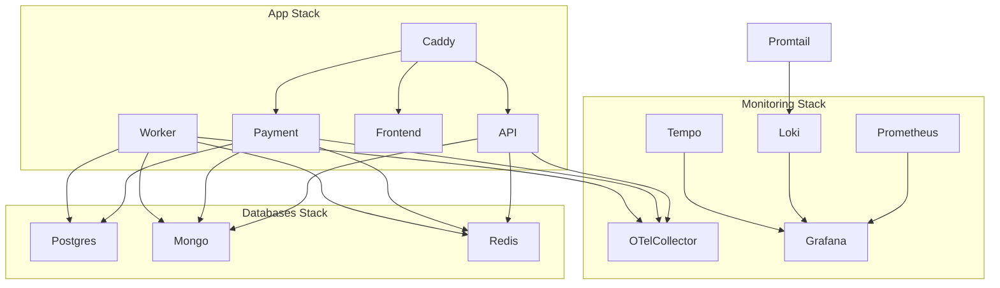
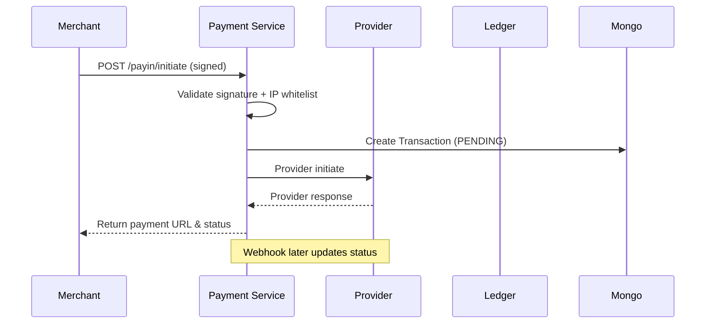
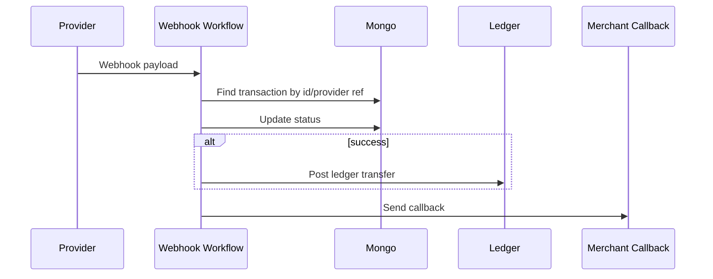
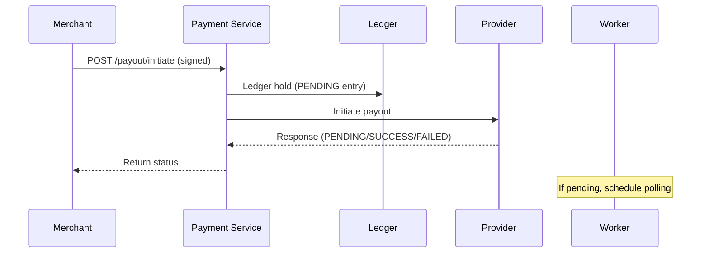
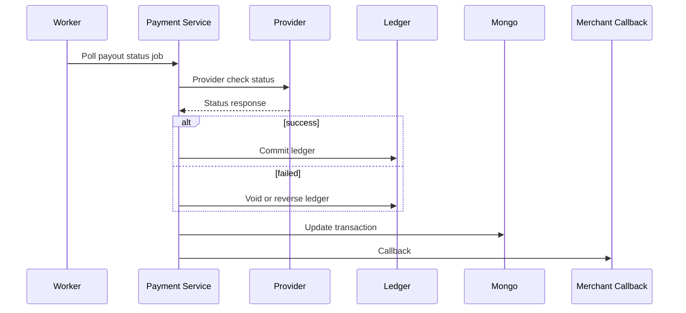
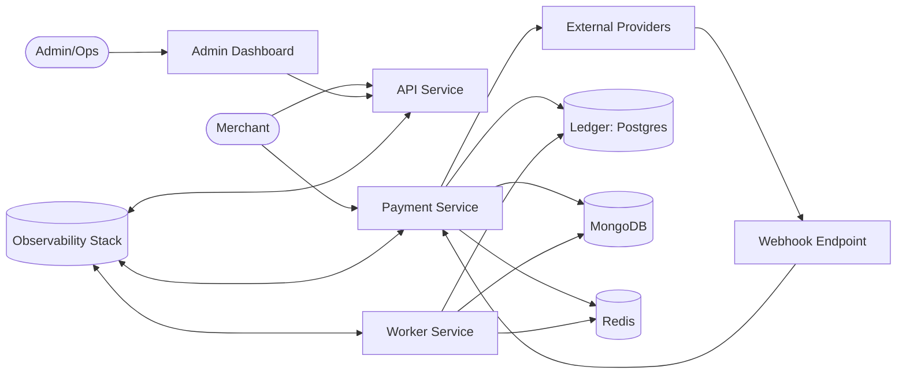
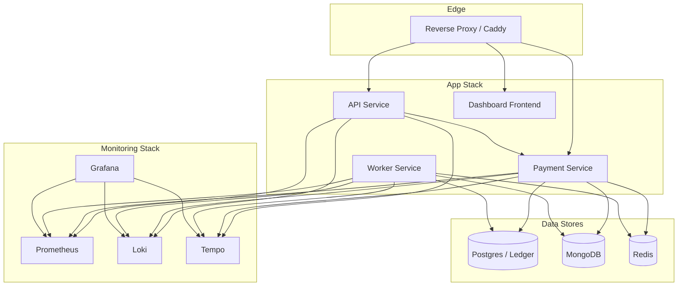

# Volume 1 — Executive Summary, Context, and HLD

## 1. Executive Summary

### 1.1 Business Objective and Scope
Wisipay Finetech 2.1 is a fintech payments platform that provides merchant-facing Payin and Payout APIs, a double‑entry ledger, provider integrations, and an internal admin/monitoring experience. The system processes transactions through external providers, posts accounting entries into a ledger, stores transactional records, and supports manual/admin operational controls.

The project scope in this report includes:
- Merchant payment APIs (Payin and Payout)
- Provider integrations and webhooks
- Ledger processing and accounting entries
- Operational workflows (manual status update/sync, fee settlements)
- Observability, monitoring, and logging
- Deployment architecture and runtime topology

Out of scope (explicitly not defined in repo): compliance certifications, financial product terms, and customer KYC/AML workflows.

### 1.2 Outcomes and Key Capabilities
Key outcomes derived from repository structure and documentation:
- API‑driven Payin/Payout processing with request signing and IP whitelist controls
- Asynchronous status resolution using webhook ingestion and polling (for payout)
- Ledger management with double‑entry accounting and posting workflows
- Multi‑provider routing and per‑channel configuration
- Admin manual operations for status corrections and settlement jobs
- Operational visibility via metrics, logs, and traces

### 1.3 Target Users and Stakeholders
- **Internal Engineering**: maintain core payment flows, ledger integrity, and integration stability
- **Operations/Admin**: resolve exceptions, trigger manual updates and fee settlements
- **Merchants/Clients**: integrate with Payin/Payout API endpoints
- **Compliance/Security**: audit trails, signing, IP controls, logging

---

## 2. Project Context

### 2.1 Problem Statement
Merchants require a reliable API to accept payments (Payin) and disburse funds (Payout). The platform must reliably track transactional state, provide accounting correctness, and handle multiple provider integrations with different APIs and webhook formats. It must also support manual corrections and report generation.

### 2.2 Constraints and Assumptions
Assumptions based on the repository:
- Ledger uses a dedicated Postgres‑backed ledger module (`libs/fintech-ledger`)
- Transactional metadata is stored in MongoDB (Mongoose)
- Redis is used for caching, queues, and rate‑limiting (TPS)
- Infrastructure is containerized and deployed using Docker Compose + Ansible
- Observability uses Prometheus for metrics and Loki/Tempo for logs/traces

Constraints:
- No explicit CI/CD pipeline scripts are provided in repo
- Compliance requirements (PCI, SOC2, etc.) are not specified
- SLA/availability targets are not documented in code

### 2.3 Out‑of‑Scope Items
- Customer identity verification (KYC/AML)
- Settlement banking integrations beyond provider‑level APIs
- Multi‑currency and FX processing (not documented)

### 2.4 Terminology and Acronyms
- **Payin**: Customer‑to‑merchant payment collection
- **Payout**: Merchant‑to‑beneficiary disbursement
- **PLE**: Provider Legal Entity (provider + legal entity channel)
- **Ledger**: Double‑entry accounting system (Postgres)
- **UAT**: User Acceptance Testing environment for merchant integrations

---

## 3. System Context (C4 Level 1)

### 3.1 Actors and Roles
- **Merchant**: Calls Payin/Payout APIs and receives callbacks
- **Admin/Ops**: Uses internal endpoints for manual corrections
- **Provider**: External payment provider API and webhook source
- **System Worker**: Background jobs for polling, expiry, and settlement

### 3.2 External Systems and Integrations
- Payment providers (e.g., Payprime, SabioPay, TPIPay)
- Email provider (ZeptoMail)
- Monitoring stack (Prometheus, Grafana, Loki, Tempo)

### 3.3 Context Diagram (Logical)
```mermaid
flowchart LR
  Merchant-->API[API Service]
  Merchant-->Payment[Payment Service]
  Payment-->Provider[External Provider APIs]
  Provider-->Webhook[Webhook Endpoint]
  Webhook-->Payment
  Payment-->Ledger[Ledger (Postgres)]
  Payment-->Mongo[(MongoDB)]
  Payment-->Redis[(Redis)]
  Worker[Worker Service]-->Redis
  Worker-->Ledger
  Worker-->Mongo
  Admin-->Payment
  Observability[(Prometheus/Loki/Tempo)]<-->API
  Observability<-->Payment
  Observability<-->Worker
```

### 3.4 Trust Boundaries
- Merchant‑facing APIs are protected by HMAC signature verification and timestamp window
- IP whitelist controls applied per merchant for Payin/Payout endpoints
- Admin endpoints require `x-admin-email` (internal usage, not public)

---

## 4. High‑Level Architecture (HLD)

### 4.1 Architectural Style and Tenets
- **Service‑oriented**: API instance, Payment instance, Worker instance
- **Event‑driven**: background jobs and webhook processing
- **Ledger integrity**: double‑entry accounting with posting and reversal workflows
- **Observability‑first**: structured logging + metrics + tracing

### 4.2 Service Topology
Based on `Backend-2.1/README.md` and `Deployment/app/docker-compose.yml`:
- **API Service** (`instances/api`) – public endpoints
- **Payment Service** (`instances/payment`) – internal payments workflows and merchant APIs
- **Worker Service** (`instances/worker`) – background jobs and polling
- **Frontend** (Next.js dashboard)

### 4.3 Data Stores
- **Postgres 16**: Ledger data (double‑entry, balances, audit)
- **MongoDB 7**: Transaction records, metadata, audit logs
- **Redis 7**: Caching, rate limiting (TPS), job queues, polling flags

### 4.4 Observability Stack
From `Deployment/monitoring/docker-compose.yml`:
- Prometheus (metrics)
- Loki (logs)
- Tempo (traces)
- OpenTelemetry Collector
- Grafana (dashboards)
- Promtail (log collection)
- Node‑Exporter & cAdvisor (host/container metrics)

### 4.5 Deployment Topology
App stack (`Deployment/app/docker-compose.yml`):
- API, Payment, Worker services (backend image)
- Frontend service (dashboard image)
- Caddy as edge/reverse proxy
- Promtail + node-exporter + cAdvisor on app host

Databases stack (`Deployment/databases/docker-compose.yml`):
- Postgres (SSL enabled)
- MongoDB
- Redis (password protected)
- Promtail + node-exporter + cAdvisor on DB host

Monitoring stack (`Deployment/monitoring/docker-compose.yml`):
- Prometheus, Loki, Tempo, OTel Collector, Grafana
- Caddy for monitoring endpoints

Note: `Deployment/README.md` mentions Traefik but the current compose files use Caddy. This report follows the compose files as source of truth.

### 4.6 HLD Diagram (Container View)


---

## 5. Core Business Capabilities (HLD View)

### 5.1 Payin Lifecycle
- Merchant initiates Payin via `/api/payment/payin/initiate`
- Payment service routes to provider and returns payment URL
- Webhooks update transaction status
- Ledger entries created on success
- Merchant callbacks sent after status update

### 5.2 Payout Lifecycle
- Merchant initiates Payout via `/api/payment/payout/initiate`
- Ledger hold is applied
- Provider initiation returns pending/success/failed
- Status polling runs for pending payouts
- On success: ledger commit; on failure: void or reverse

### 5.3 Status Polling and Webhooks
- Payout status polling scheduled in worker (Redis + delayed jobs)
- Webhooks processed through worker/queue
- Polling stops when definitive status arrives

### 5.4 Ledger and Accounting
- Double‑entry ledger with `POSTED`, `PENDING`, `VOIDED` states
- Supports transfer, post, reverse, and void operations
- Ledger accounts generated based on entity + purpose

### 5.5 Reporting and Exports
- Transaction reports (merchant/admin views)
- Account statement and ledger reports
- CSV export with expanded fields for admin

### 5.6 Manual Operations
- Manual status update and sync (admin)
- Expire pending payins for a date (admin)
- Provider fee settlement enqueue and verification

---

## 6. System Design (Selected Flows)

### 6.1 Payin Initiation (Sequence)


### 6.2 Payin Webhook (Sequence)


### 6.3 Payout Initiation (Sequence)


### 6.4 Payout Status Polling (Sequence)


---

## 7. Technology Stack (HLD)

### 7.1 Backend
- Runtime: Bun (package manager), Node.js compatible environment
- Web framework: Hono
- Language: TypeScript
- ORM/DB: Mongoose (MongoDB), Kysely/pg (Postgres)
- Caching/Queue: Redis (ioredis)
- Logging: Pino
- Observability: OpenTelemetry SDK, Prometheus exporter

### 7.2 Frontend
- Framework: Next.js 15 (App Router)
- UI: React 19
- Styling: Tailwind CSS 4
- Dashboard template for financial UI

### 7.3 Infrastructure
- Containers: Docker
- Orchestration: Docker Compose
- Reverse proxy: Caddy
- Deployment: Ansible playbooks (multi‑client)
- Monitoring: Prometheus, Grafana, Loki, Tempo, OTel Collector

---

## 8. Open Questions / TBD

- Exact SLAs and performance targets
- Compliance requirements (PCI/SOC2/ISO)
- Disaster recovery and backup policies
- CI/CD automation and pipeline definitions

---

End of Volume 1.


---

## Diagrams

### System Context (C4 L1)





### Container Architecture (C4 L2)




