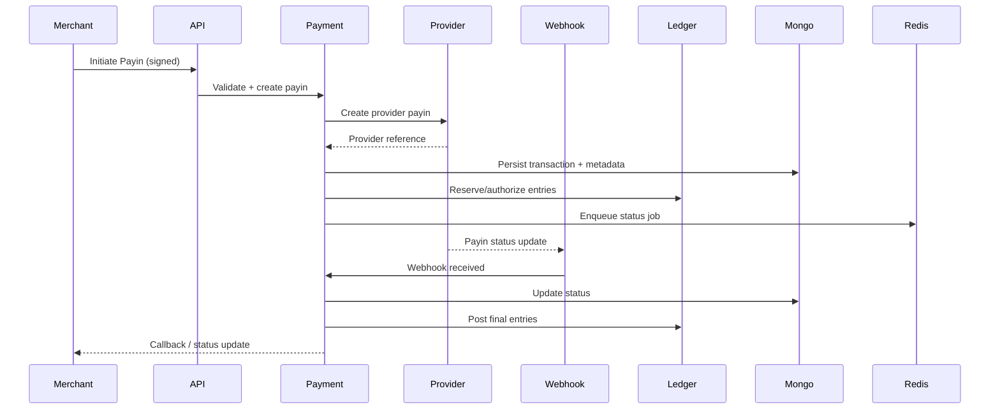
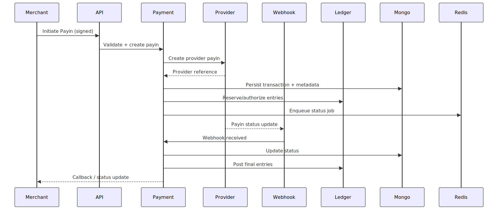
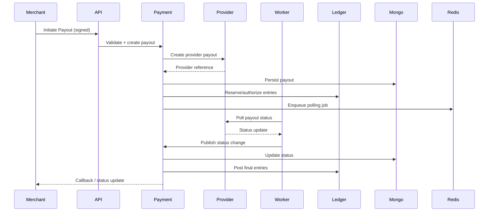

# Volume 2 — Backend LLD (Services, Workflows, Ledger, Providers)

## 1. Backend Overview

### 1.1 Runtime and Framework
- Runtime: Bun (package manager) with Node‑compatible runtime
- Framework: Hono
- Language: TypeScript
- Entry points: `src/instances/api.ts`, `src/instances/payment.ts`, `src/instances/worker.ts`

### 1.2 Architectural Layers
- Controllers: HTTP endpoints and request/response handling
- DTOs: Request validation via Zod
- Services: Core business logic (payments, ledger, provider, reporting)
- Workflows: Orchestration of multi‑step flows (payin/payout/webhook)
- Repositories: Data access layer (Mongo/Mongoose)
- Infra: Logging, telemetry, Redis, Mongo, Postgres (ledger)

---

## 2. Process Instances

### 2.1 API Instance
- File: `Backend-2.1/src/instances/api.ts`
- Purpose: Public and admin HTTP endpoints (non‑payment services)
- Bootstrap: `src/bootstrap.ts`

### 2.2 Payment Instance
- File: `Backend-2.1/src/instances/payment.ts`
- Purpose: Merchant payment APIs, provider interactions, webhook endpoints
- Observability: OTel SDK loaded at startup

### 2.3 Worker Instance
- File: `Backend-2.1/src/instances/worker.ts`
- Purpose: Background job processing, scheduled polling, settlement jobs
- Observability: OTel SDK loaded at startup

---

## 3. Core Domain Modules

### 3.1 Transaction Domain
- Model: `Backend-2.1/src/models/transaction.model.ts`
- Key attributes (observed in code):
  - `id`, `orderId`, `type`, `status`
  - `amount`, `netAmount`, `currency`
  - `merchantId`, `providerId`, `legalEntityId`, `providerLegalEntityId`
  - `utr`, `providerRef`
  - `events` (audit trail)
  - `meta` (ledgerEntryId, manualLedgerEntries, flags)

### 3.2 Ledger Domain
- Ledger core: `Backend-2.1/libs/fintech-ledger`
- Service wrapper: `Backend-2.1/src/services/ledger/ledger.service.ts`
- Operations:
  - `transfer`, `post`, `reverse`, `void`
  - Supports `PENDING` and `POSTED` flows
  - Double‑entry accounting using Postgres backend

### 3.3 Provider Domain
- Provider config and clients under `Backend-2.1/src/provider-config`
- Provider routing and config resolution under `Backend-2.1/src/services/provider-config`

---

## 4. Controllers and Routes

### 4.1 Payment Controller
- File: `Backend-2.1/src/controllers/payment/payment.controller.ts`
- Responsibilities:
  - Payin/payout initiation endpoints
  - Manual admin endpoints (status update, status sync, expire pending, fee settlement)
  - Audit logging for manual actions

### 4.2 Webhook Controller
- File: `Backend-2.1/src/controllers/payment/webhook.controller.ts`
- Responsibilities:
  - Ingest provider webhooks
  - Pass raw payload to workflow
  - Capture raw body + headers for observability

### 4.3 Payment Routes
- File: `Backend-2.1/src/routes/payment/payment.routes.ts`
- Endpoints (subset):
  - `/api/payment/payin/initiate`
  - `/api/payment/payout/initiate`
  - `/api/payment/:orderId` and status endpoints
  - `/api/payment/manual/status/update`
  - `/api/payment/manual/status/sync`
  - `/api/payment/manual/expire/pending-previous-day`
  - `/api/payment/manual/provider-fee-settlement`

---

## 5. DTOs and Validation

### 5.1 Payment DTOs
- Validation via Zod schemas
- Location: `Backend-2.1/src/dto/payment/*.ts`
- Examples:
  - `ManualStatusUpdateSchema`
  - `ManualStatusSyncSchema`
  - `ManualExpirePendingSchema`
  - `ManualProviderFeeSettlementSchema`

### 5.2 Ledger DTOs
- Location: `Backend-2.1/src/dto/ledger/*.ts`
- Used for internal transfer and operations orchestration

---

## 6. Workflows

### 6.1 Payin Workflow
- File: `Backend-2.1/src/workflows/payin.workflow.ts`
- Steps (high‑level):
  - Validate merchant and request
  - Create transaction record
  - Initiate provider payin
  - Update status and send callback
  - Schedule auto‑expiry if pending

### 6.2 Payout Workflow
- File: `Backend-2.1/src/workflows/payout.workflow.ts`
- Steps (high‑level):
  - Validate merchant request
  - Create transaction record
  - Ledger hold (PENDING entry)
  - Provider initiate
  - Schedule status polling if pending
  - Commit or void ledger based on provider result

### 6.3 Webhook Workflow
- File: `Backend-2.1/src/workflows/webhook.workflow.ts`
- Steps (high‑level):
  - Parse and validate webhook payload
  - Lookup transaction by id/provider reference
  - Update status and ledger entries
  - Stop payout polling on definitive status
  - Send merchant callback

---

## 7. Services

### 7.1 Payment Service
- File: `Backend-2.1/src/services/payment/payment.service.ts`
- Responsibilities:
  - Core transaction lifecycle changes
  - Manual status update and sync
  - Expire pending payins for a date
  - Manual provider fee settlement enqueue
  - Ledger updates (commit/void/reverse) as needed
  - Trigger merchant callbacks

### 7.2 Payment Ledger Service
- File: `Backend-2.1/src/services/payment/payment-ledger.service.ts`
- Responsibilities:
  - Ledger transfers for payin/payout
  - Commit, void, and reverse entries
  - Track manual ledger entries in transaction metadata

### 7.3 Transaction Monitor Service
- File: `Backend-2.1/src/services/payment/transaction-monitor.service.ts`
- Responsibilities:
  - Schedule payin auto‑expiry
  - Schedule payout status polling
  - Execute polling jobs and update transactions
  - Stop polling on definitive status

### 7.4 Ledger Operation Service
- File: `Backend-2.1/src/services/ledger/ledger-operation.service.ts`
- Responsibilities:
  - Standardized ledger postings for business operations
  - Resolves accounts for merchant/provider/legal entity
  - Supports operational entries (settlements, fees)

### 7.5 Ledger Transfer Service
- File: `Backend-2.1/src/services/ledger/ledger-transfer.service.ts`
- Responsibilities:
  - Validates and builds ledger transfers
  - Supports backdated entries and value dates
  - Creates transaction records around transfers

### 7.6 Ledger Entry Service
- File: `Backend-2.1/src/services/ledger/ledger-entry.service.ts`
- Responsibilities:
  - Account statement generation
  - General ledger, trial balance, balance sheet
  - Paginated ledger entries and filters

### 7.7 Report Service
- File: `Backend-2.1/src/services/common/report.service.ts`
- Responsibilities:
  - CSV exports of transactions and ledger statements
  - Admin fields expansion

### 7.8 Audit Service
- File: `Backend-2.1/src/services/common/audit.service.ts`
- Responsibilities:
  - Structured audit logging
  - Persist audit logs to MongoDB

### 7.9 Cache Service
- File: `Backend-2.1/src/services/common/cache.service.ts`
- Responsibilities:
  - Cache merchants, providers, and channels in Redis
  - Apply channel overrides for payout polling

---

## 8. Provider Integrations

### 8.1 Provider Client
- Location: `Backend-2.1/src/services/provider-config`
- Responsibilities:
  - Load provider configs
  - Execute provider API calls
  - Centralized request execution

### 8.2 Provider HTTP
- File: `Backend-2.1/src/provider-config/provider-http.ts`
- Responsibilities:
  - Standardized HTTP call wrapper for providers
  - Sensitive data redaction in logs
  - Request/response logging and raw body capture

### 8.3 Payprime Provider
- File: `Backend-2.1/src/provider-config/payprime.provider.ts`
- Features:
  - Payout initiation and status check
  - Webhook parsing (supports array payloads)
  - Flexible resolution of transaction IDs and UTR

### 8.4 SabioPay Provider
- File: `Backend-2.1/src/provider-config/sabiopay.provider.ts`
- Features:
  - Payout initiation with duplicate merchant reference handling
  - Enhanced error parsing and messaging
  - Status checks with fallback UTR fields

### 8.5 TPIPay Provider
- File: `Backend-2.1/src/provider-config/tpipay.provider.ts`
- Feature:
  - Callback URL disabled in payload (as per latest change)

---

## 9. Security Controls

### 9.1 Merchant Request Signing
- File: `Backend-2.1/src/middlewares/payment-security.middleware.ts`
- Standard signature: `HMAC_SHA256(rawBody + "|" + timestamp, secret)`
- Legacy signature: `HMAC_SHA256(amount|currency|orderId|secret)`
- Timestamp window: 60 seconds

### 9.2 IP Whitelisting
- Per‑merchant and per‑service whitelist enforcement
- Dashboard bypass allowed for configured trusted origins

### 9.3 Admin Controls
- Admin endpoints require `x-admin-email`
- Audit logging for all manual operations

---

## 10. Logging and Observability

### 10.1 Logging
- Logger: Pino
- Context: AsyncLocalStorage (`src/infra/log-context.ts`)
- Standard event fields: `requestId`, `correlationId`, `traceId`, `spanId`, `actorId`, `merchantId`

### 10.2 Metrics and Tracing
- OpenTelemetry SDK (`src/infra/otel-sdk.ts`)
- Prometheus exporter for metrics
- OTLP exporter for traces

---

## 11. Job and Webhook Queues

### 11.1 Job Queue
- File: `Backend-2.1/src/utils/job-queue.util.ts`
- Backed by Redis
- Supports delayed jobs
- Used for settlement and polling jobs

### 11.2 Webhook Queue
- File: `Backend-2.1/src/utils/webhook-queue.util.ts`
- Backed by Redis
- Retries and DLQ handling

### 11.3 Worker
- File: `Backend-2.1/src/workers/background.worker.ts`
- Job types:
  - `PROVIDER_FEE_SETTLEMENT`
  - `PAYIN_AUTO_EXPIRE`
  - `PAYOUT_STATUS_POLL`
  - `SETTLEMENT_VERIFICATION`
- Webhook processing executed with log context

---

## 12. Error Handling and Resilience

### 12.1 Payment Errors
- File: `Backend-2.1/src/utils/payment-errors.util.ts`
- Standardized error codes and messages
- Includes ledger error mapping

### 12.2 Idempotency and Reversal
- Idempotency keys used in ledger transfers
- Ledger reverse and void operations used for error correction

---

## 13. Backend LLD Summary

The backend is a service‑oriented architecture with clear separation between transport, orchestration, and domain logic. Payment lifecycle management is centralized in workflow and service layers, while ledger integrity is enforced through a dedicated double‑entry module and structured operational controls. Observability is embedded throughout with structured logging and tracing.

End of Volume 2.

---

## Diagrams

### Payin Sequence

### Payout Sequence

