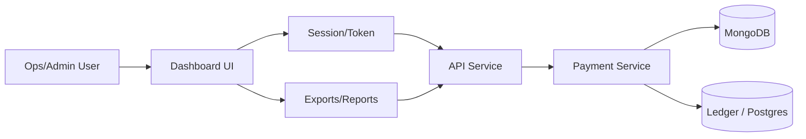

# Volume 3 — Frontend LLD, Data Model, and API Integration

## 1. Frontend Overview

### 1.1 Framework and Tooling
- Framework: Next.js 15 (App Router)
- Language: TypeScript
- UI: React 19
- Styling: Tailwind CSS 4
- Repo location: `Frontend/`

### 1.2 Purpose
- Internal dashboard for financial operations
- Visualizes transactions, balances, and analytics
- Note: The `Frontend/README.md` describes the UI as a template. If production usage differs, this section should be updated.

---

## 2. Project Structure

Directory structure from `Frontend/README.md`:
```
Frontend/src/
app/
components/
utils/
```

Key components:
- `Dashboard.tsx` – main layout
- `TransactionsPanel.tsx` – transaction list UI
- `StatisticsChart.tsx` – analytics chart
- `CardSection.tsx` and `CreditCard.tsx` – account cards
- `Sidebar.tsx` and `Header.tsx` – navigation and header

---

## 3. UI and UX Design

### 3.1 Layout
- Sidebar navigation with primary sections
- Dashboard grid with key widgets
- Responsive layout for desktop and mobile

### 3.2 Visual Theme
- Dark theme with gradient accents
- Glass‑morphism card styling
- Typography via Inter

---

## 4. Data Model (Frontend View)

The dashboard template does not include explicit runtime API integrations in the README. The expected data model for production would typically include:
- Merchant summary
- Transaction list with status and amount
- Balance summary
- Provider status metrics

This section should be updated once frontend API calls are wired to backend endpoints.

---

## 5. API Integration Points (Expected)

Based on backend endpoints:
- Transaction list and status
  - `GET /api/payment/:orderId`
  - `GET /api/payment/payin/status/:orderId`
  - `GET /api/payment/payout/status/:orderId`
- Initiate payin and payout
  - `POST /api/payment/payin/initiate`
  - `POST /api/payment/payout/initiate`

Admin/internal operations (if wired to dashboard):
- Manual status update
- Manual status sync
- Expire pending payins
- Provider fee settlement

These integrations are not visible in frontend code, so they are listed as expected only.

---

## 6. Security and Auth (Frontend)

The repository does not define frontend authentication flows. Possible approaches for production:
- Session‑based auth
- JWT‑based auth
- Admin UI behind Caddy or internal network

This section should be updated based on actual implementation.

---

## 7. Frontend LLD Summary

The frontend repository is structured as a dashboard template using Next.js and Tailwind, with reusable components for finance‑oriented UI. The current codebase appears template‑oriented and needs explicit API integration definitions for production usage.

End of Volume 3.


---

## Diagrams

### Dashboard Data Flow




