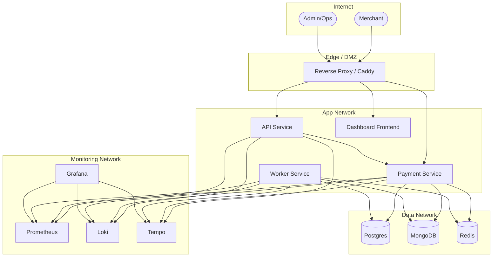

# Volume 4 — Infrastructure, Deployment, Observability, and NFRs

## 1. Infrastructure Overview

### 1.1 Deployment Model
- Containerized deployment with Docker Compose
- Multi‑stack architecture:
  - App stack
  - Databases stack
  - Monitoring stack
- Orchestration via Ansible playbooks for multi‑client environments

### 1.2 App Stack (from `Deployment/app/docker-compose.yml`)
Services:
- `api` (backend API service)
- `payment` (payment service)
- `worker` (background jobs)
- `frontend` (Next.js dashboard)
- `caddy` (reverse proxy)
- `promtail`, `node-exporter`, `cadvisor` (monitoring agents)

Network:
- `fintech-network` bridge

### 1.3 Database Stack (from `Deployment/databases/docker-compose.yml`)
Services:
- `postgres` (ledger storage, SSL enabled)
- `mongo` (transaction and audit storage)
- `redis` (cache + queues)
- `promtail`, `node-exporter`, `cadvisor`

### 1.4 Monitoring Stack (from `Deployment/monitoring/docker-compose.yml`)
Services:
- `prometheus` (metrics)
- `grafana` (visualization)
- `loki` (logs)
- `tempo` (traces)
- `otel-collector` (OpenTelemetry ingest)
- `promtail` (log collection)
- `caddy` (proxy)

---

## 2. Deployment and Operations

### 2.1 Ansible Deployment
- Repo: `Deployment/ansible`
- Playbooks:
  - `ansible/playbooks/site.yml`
  - `ansible/playbooks/app.yml`
  - `ansible/playbooks/databases.yml`
  - `ansible/playbooks/monitoring.yml`
- Environment separation: `Deployment/clients/<client>`

### 2.2 Client‑specific Environments
- `.env.stack`, `.env.backend`, `.env.dashboard`, `.env.databases`, `.env.monitoring`
- Logo assets under `Deployment/clients/<client>/<client>.png`

### 2.3 Reverse Proxy
- Caddy is used for app and monitoring stacks
- Handles TLS termination and routing

---

## 3. Observability

### 3.1 Logs
- Structured JSON logging via Pino
- Context propagation via AsyncLocalStorage
- Centralized shipping via Promtail to Loki

### 3.2 Metrics
- Prometheus exporter in backend via OpenTelemetry SDK
- Node exporter and cAdvisor for host and container metrics

### 3.3 Tracing
- OpenTelemetry SDK configured with OTLP trace exporter
- Traces sent to Tempo via OTel Collector

---

## 4. Non‑Functional Requirements (NFRs)

The repo does not define formal NFRs. The following are inferred and should be validated:

### 4.1 Performance
- API response times targeted for synchronous Payin/Payout initiation
- Asynchronous processing for polling and webhook handling
- Redis‑backed queues to offload processing

### 4.2 Availability
- Multiple services deployed per stack
- Health checks defined for API, payment, worker, frontend
- Redis and databases deployed as single instances per stack

### 4.3 Security
- HMAC‑based request signing
- Timestamp validation to prevent replay
- IP whitelist controls per merchant
- Encrypted secrets (API secret decryption in middleware)

### 4.4 Compliance
- Compliance requirements not specified (TBD)
- Audit logging and traceability present

### 4.5 Scalability
- Horizontal scaling possible for API/payment/worker
- Redis and databases are single nodes by default
- Provider polling and webhook workflows are asynchronous

---

## 5. Operational Workflows

### 5.1 Payin Auto‑Expiry
- Configurable via `PAYIN_AUTO_EXPIRE_MINUTES`
- Scheduled by `TransactionMonitorService`

### 5.2 Payout Status Polling
- Payout polling is delayed and bounded
- Stop polling on final status

### 5.3 Provider Fee Settlement
- Enqueue settlement jobs per PLE and date
- Skip if settlement exists for given date

---

## 6. Configuration Management

### 6.1 Environment Variables
- Backend: `Backend-2.1/src/config/env.ts`
- Frontend: `Frontend/.env` (not detailed in repo)
- Monitoring: `Deployment/clients/<client>/.env.monitoring`

### 6.2 Secrets
- Merchant API secrets stored encrypted
- Redis password set via env
- Postgres SSL enabled via mounted certificates

---

## 7. Risks and Gaps

- No explicit DR or backup strategy described
- CI/CD pipeline is not documented
- Compliance requirements are not listed
- Production monitoring thresholds and alerts are not defined

End of Volume 4.

---

## Diagrams

### Deployment Topology

