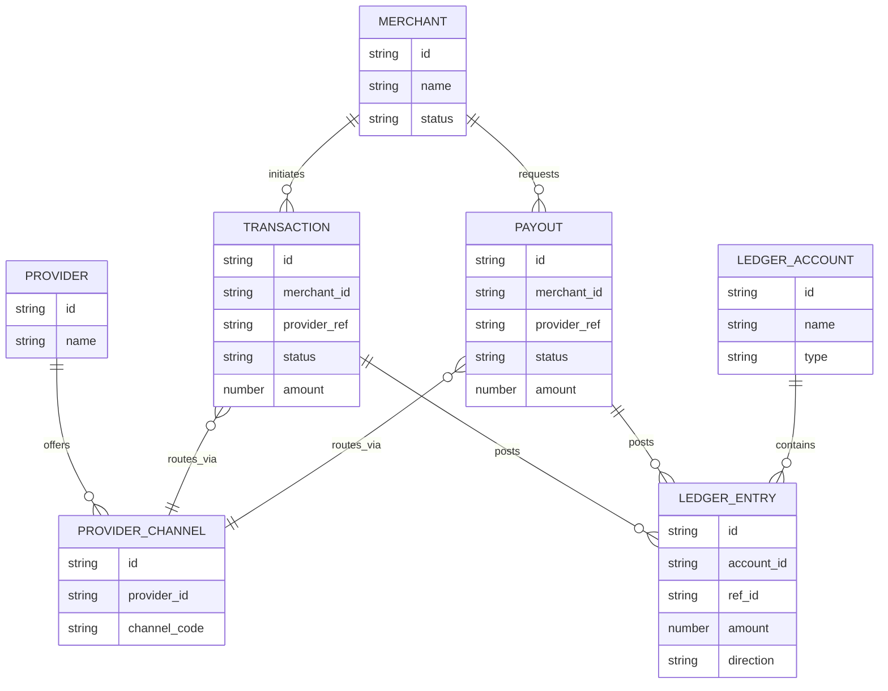

# Volume 7 — Data Dictionary (MongoDB + Ledger SQL)

This volume provides a field‑level catalog of core entities for knowledge transfer.

---

## 1. MongoDB Collections

### 1.1 `transactions`

| Field | Type | Required | Notes |
|---|---|---|---|
| `id` | string | yes | TXN sequence id; indexed |
| `merchantId` | string | no | Merchant reference |
| `providerId` | string | no | Provider reference |
| `legalEntityId` | string | no | Legal entity reference |
| `providerLegalEntityId` | string | no | PLE reference |
| `type` | enum | yes | TransactionType |
| `status` | enum | yes | PENDING/PROCESSING/SUCCESS/FAILED/EXPIRED/REVERSED |
| `amount` | number | yes | Gross amount |
| `netAmount` | number | yes | Net amount |
| `currency` | string | yes | Default INR |
| `orderId` | string | yes | Unique order id |
| `providerRef` | string | no | Provider transaction ref |
| `utr` | string | no | Bank UTR |
| `paymentMode` | string | no | UPI/IMPS/NEFT/RTGS, etc. |
| `remarks` | string | no | Free text |
| `party` | object | no | Party details (name/email/phone/bank) |
| `fees` | object | no | merchantFees/providerFees |
| `error` | string | no | Failure reason |
| `meta` | object | no | Ledger ids, idempotency, etc. |
| `events[]` | array | no | Timeline events |
| `flags[]` | array | no | Transaction flags |
| `isBackDated` | boolean | no | Backdated indicator |
| `insertedDate` | date | no | Insertion date for backdated txns |
| `createdAt` | date | auto | Created timestamp |
| `updatedAt` | date | auto | Updated timestamp |

Indexes:
- `{ providerId, providerRef }` unique (partial)
- `{ createdAt: -1 }`

---

### 1.2 `merchants`

| Field | Type | Required | Notes |
|---|---|---|---|
| `id` | string | yes | MID sequence id |
| `name` | string | yes | Merchant name |
| `displayName` | string | no | Default: name |
| `email` | string | yes | Unique |
| `password` | string | yes | Argon2id hash |
| `role` | enum | yes | Merchant role |
| `status` | boolean | yes | Active/inactive |
| `panelIpWhitelist` | string[] | no | Panel access whitelist |
| `isPanelIpWhitelistEnabled` | boolean | no | Panel whitelist toggle |
| `isOnboard` | boolean | no | Onboarded flag |
| `apiSecretEncrypted` | string | no | Encrypted merchant secret |
| `apiSecretUpdatedAt` | date | no | Secret rotation time |
| `apiSecretEnabled` | boolean | no | Secret enabled toggle |
| `payin` | object | yes | SharedServiceConfig |
| `payout` | object | yes | SharedServiceConfig |
| `accounts` | object | no | Ledger account IDs |
| `createdAt` | date | auto | Created timestamp |
| `updatedAt` | date | auto | Updated timestamp |

Indexes:
- `status`, `role`, `createdAt`, `payin.isActive`, `payout.isActive`

---

### 1.3 `providers`

| Field | Type | Required | Notes |
|---|---|---|---|
| `id` | string | yes | Provider slug |
| `name` | string | yes | Unique name |
| `displayName` | string | no | Human‑readable |
| `type` | enum | yes | BANK/GATEWAY |
| `isActive` | boolean | yes | Provider enable flag |
| `capabilities` | object | yes | payin/payout support |

---

### 1.4 `provider_legal_entities` (PLE)

| Field | Type | Required | Notes |
|---|---|---|---|
| `id` | string | yes | PLE sequence id |
| `name` | string | no | Friendly name |
| `providerId` | string | yes | Provider ref |
| `legalEntityId` | string | yes | Legal entity ref |
| `payin` | object | no | SharedServiceConfig |
| `payout` | object | no | SharedServiceConfig |
| `webhooks` | object | no | Payin/Payout/Common URLs |
| `accounts` | object | no | Ledger account IDs |
| `isActive` | boolean | yes | Active flag |
| `isOnboard` | boolean | no | Onboard flag |

Index:
- Unique `{ providerId, legalEntityId }`

---

### 1.5 `legal_entities`

| Field | Type | Required | Notes |
|---|---|---|---|
| `id` | string | yes | Slug id |
| `name` | string | yes | Entity name |
| `displayName` | string | no | Friendly name |
| `identifier` | string | yes | PAN/CIN |
| `gstin` | string | no | GSTIN |
| `bankAccount` | object | no | Bank details |
| `accounts` | object | no | Ledger account IDs |
| `isActive` | boolean | yes | Active flag |
| `isOnboard` | boolean | no | Onboard flag |

---

### 1.6 `admins`

| Field | Type | Required | Notes |
|---|---|---|---|
| `id` | string | yes | ADM sequence id |
| `name` | string | yes | Admin name |
| `email` | string | yes | Unique |
| `password` | string | yes | Argon2id hash |
| `role` | enum | yes | Admin role |
| `status` | boolean | yes | Active flag |
| `panelIpWhitelist` | string[] | no | Panel access whitelist |

---

### 1.7 `audit_logs`

| Field | Type | Required | Notes |
|---|---|---|---|
| `action` | string | yes | Action name |
| `actorId` | string | no | Actor id |
| `actorType` | string | no | Actor type |
| `entityType` | string | no | Entity type |
| `entityId` | string | no | Entity id |
| `metadata` | object | no | Metadata |
| `requestId` | string | no | Request id |
| `traceId` | string | no | Trace id |

---

### 1.8 `generated_reports`

| Field | Type | Required | Notes |
|---|---|---|---|
| `id` | string | yes | REP sequence id |
| `type` | enum | yes | TRANSACTIONS/LEDGER_STATEMENT |
| `status` | enum | yes | PENDING/PROCESSING/COMPLETED/FAILED |
| `ownerId` | string | yes | Merchant/admin id |
| `ownerType` | enum | yes | MERCHANT/ADMIN |
| `filters` | object | no | Filter criteria |
| `filePath` | string | no | Path to file |
| `expiresAt` | date | yes | Default +7 days |

---

### 1.9 `login_history`

| Field | Type | Required | Notes |
|---|---|---|---|
| `userId` | string | no | Admin/Merchant id |
| `userType` | enum | yes | ADMIN/MERCHANT/UNKNOWN |
| `email` | string | yes | Login email |
| `ipAddress` | string | yes | IP |
| `status` | enum | yes | SUCCESS/FAILED |
| `failureReason` | string | no | Failure reason |
| `createdAt` | date | auto | Timestamp |

---

### 1.10 `merchant_bank_accounts`

| Field | Type | Required | Notes |
|---|---|---|---|
| `id` | string | yes | WA sequence id |
| `merchantId` | string | yes | Merchant id |
| `accountNumber` | string | yes | Bank account |
| `ifsc` | string | yes | IFSC |
| `bankName` | string | yes | Bank |
| `beneficiaryName` | string | yes | Beneficiary |
| `status` | enum | yes | BankAccountStatus |
| `approvedBy` | string | no | Admin id |

---

## 2. Shared Service Config (Embedded)

Embedded in Merchant and PLE documents.

| Field | Type | Notes |
|---|---|---|
| `isActive` | boolean | Feature toggle |
| `fees[]` | array | Fee tiers |
| `tps` | number | TPS per merchant/service |
| `dailyLimit` | number | Daily cap |
| `minAmount` | number | Minimum amount |
| `maxAmount` | number | Maximum amount |
| `apiIpWhitelist` | string[] | IP whitelist |
| `isApiIpWhitelistEnabled` | boolean | Toggle |
| `callbackUrl` | string | Webhook target |
| `pollImmediately` | boolean | Immediate polling toggle |
| `routing` | object | Provider + legal entity |
| `routingFallbacks[]` | array | Fallback routing |

---

## 3. Ledger Database (Postgres)

Schema derived from `libs/fintech-ledger/src/db/schema.sql`.

### 3.1 `accounts`
- `id` (PK), `code` (unique)
- `type` (ASSET/LIABILITY/EQUITY/INCOME/EXPENSE/OFF_BALANCE)
- `status` (ACTIVE/FROZEN/LOCKED_INFLOW/LOCKED_OUTFLOW)
- `ledger_balance`, `pending_balance`
- `allow_overdraft`, `min_balance`

### 3.2 `journal_entries`
- `id` (PK)
- `description` (narration)
- `posted_at`, `created_at`, `value_date`
- `status` (PENDING/POSTED/ARCHIVED/VOID)
- `idempotency_key`, `external_ref`, `correlation_id`
- `metadata`, `hash`, `previous_hash`, `sequence`

### 3.3 `journal_lines`
- Partitioned by `created_at`
- `id`, `entry_id`, `account_id`, `amount`, `balance_after`

### 3.4 `balance_snapshots`
- `account_id`, `balance`, `created_at`

### 3.5 `audit_logs`
- `action`, `target_id`, `actor_id`, `payload`, `created_at`

---

End of Volume 7.

---

## Diagrams

### Core Data Model

