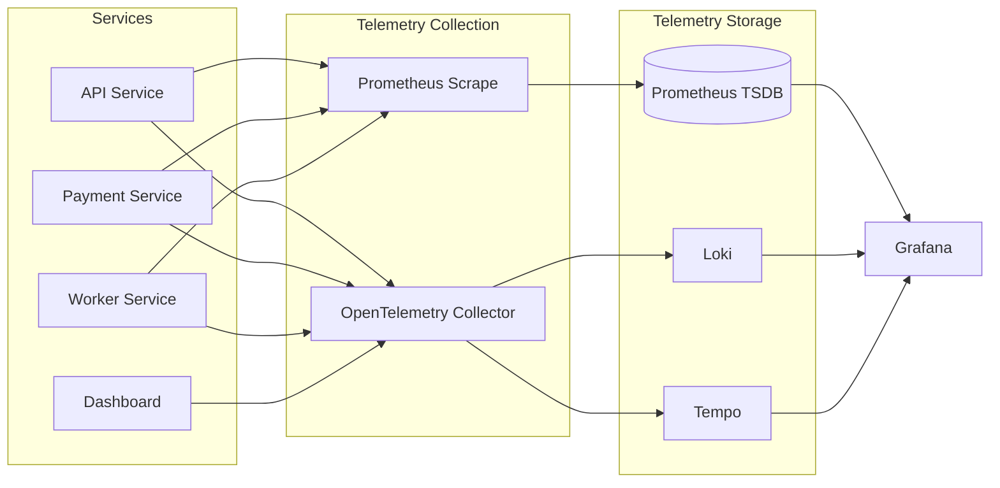

# Volume 9 — Observability and Monitoring (Detailed)

This section consolidates monitoring and observability practices from `Deployment/docs/monitoring.md` and runtime config.

---

## 1. Goals

- Full visibility across payment, ledger, and webhook flows
- Correlated logs and traces for debugging
- Metrics for latency, errors, throughput, and queue health
- Minimal operational overhead using open‑source stack

---

## 2. Components

1. **Grafana** — dashboards and visualization
2. **Prometheus** — metrics collection
3. **Loki** — logs backend
4. **Tempo** — tracing backend
5. **OTel Collector** — tracing ingestion
6. **Promtail** — log shipping
7. **Blackbox Exporter** — HTTP probes
8. **Node Exporter** — host metrics
9. **cAdvisor** — container metrics

---

## 3. Ports and Endpoints

- Grafana: `3000`
- Prometheus: `9090`
- Loki: `3100`
- Tempo: `3200`
- OTel Collector: `4317` (gRPC), `4318` (HTTP)
- Metrics ports: `9464` (api), `9465` (payment), `9466` (worker)
- Blackbox: `9115`

---

## 4. Logging Standards

### 4.1 Fields
Standard fields (examples):
- `event`, `source`, `component`, `merchantId`, `providerId`, `transactionId`, `orderId`
- `traceId`, `spanId`, `requestId`, `correlationId`

### 4.2 Redaction
Provider HTTP client redacts sensitive keys:
- API keys, tokens, passwords
- Account numbers, IFSC
- Email/phone

### 4.3 Log Classification
- `payment.workflow.*` for workflows
- `provider.http.*` for provider requests
- `job.*` and `webhook.*` for worker tasks

---

## 5. Tracing Standards

- Auto instrumentation via OpenTelemetry
- Trace ID and span ID added to logs
- Exported to Tempo via OTel Collector

---

## 6. Metrics Standards

- OTel Prometheus exporter enabled in backend
- Prometheus scrapes app + OTel

---

## 7. Retention Policies

- Prometheus metrics: 30 days
- Loki logs: 30 days
- Tempo traces: 30 days

---

## 8. Deployment (Monitoring Stack)

Deploy with Docker Compose:
```
cd monitoring
docker compose --env-file ../clients/<client>/.env.stack up -d
```

If app network is missing:
```
docker network create <client>_fintech_network
```

---

## 9. Promtail (Log Shipping)

Example promtail config includes:
- Docker SD discovery
- JSON pipeline parsing
- Log field labeling (event/source/merchantId)

---

## 10. Example Queries

- Webhook traffic by provider
- Webhook failure rate
- Status poll updates
- Callback failures by source

---

End of Volume 9.


---

## Diagrams

### Observability Pipeline




