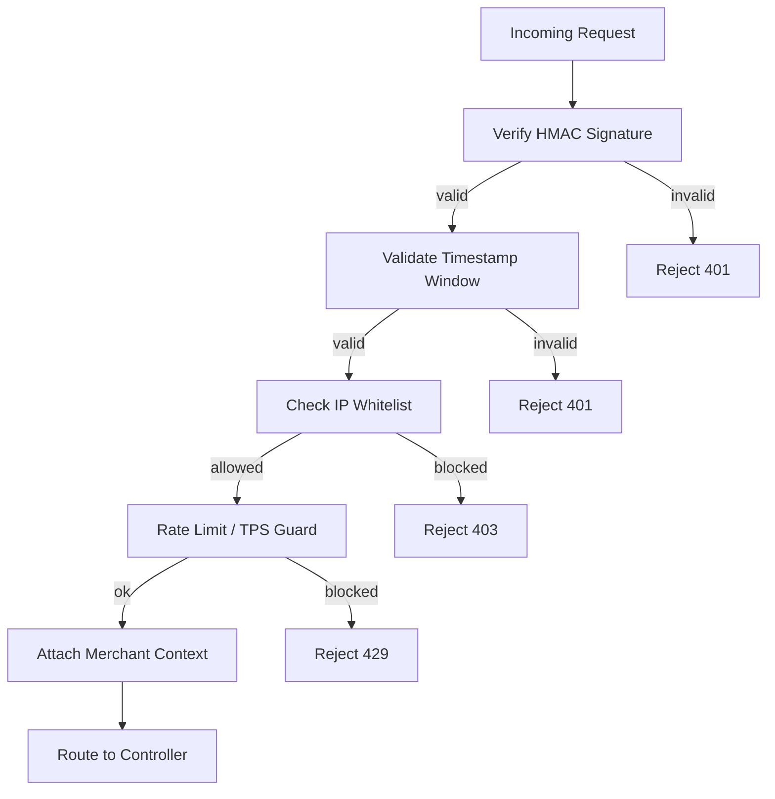

# Volume 11 — Security, Privacy, and Compliance Mapping

This section maps implemented controls to common security themes. Compliance certifications are **TBD** in this repo and should be validated separately.

---

## 1. Authentication & Authorization

### 1.1 Merchant Auth
- HMAC signature based on raw body and timestamp
- Timestamp tolerance: ±60 seconds
- Optional legacy hash support

### 1.2 Admin/Auth
- JWT authentication using `JWT_SECRET`
- Roles enforced by middleware

---

## 2. Network Security

- IP whitelisting per merchant payin/payout
- Panel IP whitelist for admin
- Caddy reverse proxy terminates TLS

---

## 3. Data Protection

### 3.1 Encryption
- Merchant secrets encrypted with AES‑256‑GCM
- Encryption key derived from `API_SECRET_ENC_KEY` or `JWT_SECRET`

### 3.2 Secret Handling
- Secrets are not logged
- Provider HTTP redacts sensitive fields

---

## 4. Auditability

- Structured audit logs with trace IDs
- Audit logs persisted to MongoDB
- Ledger audit logs in Postgres

---

## 5. Compliance Gaps (TBD)

- PCI DSS: **TBD**
- SOC2: **TBD**
- ISO 27001: **TBD**
- Data retention policy: **TBD**

---

End of Volume 11.

---

## Diagrams

### Request Validation Flow

