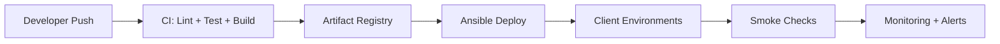

# Volume 13 — CI/CD, Testing, and Release Management

This section is partially speculative; no CI/CD pipeline files are present in the repo.

---

## 1. Build Process

Backend:
- `bun install`
- `bun run build` (TypeScript compile + alias rewrite)

Frontend:
- `yarn install`
- `yarn dev` (local)
- `yarn build` (production)

---

## 2. Release Strategy (Suggested)

1. Build backend Docker image
2. Build frontend Docker image
3. Push images to registry
4. Deploy via Ansible per stack

---

## 3. Testing Strategy (Observed + Suggested)

### 3.1 Unit Tests
- Not present in repo (TBD)

### 3.2 Integration Tests
- Not present (TBD)

### 3.3 UAT
- UAT endpoints exist for merchants
- Callback simulation after ~2 seconds

### 3.4 Performance Testing
- Not documented (TBD)

---

## 4. Versioning and Release Notes

- Release process not documented
- Suggest semantic versioning for API and backend

---

End of Volume 13.

---

## Diagrams

### CI/CD Pipeline

