# Wisipay Finetech 2.1 — Full Technical Project Report

Audience: Internal Engineering
Purpose: Knowledge Transfer
Language: English
Generated from repo state

---

# Wisipay Finetech 2.1 — Technical Project Report (Internal Engineering)

Document Type: Full Technical Report (HLD + LLD + System Design)
Version: 0.1 (generated from repo state)
Audience: Internal Engineering
Language: English
Scope: Backend, Frontend, Deployment/Infra, Workflows, Security, Observability

---

## Volume Plan (Target 100+ pages total)

- Volume 1: Executive Summary, Scope, System Context, HLD Overview
- Volume 2: Backend LLD (Services, Controllers, Workflows, Ledger, Providers)
- Volume 3: Frontend LLD, Data Model, API Contract, Integration Details
- Volume 4: Infrastructure, Deployment, Observability, NFRs, Security, Ops
- Volume 5: Appendices (Config, Glossary, Checklists, Risk Register)

---

## Detailed Table of Contents

### 1. Executive Summary
1.1 Business Objective and Scope
1.2 Outcomes and Key Capabilities
1.3 Target Users and Stakeholders

### 2. Project Context
2.1 Problem Statement
2.2 Constraints and Assumptions
2.3 Out-of-Scope Items
2.4 Terminology and Acronyms

### 3. System Context (C4 Level 1)
3.1 Actors and Roles (Merchants, Admins, Providers)
3.2 External Systems and Integrations
3.3 Context Diagram (Logical)
3.4 Trust Boundaries

### 4. High-Level Architecture (HLD)
4.1 Architectural Style and Tenets
4.2 Service Topology (API, Payment, Worker, Frontend)
4.3 Data Stores (Postgres, MongoDB, Redis)
4.4 Observability and Logging Stack
4.5 Deployment Topology (App, Databases, Monitoring Stacks)
4.6 HLD Diagram (System/Container)

### 5. Core Business Capabilities
5.1 Payin Lifecycle
5.2 Payout Lifecycle
5.3 Status Polling and Webhooks
5.4 Ledger and Accounting
5.5 Reporting and Exports
5.6 Manual Operations (Admin)

### 6. System Design (Flows)
6.1 Payin Initiation — Sequence
6.2 Payin Webhook — Sequence
6.3 Payout Initiation — Sequence
6.4 Payout Polling — Sequence
6.5 Manual Status Update — Sequence
6.6 Provider Fee Settlement — Sequence

### 7. Data Architecture
7.1 Primary Data Entities (Transaction, Merchant, Provider, Ledger)
7.2 Storage Mapping (Mongo vs Postgres)
7.3 Indexing and Query Patterns
7.4 Data Consistency and Idempotency

### 8. Backend LLD
8.1 Layering Overview (Controllers, Services, Repos, Workflows)
8.2 Instances (api, payment, worker)
8.3 Payment Module (Controllers, DTOs, Service)
8.4 Ledger Module (Transfer, Entry, Operations)
8.5 Provider Config and Provider Client
8.6 Security Middleware (HMAC, IP Whitelist)
8.7 Job and Webhook Queues
8.8 Audit and Logging

### 9. Frontend LLD
9.1 Dashboard Structure
9.2 UI Components and Data Model
9.3 Auth/Session (if any)
9.4 API Integration Points

### 10. Infrastructure & Deployment
10.1 Docker Packaging
10.2 App Stack (Caddy, API, Payment, Worker, Frontend)
10.3 Databases Stack (Postgres, Mongo, Redis)
10.4 Monitoring Stack (Prometheus, Loki, Grafana, Tempo, OTel Collector)
10.5 Network Segmentation and Ports
10.6 Ansible Deployment Workflow
10.7 Environment Configuration and Secrets

### 11. Non-Functional Requirements
11.1 Performance and Throughput
11.2 Availability and Resilience
11.3 Security Controls
11.4 Compliance (Documented / TBD)
11.5 Observability (Logs, Metrics, Traces)
11.6 Operational Controls and Maintenance

### 12. Risk Register
12.1 Known Risks
12.2 Mitigations
12.3 Residual Risks

### 13. Testing Strategy
13.1 Unit Testing
13.2 Integration Testing
13.3 UAT Flows
13.4 Performance Testing

### 14. CI/CD and Release Strategy
14.1 Build Pipeline
14.2 Artifact Strategy
14.3 Deployment Strategy
14.4 Rollback Strategy

### 15. Appendices
15.1 API Reference Summary
15.2 Configuration Matrix
15.3 Glossary
15.4 Open Questions / TBD Items

---

Notes:
- This report is generated from repo structure and configuration. Items not found in code/config are marked as TBD.
- Detailed volumes will be produced iteratively to reach 100+ pages.


---

# Volume 1 — Executive Summary, Context, and HLD

## 1. Executive Summary

### 1.1 Business Objective and Scope
Wisipay Finetech 2.1 is a fintech payments platform that provides merchant-facing Payin and Payout APIs, a double‑entry ledger, provider integrations, and an internal admin/monitoring experience. The system processes transactions through external providers, posts accounting entries into a ledger, stores transactional records, and supports manual/admin operational controls.

The project scope in this report includes:
- Merchant payment APIs (Payin and Payout)
- Provider integrations and webhooks
- Ledger processing and accounting entries
- Operational workflows (manual status update/sync, fee settlements)
- Observability, monitoring, and logging
- Deployment architecture and runtime topology

Out of scope (explicitly not defined in repo): compliance certifications, financial product terms, and customer KYC/AML workflows.

### 1.2 Outcomes and Key Capabilities
Key outcomes derived from repository structure and documentation:
- API‑driven Payin/Payout processing with request signing and IP whitelist controls
- Asynchronous status resolution using webhook ingestion and polling (for payout)
- Ledger management with double‑entry accounting and posting workflows
- Multi‑provider routing and per‑channel configuration
- Admin manual operations for status corrections and settlement jobs
- Operational visibility via metrics, logs, and traces

### 1.3 Target Users and Stakeholders
- **Internal Engineering**: maintain core payment flows, ledger integrity, and integration stability
- **Operations/Admin**: resolve exceptions, trigger manual updates and fee settlements
- **Merchants/Clients**: integrate with Payin/Payout API endpoints
- **Compliance/Security**: audit trails, signing, IP controls, logging

---

## 2. Project Context

### 2.1 Problem Statement
Merchants require a reliable API to accept payments (Payin) and disburse funds (Payout). The platform must reliably track transactional state, provide accounting correctness, and handle multiple provider integrations with different APIs and webhook formats. It must also support manual corrections and report generation.

### 2.2 Constraints and Assumptions
Assumptions based on the repository:
- Ledger uses a dedicated Postgres‑backed ledger module (`libs/fintech-ledger`)
- Transactional metadata is stored in MongoDB (Mongoose)
- Redis is used for caching, queues, and rate‑limiting (TPS)
- Infrastructure is containerized and deployed using Docker Compose + Ansible
- Observability uses Prometheus for metrics and Loki/Tempo for logs/traces

Constraints:
- No explicit CI/CD pipeline scripts are provided in repo
- Compliance requirements (PCI, SOC2, etc.) are not specified
- SLA/availability targets are not documented in code

### 2.3 Out‑of‑Scope Items
- Customer identity verification (KYC/AML)
- Settlement banking integrations beyond provider‑level APIs
- Multi‑currency and FX processing (not documented)

### 2.4 Terminology and Acronyms
- **Payin**: Customer‑to‑merchant payment collection
- **Payout**: Merchant‑to‑beneficiary disbursement
- **PLE**: Provider Legal Entity (provider + legal entity channel)
- **Ledger**: Double‑entry accounting system (Postgres)
- **UAT**: User Acceptance Testing environment for merchant integrations

---

## 3. System Context (C4 Level 1)

### 3.1 Actors and Roles
- **Merchant**: Calls Payin/Payout APIs and receives callbacks
- **Admin/Ops**: Uses internal endpoints for manual corrections
- **Provider**: External payment provider API and webhook source
- **System Worker**: Background jobs for polling, expiry, and settlement

### 3.2 External Systems and Integrations
- Payment providers (e.g., Payprime, SabioPay, TPIPay)
- Email provider (ZeptoMail)
- Monitoring stack (Prometheus, Grafana, Loki, Tempo)

### 3.3 Context Diagram (Logical)
```mermaid
flowchart LR
  Merchant-->API[API Service]
  Merchant-->Payment[Payment Service]
  Payment-->Provider[External Provider APIs]
  Provider-->Webhook[Webhook Endpoint]
  Webhook-->Payment
  Payment-->Ledger[Ledger (Postgres)]
  Payment-->Mongo[(MongoDB)]
  Payment-->Redis[(Redis)]
  Worker[Worker Service]-->Redis
  Worker-->Ledger
  Worker-->Mongo
  Admin-->Payment
  Observability[(Prometheus/Loki/Tempo)]<-->API
  Observability<-->Payment
  Observability<-->Worker
```

### 3.4 Trust Boundaries
- Merchant‑facing APIs are protected by HMAC signature verification and timestamp window
- IP whitelist controls applied per merchant for Payin/Payout endpoints
- Admin endpoints require `x-admin-email` (internal usage, not public)

---

## 4. High‑Level Architecture (HLD)

### 4.1 Architectural Style and Tenets
- **Service‑oriented**: API instance, Payment instance, Worker instance
- **Event‑driven**: background jobs and webhook processing
- **Ledger integrity**: double‑entry accounting with posting and reversal workflows
- **Observability‑first**: structured logging + metrics + tracing

### 4.2 Service Topology
Based on `Backend-2.1/README.md` and `Deployment/app/docker-compose.yml`:
- **API Service** (`instances/api`) – public endpoints
- **Payment Service** (`instances/payment`) – internal payments workflows and merchant APIs
- **Worker Service** (`instances/worker`) – background jobs and polling
- **Frontend** (Next.js dashboard)

### 4.3 Data Stores
- **Postgres 16**: Ledger data (double‑entry, balances, audit)
- **MongoDB 7**: Transaction records, metadata, audit logs
- **Redis 7**: Caching, rate limiting (TPS), job queues, polling flags

### 4.4 Observability Stack
From `Deployment/monitoring/docker-compose.yml`:
- Prometheus (metrics)
- Loki (logs)
- Tempo (traces)
- OpenTelemetry Collector
- Grafana (dashboards)
- Promtail (log collection)
- Node‑Exporter & cAdvisor (host/container metrics)

### 4.5 Deployment Topology
App stack (`Deployment/app/docker-compose.yml`):
- API, Payment, Worker services (backend image)
- Frontend service (dashboard image)
- Caddy as edge/reverse proxy
- Promtail + node-exporter + cAdvisor on app host

Databases stack (`Deployment/databases/docker-compose.yml`):
- Postgres (SSL enabled)
- MongoDB
- Redis (password protected)
- Promtail + node-exporter + cAdvisor on DB host

Monitoring stack (`Deployment/monitoring/docker-compose.yml`):
- Prometheus, Loki, Tempo, OTel Collector, Grafana
- Caddy for monitoring endpoints

Note: `Deployment/README.md` mentions Traefik but the current compose files use Caddy. This report follows the compose files as source of truth.

### 4.6 HLD Diagram (Container View)
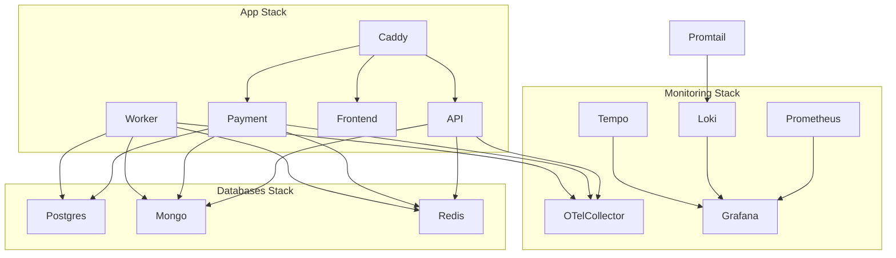

---

## 5. Core Business Capabilities (HLD View)

### 5.1 Payin Lifecycle
- Merchant initiates Payin via `/api/payment/payin/initiate`
- Payment service routes to provider and returns payment URL
- Webhooks update transaction status
- Ledger entries created on success
- Merchant callbacks sent after status update

### 5.2 Payout Lifecycle
- Merchant initiates Payout via `/api/payment/payout/initiate`
- Ledger hold is applied
- Provider initiation returns pending/success/failed
- Status polling runs for pending payouts
- On success: ledger commit; on failure: void or reverse

### 5.3 Status Polling and Webhooks
- Payout status polling scheduled in worker (Redis + delayed jobs)
- Webhooks processed through worker/queue
- Polling stops when definitive status arrives

### 5.4 Ledger and Accounting
- Double‑entry ledger with `POSTED`, `PENDING`, `VOIDED` states
- Supports transfer, post, reverse, and void operations
- Ledger accounts generated based on entity + purpose

### 5.5 Reporting and Exports
- Transaction reports (merchant/admin views)
- Account statement and ledger reports
- CSV export with expanded fields for admin

### 5.6 Manual Operations
- Manual status update and sync (admin)
- Expire pending payins for a date (admin)
- Provider fee settlement enqueue and verification

---

## 6. System Design (Selected Flows)

### 6.1 Payin Initiation (Sequence)
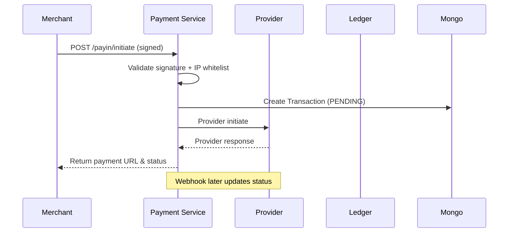

### 6.2 Payin Webhook (Sequence)
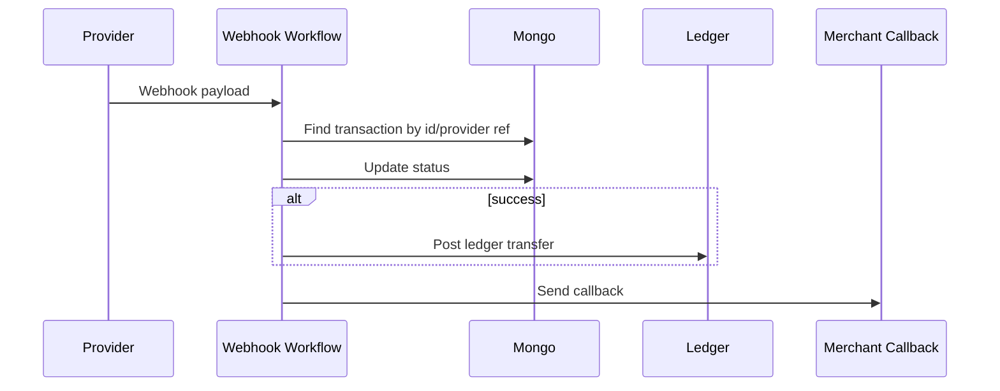

### 6.3 Payout Initiation (Sequence)
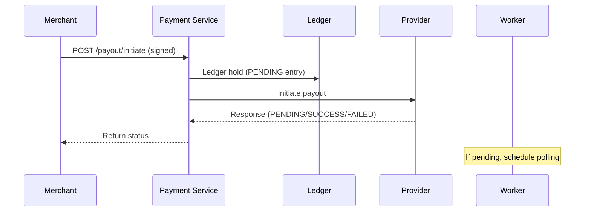

### 6.4 Payout Status Polling (Sequence)
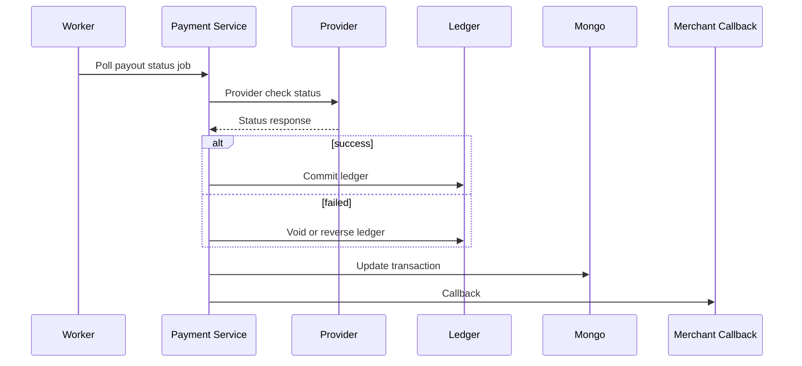

---

## 7. Technology Stack (HLD)

### 7.1 Backend
- Runtime: Bun (package manager), Node.js compatible environment
- Web framework: Hono
- Language: TypeScript
- ORM/DB: Mongoose (MongoDB), Kysely/pg (Postgres)
- Caching/Queue: Redis (ioredis)
- Logging: Pino
- Observability: OpenTelemetry SDK, Prometheus exporter

### 7.2 Frontend
- Framework: Next.js 15 (App Router)
- UI: React 19
- Styling: Tailwind CSS 4
- Dashboard template for financial UI

### 7.3 Infrastructure
- Containers: Docker
- Orchestration: Docker Compose
- Reverse proxy: Caddy
- Deployment: Ansible playbooks (multi‑client)
- Monitoring: Prometheus, Grafana, Loki, Tempo, OTel Collector

---

## 8. Open Questions / TBD

- Exact SLAs and performance targets
- Compliance requirements (PCI/SOC2/ISO)
- Disaster recovery and backup policies
- CI/CD automation and pipeline definitions

---

End of Volume 1.


---

# Volume 2 — Backend LLD (Services, Workflows, Ledger, Providers)

## 1. Backend Overview

### 1.1 Runtime and Framework
- Runtime: Bun (package manager) with Node‑compatible runtime
- Framework: Hono
- Language: TypeScript
- Entry points: `src/instances/api.ts`, `src/instances/payment.ts`, `src/instances/worker.ts`

### 1.2 Architectural Layers
- Controllers: HTTP endpoints and request/response handling
- DTOs: Request validation via Zod
- Services: Core business logic (payments, ledger, provider, reporting)
- Workflows: Orchestration of multi‑step flows (payin/payout/webhook)
- Repositories: Data access layer (Mongo/Mongoose)
- Infra: Logging, telemetry, Redis, Mongo, Postgres (ledger)

---

## 2. Process Instances

### 2.1 API Instance
- File: `Backend-2.1/src/instances/api.ts`
- Purpose: Public and admin HTTP endpoints (non‑payment services)
- Bootstrap: `src/bootstrap.ts`

### 2.2 Payment Instance
- File: `Backend-2.1/src/instances/payment.ts`
- Purpose: Merchant payment APIs, provider interactions, webhook endpoints
- Observability: OTel SDK loaded at startup

### 2.3 Worker Instance
- File: `Backend-2.1/src/instances/worker.ts`
- Purpose: Background job processing, scheduled polling, settlement jobs
- Observability: OTel SDK loaded at startup

---

## 3. Core Domain Modules

### 3.1 Transaction Domain
- Model: `Backend-2.1/src/models/transaction.model.ts`
- Key attributes (observed in code):
  - `id`, `orderId`, `type`, `status`
  - `amount`, `netAmount`, `currency`
  - `merchantId`, `providerId`, `legalEntityId`, `providerLegalEntityId`
  - `utr`, `providerRef`
  - `events` (audit trail)
  - `meta` (ledgerEntryId, manualLedgerEntries, flags)

### 3.2 Ledger Domain
- Ledger core: `Backend-2.1/libs/fintech-ledger`
- Service wrapper: `Backend-2.1/src/services/ledger/ledger.service.ts`
- Operations:
  - `transfer`, `post`, `reverse`, `void`
  - Supports `PENDING` and `POSTED` flows
  - Double‑entry accounting using Postgres backend

### 3.3 Provider Domain
- Provider config and clients under `Backend-2.1/src/provider-config`
- Provider routing and config resolution under `Backend-2.1/src/services/provider-config`

---

## 4. Controllers and Routes

### 4.1 Payment Controller
- File: `Backend-2.1/src/controllers/payment/payment.controller.ts`
- Responsibilities:
  - Payin/payout initiation endpoints
  - Manual admin endpoints (status update, status sync, expire pending, fee settlement)
  - Audit logging for manual actions

### 4.2 Webhook Controller
- File: `Backend-2.1/src/controllers/payment/webhook.controller.ts`
- Responsibilities:
  - Ingest provider webhooks
  - Pass raw payload to workflow
  - Capture raw body + headers for observability

### 4.3 Payment Routes
- File: `Backend-2.1/src/routes/payment/payment.routes.ts`
- Endpoints (subset):
  - `/api/payment/payin/initiate`
  - `/api/payment/payout/initiate`
  - `/api/payment/:orderId` and status endpoints
  - `/api/payment/manual/status/update`
  - `/api/payment/manual/status/sync`
  - `/api/payment/manual/expire/pending-previous-day`
  - `/api/payment/manual/provider-fee-settlement`

---

## 5. DTOs and Validation

### 5.1 Payment DTOs
- Validation via Zod schemas
- Location: `Backend-2.1/src/dto/payment/*.ts`
- Examples:
  - `ManualStatusUpdateSchema`
  - `ManualStatusSyncSchema`
  - `ManualExpirePendingSchema`
  - `ManualProviderFeeSettlementSchema`

### 5.2 Ledger DTOs
- Location: `Backend-2.1/src/dto/ledger/*.ts`
- Used for internal transfer and operations orchestration

---

## 6. Workflows

### 6.1 Payin Workflow
- File: `Backend-2.1/src/workflows/payin.workflow.ts`
- Steps (high‑level):
  - Validate merchant and request
  - Create transaction record
  - Initiate provider payin
  - Update status and send callback
  - Schedule auto‑expiry if pending

### 6.2 Payout Workflow
- File: `Backend-2.1/src/workflows/payout.workflow.ts`
- Steps (high‑level):
  - Validate merchant request
  - Create transaction record
  - Ledger hold (PENDING entry)
  - Provider initiate
  - Schedule status polling if pending
  - Commit or void ledger based on provider result

### 6.3 Webhook Workflow
- File: `Backend-2.1/src/workflows/webhook.workflow.ts`
- Steps (high‑level):
  - Parse and validate webhook payload
  - Lookup transaction by id/provider reference
  - Update status and ledger entries
  - Stop payout polling on definitive status
  - Send merchant callback

---

## 7. Services

### 7.1 Payment Service
- File: `Backend-2.1/src/services/payment/payment.service.ts`
- Responsibilities:
  - Core transaction lifecycle changes
  - Manual status update and sync
  - Expire pending payins for a date
  - Manual provider fee settlement enqueue
  - Ledger updates (commit/void/reverse) as needed
  - Trigger merchant callbacks

### 7.2 Payment Ledger Service
- File: `Backend-2.1/src/services/payment/payment-ledger.service.ts`
- Responsibilities:
  - Ledger transfers for payin/payout
  - Commit, void, and reverse entries
  - Track manual ledger entries in transaction metadata

### 7.3 Transaction Monitor Service
- File: `Backend-2.1/src/services/payment/transaction-monitor.service.ts`
- Responsibilities:
  - Schedule payin auto‑expiry
  - Schedule payout status polling
  - Execute polling jobs and update transactions
  - Stop polling on definitive status

### 7.4 Ledger Operation Service
- File: `Backend-2.1/src/services/ledger/ledger-operation.service.ts`
- Responsibilities:
  - Standardized ledger postings for business operations
  - Resolves accounts for merchant/provider/legal entity
  - Supports operational entries (settlements, fees)

### 7.5 Ledger Transfer Service
- File: `Backend-2.1/src/services/ledger/ledger-transfer.service.ts`
- Responsibilities:
  - Validates and builds ledger transfers
  - Supports backdated entries and value dates
  - Creates transaction records around transfers

### 7.6 Ledger Entry Service
- File: `Backend-2.1/src/services/ledger/ledger-entry.service.ts`
- Responsibilities:
  - Account statement generation
  - General ledger, trial balance, balance sheet
  - Paginated ledger entries and filters

### 7.7 Report Service
- File: `Backend-2.1/src/services/common/report.service.ts`
- Responsibilities:
  - CSV exports of transactions and ledger statements
  - Admin fields expansion

### 7.8 Audit Service
- File: `Backend-2.1/src/services/common/audit.service.ts`
- Responsibilities:
  - Structured audit logging
  - Persist audit logs to MongoDB

### 7.9 Cache Service
- File: `Backend-2.1/src/services/common/cache.service.ts`
- Responsibilities:
  - Cache merchants, providers, and channels in Redis
  - Apply channel overrides for payout polling

---

## 8. Provider Integrations

### 8.1 Provider Client
- Location: `Backend-2.1/src/services/provider-config`
- Responsibilities:
  - Load provider configs
  - Execute provider API calls
  - Centralized request execution

### 8.2 Provider HTTP
- File: `Backend-2.1/src/provider-config/provider-http.ts`
- Responsibilities:
  - Standardized HTTP call wrapper for providers
  - Sensitive data redaction in logs
  - Request/response logging and raw body capture

### 8.3 Payprime Provider
- File: `Backend-2.1/src/provider-config/payprime.provider.ts`
- Features:
  - Payout initiation and status check
  - Webhook parsing (supports array payloads)
  - Flexible resolution of transaction IDs and UTR

### 8.4 SabioPay Provider
- File: `Backend-2.1/src/provider-config/sabiopay.provider.ts`
- Features:
  - Payout initiation with duplicate merchant reference handling
  - Enhanced error parsing and messaging
  - Status checks with fallback UTR fields

### 8.5 TPIPay Provider
- File: `Backend-2.1/src/provider-config/tpipay.provider.ts`
- Feature:
  - Callback URL disabled in payload (as per latest change)

---

## 9. Security Controls

### 9.1 Merchant Request Signing
- File: `Backend-2.1/src/middlewares/payment-security.middleware.ts`
- Standard signature: `HMAC_SHA256(rawBody + "|" + timestamp, secret)`
- Legacy signature: `HMAC_SHA256(amount|currency|orderId|secret)`
- Timestamp window: 60 seconds

### 9.2 IP Whitelisting
- Per‑merchant and per‑service whitelist enforcement
- Dashboard bypass allowed for configured trusted origins

### 9.3 Admin Controls
- Admin endpoints require `x-admin-email`
- Audit logging for all manual operations

---

## 10. Logging and Observability

### 10.1 Logging
- Logger: Pino
- Context: AsyncLocalStorage (`src/infra/log-context.ts`)
- Standard event fields: `requestId`, `correlationId`, `traceId`, `spanId`, `actorId`, `merchantId`

### 10.2 Metrics and Tracing
- OpenTelemetry SDK (`src/infra/otel-sdk.ts`)
- Prometheus exporter for metrics
- OTLP exporter for traces

---

## 11. Job and Webhook Queues

### 11.1 Job Queue
- File: `Backend-2.1/src/utils/job-queue.util.ts`
- Backed by Redis
- Supports delayed jobs
- Used for settlement and polling jobs

### 11.2 Webhook Queue
- File: `Backend-2.1/src/utils/webhook-queue.util.ts`
- Backed by Redis
- Retries and DLQ handling

### 11.3 Worker
- File: `Backend-2.1/src/workers/background.worker.ts`
- Job types:
  - `PROVIDER_FEE_SETTLEMENT`
  - `PAYIN_AUTO_EXPIRE`
  - `PAYOUT_STATUS_POLL`
  - `SETTLEMENT_VERIFICATION`
- Webhook processing executed with log context

---

## 12. Error Handling and Resilience

### 12.1 Payment Errors
- File: `Backend-2.1/src/utils/payment-errors.util.ts`
- Standardized error codes and messages
- Includes ledger error mapping

### 12.2 Idempotency and Reversal
- Idempotency keys used in ledger transfers
- Ledger reverse and void operations used for error correction

---

## 13. Backend LLD Summary

The backend is a service‑oriented architecture with clear separation between transport, orchestration, and domain logic. Payment lifecycle management is centralized in workflow and service layers, while ledger integrity is enforced through a dedicated double‑entry module and structured operational controls. Observability is embedded throughout with structured logging and tracing.

End of Volume 2.


---

# Volume 3 — Frontend LLD, Data Model, and API Integration

## 1. Frontend Overview

### 1.1 Framework and Tooling
- Framework: Next.js 15 (App Router)
- Language: TypeScript
- UI: React 19
- Styling: Tailwind CSS 4
- Repo location: `Frontend/`

### 1.2 Purpose
- Internal dashboard for financial operations
- Visualizes transactions, balances, and analytics
- Note: The `Frontend/README.md` describes the UI as a template. If production usage differs, this section should be updated.

---

## 2. Project Structure

Directory structure from `Frontend/README.md`:
```
Frontend/src/
app/
components/
utils/
```

Key components:
- `Dashboard.tsx` – main layout
- `TransactionsPanel.tsx` – transaction list UI
- `StatisticsChart.tsx` – analytics chart
- `CardSection.tsx` and `CreditCard.tsx` – account cards
- `Sidebar.tsx` and `Header.tsx` – navigation and header

---

## 3. UI and UX Design

### 3.1 Layout
- Sidebar navigation with primary sections
- Dashboard grid with key widgets
- Responsive layout for desktop and mobile

### 3.2 Visual Theme
- Dark theme with gradient accents
- Glass‑morphism card styling
- Typography via Inter

---

## 4. Data Model (Frontend View)

The dashboard template does not include explicit runtime API integrations in the README. The expected data model for production would typically include:
- Merchant summary
- Transaction list with status and amount
- Balance summary
- Provider status metrics

This section should be updated once frontend API calls are wired to backend endpoints.

---

## 5. API Integration Points (Expected)

Based on backend endpoints:
- Transaction list and status
  - `GET /api/payment/:orderId`
  - `GET /api/payment/payin/status/:orderId`
  - `GET /api/payment/payout/status/:orderId`
- Initiate payin and payout
  - `POST /api/payment/payin/initiate`
  - `POST /api/payment/payout/initiate`

Admin/internal operations (if wired to dashboard):
- Manual status update
- Manual status sync
- Expire pending payins
- Provider fee settlement

These integrations are not visible in frontend code, so they are listed as expected only.

---

## 6. Security and Auth (Frontend)

The repository does not define frontend authentication flows. Possible approaches for production:
- Session‑based auth
- JWT‑based auth
- Admin UI behind Caddy or internal network

This section should be updated based on actual implementation.

---

## 7. Frontend LLD Summary

The frontend repository is structured as a dashboard template using Next.js and Tailwind, with reusable components for finance‑oriented UI. The current codebase appears template‑oriented and needs explicit API integration definitions for production usage.

End of Volume 3.


---

# Volume 4 — Infrastructure, Deployment, Observability, and NFRs

## 1. Infrastructure Overview

### 1.1 Deployment Model
- Containerized deployment with Docker Compose
- Multi‑stack architecture:
  - App stack
  - Databases stack
  - Monitoring stack
- Orchestration via Ansible playbooks for multi‑client environments

### 1.2 App Stack (from `Deployment/app/docker-compose.yml`)
Services:
- `api` (backend API service)
- `payment` (payment service)
- `worker` (background jobs)
- `frontend` (Next.js dashboard)
- `caddy` (reverse proxy)
- `promtail`, `node-exporter`, `cadvisor` (monitoring agents)

Network:
- `fintech-network` bridge

### 1.3 Database Stack (from `Deployment/databases/docker-compose.yml`)
Services:
- `postgres` (ledger storage, SSL enabled)
- `mongo` (transaction and audit storage)
- `redis` (cache + queues)
- `promtail`, `node-exporter`, `cadvisor`

### 1.4 Monitoring Stack (from `Deployment/monitoring/docker-compose.yml`)
Services:
- `prometheus` (metrics)
- `grafana` (visualization)
- `loki` (logs)
- `tempo` (traces)
- `otel-collector` (OpenTelemetry ingest)
- `promtail` (log collection)
- `caddy` (proxy)

---

## 2. Deployment and Operations

### 2.1 Ansible Deployment
- Repo: `Deployment/ansible`
- Playbooks:
  - `ansible/playbooks/site.yml`
  - `ansible/playbooks/app.yml`
  - `ansible/playbooks/databases.yml`
  - `ansible/playbooks/monitoring.yml`
- Environment separation: `Deployment/clients/<client>`

### 2.2 Client‑specific Environments
- `.env.stack`, `.env.backend`, `.env.dashboard`, `.env.databases`, `.env.monitoring`
- Logo assets under `Deployment/clients/<client>/<client>.png`

### 2.3 Reverse Proxy
- Caddy is used for app and monitoring stacks
- Handles TLS termination and routing

---

## 3. Observability

### 3.1 Logs
- Structured JSON logging via Pino
- Context propagation via AsyncLocalStorage
- Centralized shipping via Promtail to Loki

### 3.2 Metrics
- Prometheus exporter in backend via OpenTelemetry SDK
- Node exporter and cAdvisor for host and container metrics

### 3.3 Tracing
- OpenTelemetry SDK configured with OTLP trace exporter
- Traces sent to Tempo via OTel Collector

---

## 4. Non‑Functional Requirements (NFRs)

The repo does not define formal NFRs. The following are inferred and should be validated:

### 4.1 Performance
- API response times targeted for synchronous Payin/Payout initiation
- Asynchronous processing for polling and webhook handling
- Redis‑backed queues to offload processing

### 4.2 Availability
- Multiple services deployed per stack
- Health checks defined for API, payment, worker, frontend
- Redis and databases deployed as single instances per stack

### 4.3 Security
- HMAC‑based request signing
- Timestamp validation to prevent replay
- IP whitelist controls per merchant
- Encrypted secrets (API secret decryption in middleware)

### 4.4 Compliance
- Compliance requirements not specified (TBD)
- Audit logging and traceability present

### 4.5 Scalability
- Horizontal scaling possible for API/payment/worker
- Redis and databases are single nodes by default
- Provider polling and webhook workflows are asynchronous

---

## 5. Operational Workflows

### 5.1 Payin Auto‑Expiry
- Configurable via `PAYIN_AUTO_EXPIRE_MINUTES`
- Scheduled by `TransactionMonitorService`

### 5.2 Payout Status Polling
- Payout polling is delayed and bounded
- Stop polling on final status

### 5.3 Provider Fee Settlement
- Enqueue settlement jobs per PLE and date
- Skip if settlement exists for given date

---

## 6. Configuration Management

### 6.1 Environment Variables
- Backend: `Backend-2.1/src/config/env.ts`
- Frontend: `Frontend/.env` (not detailed in repo)
- Monitoring: `Deployment/clients/<client>/.env.monitoring`

### 6.2 Secrets
- Merchant API secrets stored encrypted
- Redis password set via env
- Postgres SSL enabled via mounted certificates

---

## 7. Risks and Gaps

- No explicit DR or backup strategy described
- CI/CD pipeline is not documented
- Compliance requirements are not listed
- Production monitoring thresholds and alerts are not defined

End of Volume 4.


---

# Volume 5 — Appendices, Glossary, and Checklists

## Appendix A — API Reference Summary

Source: `Backend-2.1/PAYMENT_API_DOCUMENTATION.md`

### A.1 Merchant Endpoints
- `POST /api/payment/payin/initiate`
- `POST /api/payment/payout/initiate`
- `GET /api/payment/:orderId`
- `GET /api/payment/payin/status/:orderId`
- `GET /api/payment/payout/status/:orderId`

### A.2 UAT Endpoints
- `POST /api/payment/uat/payin/initiate`
- `POST /api/payment/uat/payout/initiate`
- `GET /api/payment/uat/:orderId`
- `GET /api/payment/uat/payin/status/:orderId`
- `GET /api/payment/uat/payout/status/:orderId`

### A.3 Manual Admin Endpoints
- `POST /api/payment/manual/status/update`
- `POST /api/payment/manual/status/sync`
- `POST /api/payment/manual/expire/pending-previous-day`
- `POST /api/payment/manual/provider-fee-settlement`

---

## Appendix B — Configuration Matrix (Partial)

### B.1 Backend Env (selected)
- `PAYIN_AUTO_EXPIRE_MINUTES`
- `REPORT_STORAGE_DIR`
- `AMOUNT_UNIT`
- `OTLP_HTTP_URL`

### B.2 Deployment Env
- `.env.stack` for stack runtime
- `.env.backend` for service settings
- `.env.databases` for DB credentials
- `.env.monitoring` for Grafana/Loki/etc

---

## Appendix C — Glossary

- **Payin**: Customer to merchant transaction
- **Payout**: Merchant to beneficiary transfer
- **Ledger**: Double‑entry accounting system
- **PLE**: Provider Legal Entity
- **OTel**: OpenTelemetry
- **TPS**: Transactions per second

---

## Appendix D — Operational Checklists

### D.1 Deployment Checklist
- Validate client env files
- Deploy databases stack
- Deploy monitoring stack
- Deploy app stack
- Verify health checks
- Verify Prometheus targets

### D.2 Release Checklist
- Build backend image
- Build frontend image
- Update env vars
- Deploy via Ansible
- Smoke tests for payin/payout

---

## Appendix E — Open Questions

- SLA targets and uptime commitments
- Backup and recovery procedures
- Compliance and audit scope
- Production incident response playbooks

---

End of Volume 5.


---

# Volume 6 — Extended Technical Deep Dive (Backend, Data, Security, Ops)

This addendum expands the base report with detailed technical content for knowledge transfer. All details are derived from the repository; any missing information is explicitly marked as TBD.

---

## 1. Codebase Map (Backend)

**Root**: `Backend-2.1/src/`

- `app.ts` — App bootstrap / wiring
- `bootstrap.ts` — Initialization of infra and app
- `instances/` — Entry points
  - `api.ts` — Public API instance
  - `payment.ts` — Payment instance
  - `worker.ts` — Background worker instance
- `controllers/` — Request handlers
- `dto/` — Request validation schemas (Zod)
- `services/` — Core business logic
- `workflows/` — Orchestrated flow logic
- `middlewares/` — Security, auth, tracing, logging, context
- `models/` — Mongoose schemas (MongoDB)
- `provider-config/` — Provider adapters and HTTP client
- `utils/` — Helpers: JWT, encryption, date, money, etc.
- `cron/` — Cron job registration
- `jobs/` — Ledger jobs (seal, snapshot, integrity, optimize, EOD)

---

## 2. Backend Entry Points (Detailed)

### 2.1 `instances/api.ts`
- Primary HTTP API service
- Hono server with routes and middlewares
- Exposes health endpoint and external APIs

### 2.2 `instances/payment.ts`
- Payment‑specific API service
- Handles merchant payment flows and webhooks
- Imports `otel-sdk` for tracing/metrics

### 2.3 `instances/worker.ts`
- Background job processing
- Registers cron jobs and processes queues
- Imports `otel-sdk` for tracing/metrics

---

## 3. Controllers (Deep Dive)

### 3.1 `PaymentController`
**File**: `src/controllers/payment/payment.controller.ts`

Core responsibilities:
- Payin/payout initiation endpoints
- Manual admin endpoints
- Validation and error handling
- Audit logging for manual operations

Manual endpoints (admin):
- Manual status update
- Manual status sync
- Manual expire pending payins
- Manual provider fee settlement

### 3.2 `WebhookController`
**File**: `src/controllers/payment/webhook.controller.ts`

Responsibilities:
- Receives webhook payload
- Logs raw body and headers
- Forwards payload into workflow

---

## 4. Middlewares (Deep Dive)

### 4.1 `payment-security.middleware.ts`
Purpose: Merchant request security

Key controls:
- Signature validation (HMAC SHA‑256)
- Timestamp window (60s)
- IP whitelist enforcement
- Merchant lookup and activation checks
- Legacy signature support

### 4.2 `auth.middleware.ts`
Purpose: Auth for internal/admin endpoints

Key controls:
- JWT verification
- Role assignment
- Log context enrichment

### 4.3 `context.ts`
Purpose: Request context

Key controls:
- Creates `requestId` and `correlationId`
- Injects into AsyncLocalStorage log context

### 4.4 `trace-id.ts`
Purpose: Tracing for requests

Key controls:
- Creates span per request
- Extracts `traceId` and `spanId`
- Adds to log context

### 4.5 `request-logger.ts`
Purpose: Request metrics logging

Key controls:
- `event= http.request`
- Captures method, path, status, duration

---

## 5. Workflows (Deep Dive)

### 5.1 Payin Workflow (`workflows/payin.workflow.ts`)

Step‑by‑step:
1. Validate merchant and request payload
2. Check TPS limits
3. Create transaction record (PENDING)
4. Initiate provider payin
5. Store provider response
6. Return response to merchant
7. If status is PENDING, schedule auto expiry

### 5.2 Payout Workflow (`workflows/payout.workflow.ts`)

Step‑by‑step:
1. Validate merchant and request
2. Check TPS and limits
3. Create transaction record (PENDING)
4. Create ledger hold entry (PENDING)
5. Initiate payout at provider
6. If pending/processing, schedule polling
7. On success: commit ledger
8. On failure: void or reverse ledger

### 5.3 Webhook Workflow (`workflows/webhook.workflow.ts`)

Step‑by‑step:
1. Parse webhook payload
2. Resolve transaction by transactionId or provider reference
3. Validate if transaction already finalized
4. Update transaction status
5. Post or reverse ledger entries as required
6. Stop polling if payout
7. Notify merchant via callback

---

## 6. Services (Deep Dive)

### 6.1 PaymentService
File: `src/services/payment/payment.service.ts`

Responsibilities:
- Manual status updates (payin/payout)
- Status sync via provider
- Expire pending payins by date
- Provider fee settlement enqueue
- Ledger updates on status change

### 6.2 PaymentLedgerService
File: `src/services/payment/payment-ledger.service.ts`

Responsibilities:
- Ledger transfers for payin/payout
- Commit, void, and reverse entries
- Manual ledger entry tracking

### 6.3 TransactionMonitorService
File: `src/services/payment/transaction-monitor.service.ts`

Responsibilities:
- Schedule payin expiry jobs
- Schedule payout polling jobs
- Process polling results

### 6.4 LedgerTransferService
File: `src/services/ledger/ledger-transfer.service.ts`

Responsibilities:
- Resolve ledger accounts
- Validate valueDate/backdated logic
- Create transaction records tied to transfers
- Execute ledger transfer

### 6.5 LedgerOperationService
File: `src/services/ledger/ledger-operation.service.ts`

Responsibilities:
- Predefined operational ledger postings
- Translates high‑level operations into ledger transfers

### 6.6 LedgerEntryService
File: `src/services/ledger/ledger-entry.service.ts`

Responsibilities:
- Ledger entry listing and filters
- Account statements with balances
- General ledger/trial balance

### 6.7 ReportService
File: `src/services/common/report.service.ts`

Responsibilities:
- Generates CSV reports
- Handles merchant/admin filters

### 6.8 AuditService
File: `src/services/common/audit.service.ts`

Responsibilities:
- Structured audit logging
- Persists audit logs to MongoDB

### 6.9 CacheService
File: `src/services/common/cache.service.ts`

Responsibilities:
- Redis cache for merchants/providers
- Channel config overrides

### 6.10 ProviderFeeSettlementService
File: `src/services/provider-fee-settlement/provider-fee-settlement.service.ts`

Responsibilities:
- Enqueue settlement jobs by date
- Process settlement postings
- Verification workflows

---

## 7. Data Model and Schema Catalog (MongoDB)

### 7.1 Transaction
File: `models/transaction.model.ts`

Key fields:
- `id`, `orderId`, `type`, `status`
- `amount`, `netAmount`, `currency`
- `merchantId`, `providerId`, `legalEntityId`, `providerLegalEntityId`
- `providerRef`, `utr`, `paymentMode`, `remarks`
- `party` (customer/bank details)
- `fees` (merchant/provider)
- `events[]` (audit trail)
- `meta` (ledger entries, idempotency, etc.)
- `isBackDated`, `insertedDate`

Indexes:
- `{ providerId, providerRef }` unique
- `{ createdAt: -1 }`

### 7.2 Merchant
File: `models/merchant.model.ts`

Key fields:
- `id`, `name`, `displayName`, `email`
- `password` (argon2id hash)
- `status`, `isOnboard`
- `payin`, `payout` (SharedServiceConfig)
- `accounts` (ledger account IDs)

Indexes:
- `status`, `role`, `createdAt`, `payin.isActive`, `payout.isActive`

### 7.3 Provider
File: `models/provider.model.ts`

Key fields:
- `id`, `name`, `displayName`, `type`
- `capabilities` (payin/payout)

### 7.4 Provider Legal Entity (PLE)
File: `models/provider-legal-entity.model.ts`

Key fields:
- `id`, `providerId`, `legalEntityId`
- `payin`, `payout` (SharedServiceConfig)
- `webhooks` (payin/payout/common)
- `accounts` (ledger account IDs)

Indexes:
- `{ providerId, legalEntityId }` unique

### 7.5 Legal Entity
File: `models/legal-entity.model.ts`

Key fields:
- `id`, `name`, `displayName`, `identifier`, `gstin`
- `bankAccount`
- `accounts.bankAccountId`

### 7.6 Admin
File: `models/admin.model.ts`

Key fields:
- `id`, `name`, `email`, `role`, `status`
- `panelIpWhitelist`

### 7.7 Audit Log
File: `models/audit-log.model.ts`

Key fields:
- `action`, `actorId`, `actorType`
- `entityType`, `entityId`
- `metadata`, `traceId`, `requestId`

### 7.8 Generated Report
File: `models/generated-report.model.ts`

Key fields:
- `id`, `type`, `status`
- `ownerId`, `ownerType`, `ownerEmail`
- `filters`, `filePath`, `expiresAt`

### 7.9 Login History
File: `models/login-history.model.ts`

Key fields:
- `userId`, `userType`, `email`
- `ipAddress`, `browser`, `device`, `location`
- `status`, `failureReason`

### 7.10 Merchant Bank Account
File: `models/merchant-bank-account.model.ts`

Key fields:
- `id`, `merchantId`, `accountNumber`, `ifsc`
- `bankName`, `beneficiaryName`, `status`

### 7.11 Counter
File: `models/counter.model.ts`

Key fields:
- `_id` (sequence name)
- `seq` (counter)

---

## 8. Ledger Model (Postgres via fintech-ledger)

### 8.1 Ledger Account ID Format
Format: `{TYPE}:{ENTITY}:{ENTITY_ID}:{PURPOSE}`
Example: `LIABILITY:MERCHANT:MER-123:PAYIN`

### 8.2 Entity Types and Purposes
Defined in `constants/ledger.constant.ts`:
- Entities: MERCHANT, PROVIDER, LEGAL_ENTITY, INCOME, WORLD
- Purposes: PAYIN, PAYOUT, HOLD, BANK, INCOME, EXPENSE, WORLD

### 8.3 Ledger Operations
- `transfer` — creates a double‑entry record
- `post` — finalizes pending entry
- `reverse` — creates inverse entry
- `void` — cancels pending entry

### 8.4 Ledger Cron Jobs
Configured via env:
- Sealer
- Snapshot
- Integrity Check
- Optimize DB
- EOD rebuild

---

## 9. API Specification (Detailed)

### 9.1 Merchant Authentication
Headers required for merchant endpoints:
- `x-merchant-id`
- `x-timestamp`
- `x-signature`

Signature algorithm:
```
HMAC_SHA256(raw_body + "|" + timestamp, api_secret)
```

Legacy signature (if `x-signature` missing):
```
HMAC_SHA256(amount|currency|orderId|secret)
```

### 9.2 Payin Initiate
`POST /api/payment/payin/initiate`

Request fields:
- `amount` (number, integer)
- `orderId` (string, 10–25)
- `paymentMode` (`UPI`|`QR`|`INTENT`)
- `customerName`, `customerEmail`, `customerPhone`

Response fields:
- `orderId`, `transactionId`, `paymentUrl`, `amount`, `status`

### 9.3 Payout Initiate
`POST /api/payment/payout/initiate`

Request fields:
- `amount`, `orderId`, `paymentMode`
- `beneficiaryName`, `beneficiaryAccountNumber`, `beneficiaryIfsc`
- `beneficiaryBankName`

Response fields:
- `transactionId`, `orderId`, `status`, `utr`

### 9.4 Status Endpoints
- `GET /api/payment/:orderId`
- `GET /api/payment/payin/status/:orderId`
- `GET /api/payment/payout/status/:orderId`

### 9.5 UAT Endpoints
- `POST /api/payment/uat/payin/initiate`
- `POST /api/payment/uat/payout/initiate`
- `GET /api/payment/uat/:orderId`

### 9.6 Manual Admin Endpoints
- `POST /api/payment/manual/status/update`
- `POST /api/payment/manual/status/sync`
- `POST /api/payment/manual/expire/pending-previous-day`
- `POST /api/payment/manual/provider-fee-settlement`

---

## 10. Security and Cryptography

### 10.1 Secret Storage
- API secrets encrypted with AES‑256‑GCM
- Key derived from `API_SECRET_ENC_KEY` or `JWT_SECRET`

### 10.2 JWT Authentication
- JWT signed with `JWT_SECRET`
- Token expiry: 7 days

### 10.3 IP Whitelisting
- Configured in merchant payin/payout service config
- Optional bypass for trusted frontend origin in dev

---

## 11. Observability (Detailed)

### 11.1 Logs
- Pino structured JSON logging
- Context enrichment with requestId, traceId, merchantId
- Sensitive field redaction for provider HTTP

### 11.2 Metrics
- OpenTelemetry Prometheus exporter
- Default ports: 9464/9465/9466

### 11.3 Traces
- OpenTelemetry auto instrumentation
- Exported to Tempo via OTel Collector

---

## 12. Deployment & Ops Runbooks

### 12.1 Standard Deploy
1. Prepare env files under `Deployment/clients/<client>`
2. Deploy databases stack
3. Deploy monitoring stack
4. Deploy app stack
5. Validate health endpoints

### 12.2 Rollback
- Re‑deploy previous container images
- Verify database compatibility

### 12.3 Outage Handling
- Provider outage: freeze payout initiation or route to fallback
- Ledger integrity issues: run integrity check job

---

## 13. CI/CD (TBD)

- No pipeline definitions in repo
- Suggested flow:
  - Build backend image
  - Build frontend image
  - Run tests
  - Deploy via Ansible

---

## 14. DR/BCP (TBD)

- Backup strategies for Postgres/Mongo/Redis not specified
- Disaster recovery playbooks not defined

---

End of Volume 6.


---

# Volume 7 — Data Dictionary (MongoDB + Ledger SQL)

This volume provides a field‑level catalog of core entities for knowledge transfer.

---

## 1. MongoDB Collections

### 1.1 `transactions`

| Field | Type | Required | Notes |
|---|---|---|---|
| `id` | string | yes | TXN sequence id; indexed |
| `merchantId` | string | no | Merchant reference |
| `providerId` | string | no | Provider reference |
| `legalEntityId` | string | no | Legal entity reference |
| `providerLegalEntityId` | string | no | PLE reference |
| `type` | enum | yes | TransactionType |
| `status` | enum | yes | PENDING/PROCESSING/SUCCESS/FAILED/EXPIRED/REVERSED |
| `amount` | number | yes | Gross amount |
| `netAmount` | number | yes | Net amount |
| `currency` | string | yes | Default INR |
| `orderId` | string | yes | Unique order id |
| `providerRef` | string | no | Provider transaction ref |
| `utr` | string | no | Bank UTR |
| `paymentMode` | string | no | UPI/IMPS/NEFT/RTGS, etc. |
| `remarks` | string | no | Free text |
| `party` | object | no | Party details (name/email/phone/bank) |
| `fees` | object | no | merchantFees/providerFees |
| `error` | string | no | Failure reason |
| `meta` | object | no | Ledger ids, idempotency, etc. |
| `events[]` | array | no | Timeline events |
| `flags[]` | array | no | Transaction flags |
| `isBackDated` | boolean | no | Backdated indicator |
| `insertedDate` | date | no | Insertion date for backdated txns |
| `createdAt` | date | auto | Created timestamp |
| `updatedAt` | date | auto | Updated timestamp |

Indexes:
- `{ providerId, providerRef }` unique (partial)
- `{ createdAt: -1 }`

---

### 1.2 `merchants`

| Field | Type | Required | Notes |
|---|---|---|---|
| `id` | string | yes | MID sequence id |
| `name` | string | yes | Merchant name |
| `displayName` | string | no | Default: name |
| `email` | string | yes | Unique |
| `password` | string | yes | Argon2id hash |
| `role` | enum | yes | Merchant role |
| `status` | boolean | yes | Active/inactive |
| `panelIpWhitelist` | string[] | no | Panel access whitelist |
| `isPanelIpWhitelistEnabled` | boolean | no | Panel whitelist toggle |
| `isOnboard` | boolean | no | Onboarded flag |
| `apiSecretEncrypted` | string | no | Encrypted merchant secret |
| `apiSecretUpdatedAt` | date | no | Secret rotation time |
| `apiSecretEnabled` | boolean | no | Secret enabled toggle |
| `payin` | object | yes | SharedServiceConfig |
| `payout` | object | yes | SharedServiceConfig |
| `accounts` | object | no | Ledger account IDs |
| `createdAt` | date | auto | Created timestamp |
| `updatedAt` | date | auto | Updated timestamp |

Indexes:
- `status`, `role`, `createdAt`, `payin.isActive`, `payout.isActive`

---

### 1.3 `providers`

| Field | Type | Required | Notes |
|---|---|---|---|
| `id` | string | yes | Provider slug |
| `name` | string | yes | Unique name |
| `displayName` | string | no | Human‑readable |
| `type` | enum | yes | BANK/GATEWAY |
| `isActive` | boolean | yes | Provider enable flag |
| `capabilities` | object | yes | payin/payout support |

---

### 1.4 `provider_legal_entities` (PLE)

| Field | Type | Required | Notes |
|---|---|---|---|
| `id` | string | yes | PLE sequence id |
| `name` | string | no | Friendly name |
| `providerId` | string | yes | Provider ref |
| `legalEntityId` | string | yes | Legal entity ref |
| `payin` | object | no | SharedServiceConfig |
| `payout` | object | no | SharedServiceConfig |
| `webhooks` | object | no | Payin/Payout/Common URLs |
| `accounts` | object | no | Ledger account IDs |
| `isActive` | boolean | yes | Active flag |
| `isOnboard` | boolean | no | Onboard flag |

Index:
- Unique `{ providerId, legalEntityId }`

---

### 1.5 `legal_entities`

| Field | Type | Required | Notes |
|---|---|---|---|
| `id` | string | yes | Slug id |
| `name` | string | yes | Entity name |
| `displayName` | string | no | Friendly name |
| `identifier` | string | yes | PAN/CIN |
| `gstin` | string | no | GSTIN |
| `bankAccount` | object | no | Bank details |
| `accounts` | object | no | Ledger account IDs |
| `isActive` | boolean | yes | Active flag |
| `isOnboard` | boolean | no | Onboard flag |

---

### 1.6 `admins`

| Field | Type | Required | Notes |
|---|---|---|---|
| `id` | string | yes | ADM sequence id |
| `name` | string | yes | Admin name |
| `email` | string | yes | Unique |
| `password` | string | yes | Argon2id hash |
| `role` | enum | yes | Admin role |
| `status` | boolean | yes | Active flag |
| `panelIpWhitelist` | string[] | no | Panel access whitelist |

---

### 1.7 `audit_logs`

| Field | Type | Required | Notes |
|---|---|---|---|
| `action` | string | yes | Action name |
| `actorId` | string | no | Actor id |
| `actorType` | string | no | Actor type |
| `entityType` | string | no | Entity type |
| `entityId` | string | no | Entity id |
| `metadata` | object | no | Metadata |
| `requestId` | string | no | Request id |
| `traceId` | string | no | Trace id |

---

### 1.8 `generated_reports`

| Field | Type | Required | Notes |
|---|---|---|---|
| `id` | string | yes | REP sequence id |
| `type` | enum | yes | TRANSACTIONS/LEDGER_STATEMENT |
| `status` | enum | yes | PENDING/PROCESSING/COMPLETED/FAILED |
| `ownerId` | string | yes | Merchant/admin id |
| `ownerType` | enum | yes | MERCHANT/ADMIN |
| `filters` | object | no | Filter criteria |
| `filePath` | string | no | Path to file |
| `expiresAt` | date | yes | Default +7 days |

---

### 1.9 `login_history`

| Field | Type | Required | Notes |
|---|---|---|---|
| `userId` | string | no | Admin/Merchant id |
| `userType` | enum | yes | ADMIN/MERCHANT/UNKNOWN |
| `email` | string | yes | Login email |
| `ipAddress` | string | yes | IP |
| `status` | enum | yes | SUCCESS/FAILED |
| `failureReason` | string | no | Failure reason |
| `createdAt` | date | auto | Timestamp |

---

### 1.10 `merchant_bank_accounts`

| Field | Type | Required | Notes |
|---|---|---|---|
| `id` | string | yes | WA sequence id |
| `merchantId` | string | yes | Merchant id |
| `accountNumber` | string | yes | Bank account |
| `ifsc` | string | yes | IFSC |
| `bankName` | string | yes | Bank |
| `beneficiaryName` | string | yes | Beneficiary |
| `status` | enum | yes | BankAccountStatus |
| `approvedBy` | string | no | Admin id |

---

## 2. Shared Service Config (Embedded)

Embedded in Merchant and PLE documents.

| Field | Type | Notes |
|---|---|---|
| `isActive` | boolean | Feature toggle |
| `fees[]` | array | Fee tiers |
| `tps` | number | TPS per merchant/service |
| `dailyLimit` | number | Daily cap |
| `minAmount` | number | Minimum amount |
| `maxAmount` | number | Maximum amount |
| `apiIpWhitelist` | string[] | IP whitelist |
| `isApiIpWhitelistEnabled` | boolean | Toggle |
| `callbackUrl` | string | Webhook target |
| `pollImmediately` | boolean | Immediate polling toggle |
| `routing` | object | Provider + legal entity |
| `routingFallbacks[]` | array | Fallback routing |

---

## 3. Ledger Database (Postgres)

Schema derived from `libs/fintech-ledger/src/db/schema.sql`.

### 3.1 `accounts`
- `id` (PK), `code` (unique)
- `type` (ASSET/LIABILITY/EQUITY/INCOME/EXPENSE/OFF_BALANCE)
- `status` (ACTIVE/FROZEN/LOCKED_INFLOW/LOCKED_OUTFLOW)
- `ledger_balance`, `pending_balance`
- `allow_overdraft`, `min_balance`

### 3.2 `journal_entries`
- `id` (PK)
- `description` (narration)
- `posted_at`, `created_at`, `value_date`
- `status` (PENDING/POSTED/ARCHIVED/VOID)
- `idempotency_key`, `external_ref`, `correlation_id`
- `metadata`, `hash`, `previous_hash`, `sequence`

### 3.3 `journal_lines`
- Partitioned by `created_at`
- `id`, `entry_id`, `account_id`, `amount`, `balance_after`

### 3.4 `balance_snapshots`
- `account_id`, `balance`, `created_at`

### 3.5 `audit_logs`
- `action`, `target_id`, `actor_id`, `payload`, `created_at`

---

End of Volume 7.


---

# Volume 8 — API Specification (Detailed)

This section consolidates merchant and admin APIs for knowledge transfer. Data shapes reflect `PAYMENT_API_DOCUMENTATION.md` and related DTOs.

---

## 1. Common Conventions

### 1.1 Base URL
- Example: `https://api.example.com`

### 1.2 Authentication Headers (Merchant)
- `x-merchant-id`
- `x-timestamp` (ms epoch)
- `x-signature` (HMAC‑SHA256)

### 1.3 Signature Algorithm

**Standard**:
```
HMAC_SHA256(raw_body + "|" + timestamp, API_SECRET)
```

**Legacy** (fallback):
```
HMAC_SHA256(amount|currency|orderId|API_SECRET)
```

### 1.4 Timestamp Window
- Requests outside ±60 seconds are rejected.

### 1.5 IP Whitelist
- Optional per merchant for payin/payout.
- Enforced by `payment-security.middleware.ts`.

---

## 2. Payin APIs

### 2.1 Initiate Payin
**Endpoint**: `POST /api/payment/payin/initiate`

**Required fields**
- `amount` (integer, >= 1)
- `orderId` (10–25 chars)
- `paymentMode` (UPI/QR/INTENT)
- `customerName`
- `customerEmail`
- `customerPhone`

**Optional fields**
- `remarks`
- `redirectUrl`

**Response**
- `transactionId`
- `orderId`
- `paymentUrl` (if provider supports)
- `amount`
- `status`

### 2.2 Payin Status
**Endpoint**: `GET /api/payment/payin/status/:orderId`

**Response**
- `transactionId`, `orderId`, `status`, `amount`, `utr?`

---

## 3. Payout APIs

### 3.1 Initiate Payout
**Endpoint**: `POST /api/payment/payout/initiate`

**Required fields**
- `amount` (integer)
- `orderId`
- `paymentMode` (UPI/NEFT/RTGS/IMPS)
- `beneficiaryName`
- `beneficiaryAccountNumber`
- `beneficiaryIfsc`
- `beneficiaryBankName`

**Optional fields**
- `beneficiaryPhone`
- `remarks`

**Response**
- `transactionId`, `orderId`, `status`, `utr?`

### 3.2 Payout Status
**Endpoint**: `GET /api/payment/payout/status/:orderId`

---

## 4. Unified Status API

**Endpoint**: `GET /api/payment/:orderId`

- Returns a consolidated transaction view regardless of type.

---

## 5. UAT APIs

UAT endpoints simulate payment flows and callbacks.

**Endpoints**
- `POST /api/payment/uat/payin/initiate`
- `POST /api/payment/uat/payout/initiate`
- `GET /api/payment/uat/:orderId`
- `GET /api/payment/uat/payin/status/:orderId`
- `GET /api/payment/uat/payout/status/:orderId`

Notes:
- Uses same signature headers
- Rate limited (per documentation)
- UAT callbacks sent after ~2 seconds

---

## 6. Merchant Profile / API Keys

**Endpoints**
- `GET /merchant/api-keys` (returns merchantId + apiSecret)
- `POST /merchant/api-keys` (rotate API secret)

---

## 7. Manual Admin APIs

### 7.1 Manual Status Update
`POST /api/payment/manual/status/update`

Body fields:
- `orderId`
- `status` (SUCCESS/FAILED)
- `utr?`
- `providerTransactionId?`
- `providerMsg?`
- `reason?`

### 7.2 Manual Status Sync
`POST /api/payment/manual/status/sync`

Body fields:
- `transactionId`
- `confirm?`

### 7.3 Expire Pending Previous Day (IST)
`POST /api/payment/manual/expire/pending-previous-day`

Body fields:
- `date?` (YYYY‑MM‑DD)
- `reason?`

### 7.4 Provider Fee Settlement
`POST /api/payment/manual/provider-fee-settlement`

Body fields:
- `date?` (YYYY‑MM‑DD)

---

## 8. Callback Payloads

Merchant callback payloads include:
- `orderId`, `transactionId`
- `amount`
- `status`
- `utr`
- `type`
- `timestamp`

Signatures:
- Legacy `hash` field
- `x-signature` header with body + timestamp

---

## 9. Error Handling

Payment errors are normalized through `payment-errors.util.ts` with standardized codes and HTTP statuses.

Typical error categories:
- Validation errors (400)
- Authentication errors (401/403)
- Rate limiting (429)
- Provider errors (500)
- Ledger failures (500)

---

End of Volume 8.


---

# Volume 9 — Observability and Monitoring (Detailed)

This section consolidates monitoring and observability practices from `Deployment/docs/monitoring.md` and runtime config.

---

## 1. Goals

- Full visibility across payment, ledger, and webhook flows
- Correlated logs and traces for debugging
- Metrics for latency, errors, throughput, and queue health
- Minimal operational overhead using open‑source stack

---

## 2. Components

1. **Grafana** — dashboards and visualization
2. **Prometheus** — metrics collection
3. **Loki** — logs backend
4. **Tempo** — tracing backend
5. **OTel Collector** — tracing ingestion
6. **Promtail** — log shipping
7. **Blackbox Exporter** — HTTP probes
8. **Node Exporter** — host metrics
9. **cAdvisor** — container metrics

---

## 3. Ports and Endpoints

- Grafana: `3000`
- Prometheus: `9090`
- Loki: `3100`
- Tempo: `3200`
- OTel Collector: `4317` (gRPC), `4318` (HTTP)
- Metrics ports: `9464` (api), `9465` (payment), `9466` (worker)
- Blackbox: `9115`

---

## 4. Logging Standards

### 4.1 Fields
Standard fields (examples):
- `event`, `source`, `component`, `merchantId`, `providerId`, `transactionId`, `orderId`
- `traceId`, `spanId`, `requestId`, `correlationId`

### 4.2 Redaction
Provider HTTP client redacts sensitive keys:
- API keys, tokens, passwords
- Account numbers, IFSC
- Email/phone

### 4.3 Log Classification
- `payment.workflow.*` for workflows
- `provider.http.*` for provider requests
- `job.*` and `webhook.*` for worker tasks

---

## 5. Tracing Standards

- Auto instrumentation via OpenTelemetry
- Trace ID and span ID added to logs
- Exported to Tempo via OTel Collector

---

## 6. Metrics Standards

- OTel Prometheus exporter enabled in backend
- Prometheus scrapes app + OTel

---

## 7. Retention Policies

- Prometheus metrics: 30 days
- Loki logs: 30 days
- Tempo traces: 30 days

---

## 8. Deployment (Monitoring Stack)

Deploy with Docker Compose:
```
cd monitoring
docker compose --env-file ../clients/<client>/.env.stack up -d
```

If app network is missing:
```
docker network create <client>_fintech_network
```

---

## 9. Promtail (Log Shipping)

Example promtail config includes:
- Docker SD discovery
- JSON pipeline parsing
- Log field labeling (event/source/merchantId)

---

## 10. Example Queries

- Webhook traffic by provider
- Webhook failure rate
- Status poll updates
- Callback failures by source

---

End of Volume 9.


---

# Volume 10 — Environment Variable Catalog

This catalog is derived from `src/config/env.ts`.

| Variable | Type | Default | Description |
|---|---|---|---|
| `NODE_ENV` | enum | `development` | Runtime environment |
| `API_PORT` | number | `4000` | API instance port |
| `PAYMENT_PORT` | number | `4001` | Payment instance port |
| `LOG_LEVEL` | string | `info` | Pino log level |
| `SERVICE_NAME` | string | `app-service` | Service name for OTel |
| `MONGODB_URI` | string | none | MongoDB connection string |
| `MONGO_DB_NAME` | string | none | Mongo database name |
| `OTLP_HTTP_URL` | string | none | OTel collector URL |
| `FRONTEND_URL` | string | none | Frontend URL (for whitelist bypass) |
| `POSTGRES_HOST` | string | `localhost` | Ledger DB host |
| `POSTGRES_PORT` | string | `5435` | Ledger DB port |
| `POSTGRES_USER` | string | `postgres` | Ledger DB user |
| `POSTGRES_PASSWORD` | string | `password` | Ledger DB password |
| `POSTGRES_DB` | string | `app_ledger` | Ledger DB name |
| `POSTGRES_POOL_MAX` | string | `20` | Ledger DB pool size |
| `MAIL_PROVIDER` | enum | `zeptomail` | Email provider |
| `MAIL_FROM_EMAIL` | string | none | Email sender |
| `MAIL_FROM_NAME` | string | none | Email sender name |
| `ZEPTOMAIL_API_KEY` | string | none | ZeptoMail API key |
| `ZEPTOMAIL_FROM_EMAIL` | string | none | ZeptoMail sender |
| `ZEPTOMAIL_FROM_NAME` | string | none | ZeptoMail sender name |
| `ZEPTOMAIL_BOUNCE_ADDRESS` | string | none | ZeptoMail bounce |
| `ZEPTOMAIL_URL` | string | none | ZeptoMail base URL |
| `MAILEROO_API_KEY` | string | none | Maileroo API key |
| `MAILEROO_FROM_EMAIL` | string | none | Maileroo sender |
| `MAILEROO_FROM_NAME` | string | none | Maileroo sender name |
| `MAILEROO_URL` | string | none | Maileroo base URL |
| `APP_BRAND_NAME` | string | `Your App` | Branding name |
| `APP_BRAND_PREFIX` | string | none | ID prefix for transactions |
| `APP_BASE_URL` | string | none | Base URL |
| `JWT_SECRET` | string | none | JWT signing key |
| `API_SECRET_ENC_KEY` | string | none | Merchant secret encryption key |
| `REDIS_URL` | string | none | Redis connection URI |
| `SUPER_ADMIN_IPS` | string | none | Super admin IPs |
| `SUPER_ADMIN_PANEL_IP_WHITELIST_ENABLED` | boolean | `false` | Enable admin IP whitelist |
| `RATE_LIMIT_MAX` | number | `100` | Rate limit max |
| `RATE_LIMIT_WINDOW` | number | `60` | Rate limit window seconds |
| `SYSTEM_TPS` | number | `100` | System TPS limit |
| `SYSTEM_TPS_WINDOW` | number | `1` | System TPS window seconds |
| `CRON_LEDGER_SEALER` | string | `*/5 * * * * *` | Ledger seal frequency |
| `CRON_LEDGER_SNAPSHOT` | string | `0 0 * * * *` | Ledger snapshot schedule |
| `CRON_LEDGER_INTEGRITY` | string | `0 0 */6 * * *` | Ledger integrity schedule |
| `CRON_LEDGER_OPTIMIZE` | string | `0 0 0 * * *` | Ledger optimize schedule |
| `CRON_LEDGER_EOD` | string | `0 30 23 * * *` | Ledger EOD rebuild |
| `CRON_PROVIDER_FEE_SETTLEMENT` | string | `0 0 1 * * *` | Provider fee settlement schedule |
| `CRON_SETTLEMENT_VERIFICATION` | string | `0 0 2 * * *` | Settlement verification schedule |
| `CRON_PAYIN_EXPIRY_SWEEP` | string | `0 */5 * * * *` | Payin expiry sweep |
| `REPORT_EMAIL_TRANSACTIONS_ENABLED` | boolean | `false` | Email transactions report |
| `REPORT_EMAIL_STATEMENT_ENABLED` | boolean | `true` | Email ledger statement |
| `REPORT_STORAGE_DIR` | string | `/data/reports` | Reports output dir |
| `AMOUNT_UNIT` | enum | `RUPEES` | Amount unit in storage |
| `PAYIN_AUTO_EXPIRE_MINUTES` | number | `30` | Auto‑expire pending payins |

---

End of Volume 10.


---

# Volume 11 — Security, Privacy, and Compliance Mapping

This section maps implemented controls to common security themes. Compliance certifications are **TBD** in this repo and should be validated separately.

---

## 1. Authentication & Authorization

### 1.1 Merchant Auth
- HMAC signature based on raw body and timestamp
- Timestamp tolerance: ±60 seconds
- Optional legacy hash support

### 1.2 Admin/Auth
- JWT authentication using `JWT_SECRET`
- Roles enforced by middleware

---

## 2. Network Security

- IP whitelisting per merchant payin/payout
- Panel IP whitelist for admin
- Caddy reverse proxy terminates TLS

---

## 3. Data Protection

### 3.1 Encryption
- Merchant secrets encrypted with AES‑256‑GCM
- Encryption key derived from `API_SECRET_ENC_KEY` or `JWT_SECRET`

### 3.2 Secret Handling
- Secrets are not logged
- Provider HTTP redacts sensitive fields

---

## 4. Auditability

- Structured audit logs with trace IDs
- Audit logs persisted to MongoDB
- Ledger audit logs in Postgres

---

## 5. Compliance Gaps (TBD)

- PCI DSS: **TBD**
- SOC2: **TBD**
- ISO 27001: **TBD**
- Data retention policy: **TBD**

---

End of Volume 11.


---

# Volume 12 — Operational Runbooks

This section documents operational procedures for engineers and SREs.

---

## 1. Deploy App Stack

1. Ensure env files exist under `Deployment/clients/<client>`
2. Deploy DB stack first
3. Deploy monitoring stack
4. Deploy app stack
5. Verify health checks

Commands:
```
ansible-playbook ansible/playbooks/databases.yml -e client=<client>
ansible-playbook ansible/playbooks/monitoring.yml -e client=<client>
ansible-playbook ansible/playbooks/app.yml -e client=<client>
```

---

## 2. Rollback Procedure

1. Identify previous stable image tags
2. Update image tag in docker-compose
3. Redeploy stack
4. Validate health endpoints

---

## 3. Provider Outage Handling

1. Detect elevated provider error rates in Grafana
2. Pause routing for affected provider
3. Enable fallback routing if configured
4. Notify operations/merchant support

---

## 4. Ledger Integrity Issue

1. Run integrity check job manually
2. Inspect ledger audit logs
3. Rebuild EOD snapshots if needed

---

## 5. Webhook Backlog

1. Inspect Redis delayed and DLQ queues
2. Confirm worker health
3. Increase worker instances
4. Re‑enqueue failed tasks if safe

---

## 6. Payin Auto‑Expiry Issues

1. Validate `PAYIN_AUTO_EXPIRE_MINUTES`
2. Verify cron sweep job is running
3. Monitor `PAYIN_AUTO_EXPIRE` job queue

---

## 7. Payout Status Polling Issues

1. Check polling flags in Redis
2. Validate provider status endpoint
3. Re‑enqueue polling jobs if needed

---

## 8. Report Generation Failures

1. Inspect `generated_reports` status
2. Check report storage dir
3. Verify disk permissions

---

End of Volume 12.


---

# Volume 13 — CI/CD, Testing, and Release Management

This section is partially speculative; no CI/CD pipeline files are present in the repo.

---

## 1. Build Process

Backend:
- `bun install`
- `bun run build` (TypeScript compile + alias rewrite)

Frontend:
- `yarn install`
- `yarn dev` (local)
- `yarn build` (production)

---

## 2. Release Strategy (Suggested)

1. Build backend Docker image
2. Build frontend Docker image
3. Push images to registry
4. Deploy via Ansible per stack

---

## 3. Testing Strategy (Observed + Suggested)

### 3.1 Unit Tests
- Not present in repo (TBD)

### 3.2 Integration Tests
- Not present (TBD)

### 3.3 UAT
- UAT endpoints exist for merchants
- Callback simulation after ~2 seconds

### 3.4 Performance Testing
- Not documented (TBD)

---

## 4. Versioning and Release Notes

- Release process not documented
- Suggest semantic versioning for API and backend

---

End of Volume 13.


---

# Volume 14 — Reference Documents (Verbatim)

This section includes verbatim internal reference documents from the repository to preserve operational details for knowledge transfer.

---

## 14.1 Payment API Documentation

# Payment API Documentation

This document provides merchant integration details for the Payment API, including request signing (hashing), endpoints, request/response formats, and merchant-facing error codes.

## 1. Base URL & Endpoints

Base URL (example): `https://api.example.com`

Merchant Payment endpoints:
- `POST /api/payment/payin/initiate`
- `POST /api/payment/payout/initiate`
- `POST /api/payment/uat/payin/initiate` (UAT)
- `POST /api/payment/uat/payout/initiate` (UAT)
- `GET /api/payment/:orderId` (status)
- `GET /api/payment/payin/status/:orderId` (payin status)
- `GET /api/payment/payout/status/:orderId` (payout status)
- `GET /api/payment/uat/:orderId` (UAT status)
- `GET /api/payment/uat/payin/status/:orderId` (UAT payin status)
- `GET /api/payment/uat/payout/status/:orderId` (UAT payout status)

Merchant Profile / API Keys endpoints:
- `GET /merchant/api-keys` (get merchantId + apiSecret)
- `POST /merchant/api-keys` (rotate and return new apiSecret)

## 2. Authentication & Security Headers

All requests must include these headers unless explicitly noted:

| Header | Description | Required |
|--------|-------------|----------|
| `x-merchant-id` | Your Merchant ID (e.g., `MER-XXXXX`) | Yes |
| `x-timestamp` | Current Unix timestamp in milliseconds | Yes |
| `x-signature` | HMAC-SHA256 signature (see below) | Yes |
| `Content-Type` | `application/json` | Yes (for POST) |

**Timestamp window:** The server only accepts timestamps within **60 seconds** of server time. Requests outside the window return `403 FORBIDDEN`.

**IP whitelisting:** If enabled for your account, requests must originate from whitelisted IPs or you will receive `403 IP Not Whitelisted`.

> Status endpoints under `/api/payment/payin/status/:orderId` and `/api/payment/payout/status/:orderId` **require signatures** and are rate‑limited by TPS. Use these endpoints for polling.

## 3. Request Signing (Hashing)

### 3.1 Standard Signature (Recommended)

Signature is computed using the exact raw HTTP request body and the timestamp.

**Algorithm**
```
HMAC-SHA256( raw_body + "|" + timestamp, API_SECRET )
```

**Important**
- `raw_body` must be the exact string sent on the wire (including key order and spacing).
- Do not re-serialize JSON differently before hashing (spacing/ordering changes will break the signature).
- The server also accepts `x-signature: sha256=<hex>` (the prefix is stripped).

**Steps**
1. Build the JSON request body.
2. Serialize it to a string (this exact string will be sent).
3. Get the current timestamp in milliseconds.
4. Concatenate: `body_string + "|" + timestamp_string`.
5. Compute HMAC-SHA256 using your API secret.
6. Put the hex string in `x-signature`.

**For GET requests**
- `raw_body` is an empty string: `""`
- Signature = `HMAC-SHA256("|" + timestamp, API_SECRET)`

### 3.2 Legacy Body Hash (Backward Compatibility)

If `x-signature` is missing, the system checks a legacy `hash` field in the body:

```
HMAC-SHA256( amount + "|" + currency + "|" + orderId + "|" + API_SECRET, API_SECRET )
```

This is supported only for older integrations. New integrations must use `x-signature`.

## 4. Order ID Rules

- Must be **unique per merchant**.
- Length **10 to 25** characters.
- Duplicate `orderId` returns `409 CONFLICT`.

## 5. Payin Initiate

**Endpoint:** `POST /api/payment/payin/initiate`

**Response Type**
```ts
type PayinInitiateResponse = {
  orderId: string;
  transactionId: string;
  paymentUrl?: string;
  amount: number;
  status: "PENDING" | "SUCCESS" | "FAILED" | "EXPIRED" | "REVERSED" | "PROCESSING";
};
```

**Body**
**Required**
- `amount` (number, integer, >= 1)
- `orderId` (string, 10-25 chars)
- `paymentMode` (`UPI`, `QR`, or `INTENT`)
- `customerName` (string, min 3 chars)
- `customerEmail` (valid email)
- `customerPhone` (10-digit Indian mobile)

**Optional**
- `remarks` (string)
- `redirectUrl` (URL)

**Response (Success)**
```json
{
  "success": true,
  "data": {
    "orderId": "ORDER_12345",
    "transactionId": "TXN-101",
    "paymentUrl": "https://checkout.example.com/...",
    "amount": 500,
    "status": "PENDING"
  }
}
```

## 6. Payout Initiate

**Endpoint:** `POST /api/payment/payout/initiate`

**Response Type**
```ts
type PayoutInitiateResponse = {
  transactionId: string;
  orderId: string;
  status: "PENDING" | "SUCCESS" | "FAILED" | "EXPIRED" | "REVERSED" | "PROCESSING";
  utr?: string;
};
```

**Body**
**Required**
- `amount` (number, integer, >= 1)
- `orderId` (string, 10-25 chars)
- `paymentMode` (`UPI`, `NEFT`, `RTGS`, `IMPS`)
- `beneficiaryName` (string, min 3 chars)
- `beneficiaryAccountNumber` (string, required)
- `beneficiaryIfsc` (string, 11 chars, IFSC format)
- `beneficiaryBankName` (string, min 3 chars)

**Optional**
- `beneficiaryPhone` (10-digit Indian mobile)
- `remarks` (string)

**Response (Success)**
```json
{
  "success": true,
  "data": {
    "transactionId": "TXN-202",
    "orderId": "ORDER_98765",
    "status": "PENDING",
    "utr": null
  }
}
```

## 7. Status Check

**Endpoints:**  
- `GET /api/payment/:orderId`  
- `GET /api/payment/payin/status/:orderId`  
- `GET /api/payment/payout/status/:orderId`
 - `GET /api/payment/uat/:orderId`
 - `GET /api/payment/uat/payin/status/:orderId`
 - `GET /api/payment/uat/payout/status/:orderId`

**Headers:** `x-merchant-id`, `x-timestamp`, `x-signature`

**Note:** For `GET` status calls, the request body is empty. Signature should be computed with `raw_body = ""`.

## 7.1 UAT System (Merchant Testing)

UAT endpoints mimic the production request/response format and **require the same signature** headers.

**Behavior**
- Returns static UAT responses (random IDs)
- Rate limit: **2 requests/second** per merchant per type
- Sends callback to your configured `payin.callbackUrl` / `payout.callbackUrl` after ~2 seconds
- UAT status is stored in Redis for 24h

**Required headers for UAT**
- `x-merchant-id`
- `x-timestamp`
- `x-signature`

**UAT Payin Response Example**
```json
{
  "success": true,
  "data": {
    "orderId": "ORDER_12345",
    "transactionId": "UAT_PAYIN_ABC123",
    "paymentUrl": "https://uat.pay/intent/UAT_PAYIN_ABC123",
    "amount": 500,
    "status": "PENDING"
  }
}
```

**UAT Payout Response Example**
```json
{
  "success": true,
  "data": {
    "transactionId": "UAT_PAYOUT_XYZ123",
    "orderId": "ORDER_98765",
    "status": "PENDING",
    "utr": null
  }
}
```

## 8. Provider Webhook Endpoints (Incoming)

These endpoints are used by payment providers to push transaction updates into the system.

**Gateway providers (require legal entity):**
- `POST /webhook/payin/:provider/:legalentity`
- `POST /webhook/payout/:provider/:legalentity`
- `POST /webhook/common/:provider/:legalentity`

**Bank providers (no legal entity):**
- `POST /webhook/payin/:provider`
- `POST /webhook/payout/:provider`
- `POST /webhook/common/:provider`

**Response (Success)**
```json
{
  "success": true,
  "data": {
    "id": "TXN-202",
    "orderId": "ORDER_98765",
    "type": "PAYOUT",
    "status": "SUCCESS",
    "amount": 1000,
    "netAmount": 1000,
    "currency": "INR",
    "utr": "UTR123456789",
    "createdAt": "2026-02-01T10:10:10.000Z"
  }
}
```

## 9. Merchant Webhook Callback (Outgoing)

When a transaction completes, we notify your callback URL (`payin.callbackUrl` or `payout.callbackUrl`) with a signed payload.

**Headers**
- `x-merchant-id`
- `x-timestamp`
- `x-signature` = `HMAC-SHA256(raw_body + "|" + timestamp, API_SECRET)`

**Body**
```json
{
  "orderId": "ORDER_12345",
  "transactionId": "TXN-101",
  "amount": 500,
  "currency": "INR",
  "status": "SUCCESS",
  "utr": "UTR123456",
  "type": "PAYIN",
  "timestamp": "2026-02-01T10:10:10.000Z",
  "hash": "legacy_hash_for_verification"
}
```

**Legacy Hash (Body)**
```
HMAC-SHA256(amount + "|" + currency + "|" + orderId + "|" + API_SECRET, API_SECRET)
```

## 10. Error Handling (Merchant-Facing)

**Error Format (Payment Workflow Errors)**
```json
{
  "success": false,
  "error": {
    "code": "PAY_1202",
    "message": "Amount exceeds maximum limit",
    "description": "The transaction amount exceeds the maximum allowed limit",
    "retryable": false
  }
}
```

**Error Format (Security/Validation Errors)**
```json
{
  "success": false,
  "error": "Missing x-merchant-id",
  "code": "BAD_REQUEST",
  "details": {}
}
```

### 9.1 Security & Validation Errors

| HTTP | Code | When |
|------|------|------|
| 400 | `BAD_REQUEST` | Missing/invalid headers, malformed JSON, invalid fields |
| 401 | `UNAUTHORIZED` | Invalid `x-merchant-id` |
| 403 | `FORBIDDEN` | Invalid signature, timestamp out of range, IP not whitelisted, merchant inactive |
| 409 | `CONFLICT` | Duplicate `orderId` |
| 500 | `INTERNAL_ERROR` | Unexpected server error |

### 9.2 Payment Workflow Error Codes (PAY_xxxx)

These codes are merchant-facing unless stated otherwise. Internal errors are masked to `PAY_1901` with message "Unable to process payment".

**Validation (PAY_100x)**
- `PAY_1001` Invalid transaction amount
- `PAY_1002` Invalid customer information
- `PAY_1003` Invalid payment mode
- `PAY_1004` Invalid beneficiary information
- `PAY_1005` Duplicate order ID
- `PAY_1006` Invalid order ID format

**Configuration (PAY_110x)**
- `PAY_1101` Service disabled
- `PAY_1102` Routing not configured (masked)
- `PAY_1103` Channel not found (masked)
- `PAY_1104` Channel inactive
- `PAY_1105` Fee config missing (masked)
- `PAY_1106` Provider config missing (masked)

**Limits & Balance (PAY_120x)**
- `PAY_1201` Amount below minimum limit
- `PAY_1202` Amount exceeds maximum limit
- `PAY_1203` Daily limit exceeded
- `PAY_1204` Monthly limit exceeded
- `PAY_1205` Insufficient balance

**Provider Errors (PAY_130x)**
- `PAY_1301` Provider unavailable (retryable)
- `PAY_1302` Provider timeout (retryable)
- `PAY_1303` Provider rejected
- `PAY_1304` Provider invalid response (masked)
- `PAY_1305` Provider maintenance (retryable)

**Ledger Errors (PAY_140x)** (masked)
- `PAY_1401` Ledger hold failed
- `PAY_1402` Ledger commit failed
- `PAY_1403` Ledger rollback failed
- `PAY_1404` Ledger unavailable

**Database Errors (PAY_150x)** (masked except duplicate)
- `PAY_1501` DB write failed
- `PAY_1502` DB read failed
- `PAY_1503` Duplicate transaction detected
- `PAY_1504` DB connection failed

**Workflow Errors (PAY_160x)** (masked)
- `PAY_1601` Workflow validation failed
- `PAY_1602` Workflow execution failed
- `PAY_1603` Workflow invalid state

**Generic**
- `PAY_1901` Internal error (masked)
- `PAY_1999` Unknown error

## 10. Sample Signature (Node.js)

```javascript
const crypto = require("crypto");
const axios = require("axios");

const API_SECRET = "your_secret_key";
const MERCHANT_ID = "your_merchant_id";
const BASE_URL = "https://api.example.com/api/payment";

async function initiatePayin(orderData) {
  const timestamp = Date.now();
  const rawBody = JSON.stringify(orderData);

  const payload = rawBody + "|" + timestamp;
  const signature = crypto
    .createHmac("sha256", API_SECRET)
    .update(payload)
    .digest("hex");

  const response = await axios.post(
    `${BASE_URL}/payin/initiate`,
    orderData,
    {
      headers: {
        "Content-Type": "application/json",
        "x-merchant-id": MERCHANT_ID,
        "x-timestamp": timestamp,
        "x-signature": signature,
      },
    }
  );

  console.log(response.data);
}
```

## 11. Sample Signature (PHP cURL)

```php
<?php
$apiSecret = 'your_secret_key';
$merchantId = 'your_merchant_id';
$baseUrl = 'https://api.example.com/api/payment';

$orderData = [
  "amount" => 500,
  "orderId" => "ORDER_" . time(),
  "paymentMode" => "UPI",
  "customerName" => "John Doe",
  "customerEmail" => "john@example.com",
  "customerPhone" => "9876543210"
];

$timestamp = round(microtime(true) * 1000);
$rawBody = json_encode($orderData);
$payload = $rawBody . "|" . $timestamp;
$signature = hash_hmac('sha256', $payload, $apiSecret);

$ch = curl_init($baseUrl . '/payin/initiate');
curl_setopt($ch, CURLOPT_RETURNTRANSFER, true);
curl_setopt($ch, CURLOPT_POST, true);
curl_setopt($ch, CURLOPT_POSTFIELDS, $rawBody);
curl_setopt($ch, CURLOPT_HTTPHEADER, [
  'Content-Type: application/json',
  'x-merchant-id: ' . $merchantId,
  'x-timestamp: ' . $timestamp,
  'x-signature: ' . $signature
]);

$response = curl_exec($ch);
$httpCode = curl_getinfo($ch, CURLINFO_HTTP_CODE);
curl_close($ch);

echo "Status Code: $httpCode\n";
echo "Response: $response\n";
?>
```

---

## 12. Merchant API Keys (Self Service)

These endpoints require a **valid merchant JWT** (same auth as other merchant panel APIs).

### 12.1 Get API Secret

**Endpoint:** `GET /merchant/api-keys`

**Headers**
- `Authorization: Bearer <JWT>`

**Response**
```json
{
  "success": true,
  "data": {
    "merchantId": "MID-1",
    "apiSecret": "sk_************************"
  }
}
```

### 12.2 Rotate API Secret

**Endpoint:** `POST /merchant/api-keys`

**Headers**
- `Authorization: Bearer <JWT>`
- `Content-Type: application/json`

**Body:** empty

**Response**
```json
{
  "success": true,
  "data": {
    "merchantId": "MID-1",
    "apiSecret": "sk_************************"
  }
}
```

© 2026 Your Company.

---

## 14.2 Manual Operations Documentation

# Manual Operations

These APIs are admin-only and require the `x-admin-email` header. They do **not** use merchant context.

## Common Header
- `x-admin-email: admin@yourcompany.com`
- `Content-Type: application/json`

## Manual Status Update
`POST /payment/manual/status/update`

Body:
```json
{
  "orderId": "ORD12345",
  "status": "SUCCESS",
  "utr": "UTR123",
  "providerTransactionId": "PROV123",
  "providerMsg": "manual fix",
  "reason": "manual correction"
}
```

Notes:
- Updates status and applies ledger changes.
- If status flips after a prior post/void, a **new ledger entry** is created (no old entry is modified).

## Manual Status Sync (Provider Fetch + Update)
`POST /payment/manual/status/sync`

Body:
```json
{
  "transactionId": "TXN12345"
}
```

Notes:
- Fetches provider status and applies the same logic as manual update.
- If provider returns `PENDING/PROCESSING`, no update is applied.

## Expire Previous Day Pending Payins (IST)
`POST /payment/manual/expire/pending-previous-day`

Body (optional):
```json
{
  "date": "YYYY-MM-DD",
  "reason": "ops cleanup"
}
```

Notes:
- If `date` is omitted, expires **previous day (IST)** payins; otherwise uses the provided date.
- Expires only `PAYIN` transactions for that date (IST) that are still `PENDING/PROCESSING`.
- Sends merchant callbacks and records audit events.

## Provider Fee Settlement (Previous Day / Custom Date, IST)
`POST /payment/manual/provider-fee-settlement`

Body (optional):
```json
{
  "date": "YYYY-MM-DD"
}
```

Notes:
- If `date` is omitted, uses **previous day (IST)**.
- Skips PLEs that already have settlement transactions for that date.
- Enqueues settlement jobs (processed by the worker).

---

## 14.3 Monitoring Documentation

# Observability Documentation (Complete, Detailed)

This document defines a fintech-grade observability system using Grafana, Tempo, Loki, Prometheus, OpenTelemetry Collector, and Promtail. It is optimized for low latency and high visibility across API, payment, and worker flows.

## What You Get
1. Logs: Pino JSON logs shipped to Loki.
2. Traces: OpenTelemetry traces exported to Tempo.
3. Metrics: Prometheus scrape from app services.
4. Dashboards: Payments latency, provider error rate, merchant failure breakdown, queue lag.
5. Retention: 30 days for logs, traces, and metrics.
6. Backend health checks: HTTP probes for `/health` endpoints.

## Core Components
1. Grafana: Visualization and dashboards.
2. Prometheus: Metrics scrape and storage.
3. Loki: Log storage.
4. Tempo: Trace storage.
5. OTel Collector: Receives traces from services.
6. Promtail: Ships logs to Loki.
7. Blackbox Exporter: HTTP health probes for backend endpoints.
8. Tempo Metrics Generator: Service graphs and span metrics to Prometheus.

## Service Ports
1. Grafana: `3000`
2. Prometheus: `9090`
3. Loki: `3100`
4. Tempo: `3200`
5. OTel Collector: `4317` (gRPC), `4318` (HTTP), `8888` (metrics)
6. App Metrics: `9464` (api), `9465` (payment), `9466` (worker)
7. Blackbox Exporter: `9115`

## Logging Standards (Implemented)
1. Structured JSON logs with fields: `event`, `source`, `component`, `merchantId`, `providerId`, `transactionId`, `orderId`, `traceId`, `webhookId`, `status`, `error`.
2. Redaction for secrets and PII (API keys, token, account numbers, card, email, phone).
3. All payment workflows emit `payment.workflow.*` events.
4. Provider HTTP emits `provider.http.request` and `provider.http.response` with latency.
5. Worker emits `job.*` and `webhook.*` events.
6. Status sync/poll and callback events use `source` values such as `WEBHOOK`, `STATUS_POLL`, `STATUS_SYNC`, `MANUAL_STATUS_UPDATE`, `AUTO_EXPIRE`.
7. Labels are kept low-cardinality (`level`, `service`, `log_service`, `event`, `source`, `merchantId`). High-cardinality fields like `traceId` and `providerId` are parsed but not indexed.
8. `service` is the container/service name; `log_service` is the app log service (`api-service`, `payment-service`, `worker-service`).

## Tracing Standards (Implemented)
1. OpenTelemetry auto-instrumentation.
2. Trace correlation injected into logs (`traceId`, `spanId`).
3. Traces exported to OTel Collector (HTTP) and stored in Tempo.

## Metrics Standards (Implemented)
1. OTel Prometheus exporter exposes metrics on `:9464` for each app service.
2. Prometheus scrapes all app instances and the OTel Collector.

## Retention (30 Days)
1. Prometheus: 30 days (`--storage.tsdb.retention.time=30d`).
2. Loki: 30 days (`retention_period: 720h`).
3. Tempo: 30 days (`block_retention: 720h`).

## Recommended Deployment
- Single monitoring server: use Docker Compose.
- Multiple app servers: Promtail on each app server, OTel export to central Collector.

## Single Monitoring Server (Docker Compose)
Use this when Grafana/Tempo/Loki/Prometheus run on one server. The monitoring stack attaches to the app network (`${CLIENT}_fintech_network`) so it can scrape and probe backend containers by service name.

### Files Required
1. `monitoring/docker-compose.yml`
2. `monitoring/otel-collector.yml`
3. `monitoring/prometheus.yml`
4. `monitoring/loki-config.yml`
5. `monitoring/tempo-config.yml`
6. `monitoring/grafana/provisioning/datasources/datasources.yml`
7. `monitoring/grafana/provisioning/dashboards/dashboards.yml`
8. `monitoring/grafana/dashboards/fintech-payments-overview.json`
9. `monitoring/blackbox.yml`

### Run
```bash
cd monitoring
docker compose --env-file ../clients/<client>/.env.stack up -d
```
If the app stack has never been started on this host, create the network first:
```bash
docker network create <client>_fintech_network
```
Prometheus remote-write receiver is enabled to accept Tempo span metrics.

### Access
1. Grafana: `http://OBS_HOST:3000` (default `admin/admin`)
2. Prometheus: `http://OBS_HOST:9090`
3. Loki: `http://OBS_HOST:3100`
4. Tempo: `http://OBS_HOST:3200`

## Multi-Server App Setup (Remote App Servers)
Each app server needs:
1. `OTLP_HTTP_URL=http://OBS_HOST:4318/v1/traces`
2. `SERVICE_NAME=api-service` or `payment-service` or `worker-service`
3. Promtail running to ship logs to Loki

## Backend Health Checks (Blackbox Exporter)
1. Targets live in `clients/<client>/targets/blackbox.yml`.
2. Default targets (single-host Docker): `http://api:4000/health`, `http://payment:4001/health`.
3. Prometheus query: `probe_success{job="blackbox-http"} == 1`.
4. For remote app servers, replace the targets with reachable hostnames/IPs.

## Promtail Agent Config (App Servers)
`/etc/promtail/config.yaml`
```yaml
server:
  http_listen_port: 9080
  grpc_listen_port: 0

positions:
  filename: /tmp/positions.yaml

clients:
  - url: http://OBS_HOST:3100/loki/api/v1/push

scrape_configs:
  - job_name: docker
    docker_sd_configs:
      - host: unix:///var/run/docker.sock
        refresh_interval: 5s
    relabel_configs:
      - source_labels: [__meta_docker_container_label_logging]
        regex: enabled
        action: keep
      - source_labels: [__meta_docker_container_name]
        target_label: container
      - source_labels: [__meta_docker_container_label_com_docker_compose_service]
        target_label: service
    pipeline_stages:
      - json:
          expressions:
            time: time
            level: level
            msg: msg
            event: event
            log_service: service
            source: source
            requestId: requestId
            correlationId: correlationId
            traceId: traceId
            spanId: spanId
            merchantId: merchantId
            providerId: providerId
            transactionId: transactionId
            orderId: orderId
            webhookId: webhookId
            status: status
            error: error
            jobType: jobType
            jobId: jobId
            jobAttempt: jobAttempt
      - timestamp:
          source: time
          format: RFC3339Nano
      - labels:
          level:
          event:
          source:
          merchantId:
          log_service:
```

## Promtail systemd unit
`/etc/systemd/system/promtail.service`
```ini
[Unit]
Description=Promtail
After=network.target

[Service]
User=root
ExecStart=/usr/local/bin/promtail -config.file=/etc/promtail/config.yaml
Restart=always
RestartSec=5

[Install]
WantedBy=multi-user.target
```

## Useful Preconfigured Panels (Grafana)
The `Fintech Payments Overview` dashboard includes log-based panels for:
1. Webhook received rate.
2. Webhook error rate.
3. Status poll updates.
4. Merchant callback failures.

## Useful LogQL Queries
1. Webhook traffic by provider:
   `{event="webhook.received"} | json | line_format "{{.providerId}}"`
2. Webhook failures (all sources):
   `sum(rate({event=~"webhook.failed|webhook.error"}[$__interval]))`
3. Status poll updates:
   `sum(rate({event="payout.status_poll.update"}[$__interval]))`
4. Callback failures by source:
   `sum by (source) (rate({event="callback.failed"}[$__interval]))`

## Prometheus Targets (Monitoring Server)
Targets are per-client and live in `clients/<client>/targets/`. Prometheus uses file-based service discovery to keep monitoring in sync with backend topology.

Default single-host Docker targets:
```
clients/<client>/targets/api.yml
clients/<client>/targets/payment.yml
clients/<client>/targets/worker.yml
clients/<client>/targets/node-exporter.yml
clients/<client>/targets/cadvisor.yml
clients/<client>/targets/blackbox.yml
```

For remote app servers, replace the `api`, `payment`, and `worker` targets with hostnames/IPs and the exposed host ports (e.g. `app1:9464`, `app1:9465`, `app1:9466`).

## OTel Collector Config (Monitoring Server)
`/etc/otelcol/otel-collector.yaml`
```yaml
receivers:
  otlp:
    protocols:
      http:
        endpoint: 0.0.0.0:4318
      grpc:
        endpoint: 0.0.0.0:4317

processors:
  batch:
    timeout: 5s
    send_batch_size: 1024

exporters:
  otlp/tempo:
    endpoint: 127.0.0.1:4317
    tls:
      insecure: true

service:
  pipelines:
    traces:
      receivers: [otlp]
      processors: [batch]
      exporters: [otlp/tempo]
  telemetry:
    metrics:
      address: 0.0.0.0:8888
```

## Loki Config (Monitoring Server)
`/etc/loki/loki-config.yaml`
```yaml
auth_enabled: false

server:
  http_listen_port: 3100

common:
  path_prefix: /var/lib/loki
  replication_factor: 1
  ring:
    kvstore:
      store: inmemory
  storage:
    filesystem:
      chunks_directory: /var/lib/loki/chunks
      rules_directory: /var/lib/loki/rules

schema_config:
  configs:
    - from: 2024-01-01
      store: tsdb
      object_store: filesystem
      schema: v13
      index:
        prefix: index_
        period: 24h

limits_config:
  retention_period: 720h

compactor:
  working_directory: /var/lib/loki/compactor
  retention_enabled: true
  delete_request_store: filesystem
```

## Tempo Config (Monitoring Server)
`/etc/tempo/tempo.yaml`
```yaml
server:
  http_listen_port: 3200
  grpc_listen_port: 4317

distributor:
  receivers:
    otlp:
      protocols:
        http:
        grpc:

ingester:
  lifecycler:
    ring:
      kvstore:
        store: inmemory
      replication_factor: 1

storage:
  trace:
    backend: local
    local:
      path: /var/lib/tempo/traces
    wal:
      path: /var/lib/tempo/wal

compactor:
  compaction:
    block_retention: 720h
```

## Grafana Provisioning (Monitoring Server)
1. Datasources: `/etc/grafana/provisioning/datasources/datasources.yaml`
2. Dashboards: `/etc/grafana/provisioning/dashboards/dashboards.yaml`
3. Dashboard JSON: `/var/lib/grafana/dashboards/fintech-payments-overview.json`

## Grafana Datasources
```yaml
apiVersion: 1

datasources:
  - name: Prometheus
    uid: prometheus
    type: prometheus
    access: proxy
    url: http://127.0.0.1:9090
    isDefault: true

  - name: Loki
    uid: loki
    type: loki
    access: proxy
    url: http://127.0.0.1:3100

  - name: Tempo
    uid: tempo
    type: tempo
    access: proxy
    url: http://127.0.0.1:3200
    jsonData:
      httpMethod: GET
      tracesToLogs:
        datasourceUid: loki
        tags: ["service", "service.name", "traceId", "trace_id"]
      serviceMap:
        datasourceUid: prometheus
```

## Curated Dashboards (Provided)
1. `Fintech Payments Overview` panels: Payment latency (p95, avg), provider error rate, merchant failure breakdown (top 20), queue lag estimate.
2. Dashboard file: `monitoring/grafana/dashboards/fintech-payments-overview.json`

## Key Log Queries (Loki/LogQL)
1. Payment latency (p95):
```logql
quantile_over_time(0.95, {service="payment-service", event="http.request"} | json | unwrap duration [$__interval])
```
2. Provider error rate:
```logql
(sum(rate({event="provider.http.response"} | json | status >= 400 [$__interval])) / sum(rate({event="provider.http.response"}[$__interval]))) * 100
```
3. Merchant failures by merchantId:
```logql
sum by (merchantId) (count_over_time({event="payment.workflow.failed"}[$__range]))
```
4. Queue lag (log-based estimate):
```logql
sum(rate({event="job.enqueue"}[$__interval])) - sum(rate({event="job.processed"}[$__interval]))
```

## Operational Checklist
1. Grafana loads dashboards.
2. Tempo receives traces.
3. Loki receives logs.
4. Prometheus scrapes app metrics.
5. Blackbox health probes return `probe_success=1`.
6. Tempo metrics generator writes span metrics and service graphs to Prometheus.

## Deployment Runbook (Step-by-Step)
1. Deploy monitoring server (single host with Docker Compose) or install services manually.
2. Configure firewall to allow: App -> OBS: 4318, 3100. OBS -> App: 9464-9466. Admin -> OBS: 3000.
3. Configure app services with `OTLP_HTTP_URL` and `SERVICE_NAME`.
4. Start Promtail on app servers.
5. Validate targets in Prometheus `http://OBS_HOST:9090/targets`.
6. Validate backend probes in Prometheus (`probe_success`).
7. Validate logs in Grafana Explore (Loki).
8. Validate traces in Grafana Explore (Tempo).

## Scaling Guidance
1. Logs grow fastest: allocate SSD storage and set retention.
2. Add Loki compactor for large scale.
3. If traffic grows, consider separate Loki/Tempo nodes.

## Security and Compliance
1. Redact PII in logs.
2. Restrict Grafana access.
3. Enable TLS at reverse proxy.
4. Track admin actions via audit logs (DB).

---

## 14.4 App Stack Deployment Doc

# Apps Stack

**Location**: `app/`

## Files
- `app/docker-compose.yml`
- `clients/<client>/.env.stack`
- `clients/<client>/.env.backend`
- `clients/<client>/.env.dashboard`
- `app/promtail-config.yml`

## Required edits
Set `LOKI_URL` in `clients/<client>/.env.stack` to your monitoring server.

Set DB + cache endpoints in `clients/<client>/.env.backend`:
```
POSTGRES_HOST=<DB_IP>
POSTGRES_PORT=5432
POSTGRES_USER=fintech
POSTGRES_PASSWORD=change_me
POSTGRES_DB=fintech

MONGODB_URI=mongodb://fintech:change_me@<DB_IP>:27017/app?authSource=admin

REDIS_URL=redis://:change_me@<DB_IP>:6379
```

Set frontend API URLs in `clients/<client>/.env.dashboard`:
```
NEXT_PUBLIC_API_URL=http://<APP_IP>:4000
NEXT_PUBLIC_PAYMENT_URL=http://<APP_IP>:4001
```

## Start
```
cd app
docker compose --env-file ../clients/<client>/.env.stack up -d
```

## Exposed ports
- `80`, `443` (Traefik)
- `3000` (frontend)
- `4000` (api)
- `4001` (payment)
- `8080` (cAdvisor, allow only from monitoring)
- `9100` (node-exporter, allow only from monitoring)

---

## 14.5 Databases Stack Deployment Doc

# Databases Stack

**Location**: `databases/`

## Files
- `databases/docker-compose.yml`
- `clients/<client>/.env.stack`
- `clients/<client>/.env.databases`
- `databases/promtail-config.yml`

## Required edits
Set `LOKI_URL` in `clients/<client>/.env.stack` to your monitoring server.

Set DB credentials in `clients/<client>/.env.databases`.

## Start
```
cd databases
docker compose --env-file ../clients/<client>/.env.stack up -d
```

## Exposed ports
- `5432` Postgres (allow only from app server)
- `27017` MongoDB (allow only from app server)
- `6379` Redis (allow only from app server)
- `8080` (cAdvisor, allow only from monitoring)
- `9100` (node-exporter, allow only from monitoring)
## 14.6 Ledger Schema (SQL)

-- Core Banking Ledger Schema V3.0 (Strict Banking)

-- 0. Enums
CREATE TYPE account_type AS ENUM (
    'ASSET', 'LIABILITY', 'EQUITY', 'INCOME', 'EXPENSE', 'OFF_BALANCE'
);

CREATE TYPE account_status AS ENUM (
    'ACTIVE',           
    'FROZEN',           
    'LOCKED_INFLOW',    
    'LOCKED_OUTFLOW'    
);

CREATE TYPE entry_status AS ENUM (
    'PENDING',
    'POSTED',
    'ARCHIVED',
    'VOID'
);

-- 1. Accounts Table
CREATE TABLE accounts (
  id TEXT PRIMARY KEY,                       
  code TEXT UNIQUE NOT NULL,                 
  type account_type NOT NULL,
  status account_status NOT NULL DEFAULT 'ACTIVE',
  
  parent_id TEXT REFERENCES accounts(id),    
  is_header BOOLEAN NOT NULL DEFAULT FALSE,  
  path TEXT,                                 
  
  ledger_balance BIGINT NOT NULL DEFAULT 0,  
  pending_balance BIGINT NOT NULL DEFAULT 0, 
  created_at TIMESTAMPTZ NOT NULL DEFAULT NOW(),
  
  -- Banking Controls
  allow_overdraft BOOLEAN NOT NULL DEFAULT FALSE,
  min_balance BIGINT NOT NULL DEFAULT 0      
);

-- 2. Journal Entries
CREATE TABLE journal_entries (
  id TEXT PRIMARY KEY,                       
  description TEXT NOT NULL,       -- Narration
  posted_at TIMESTAMPTZ,                     
  created_at TIMESTAMPTZ NOT NULL DEFAULT NOW(),
  value_date TIMESTAMPTZ,          -- Banking Value Date
  status entry_status NOT NULL DEFAULT 'PENDING',

  idempotency_key TEXT UNIQUE,
  
  -- Identifiers for Reconciliation
  external_ref TEXT,               -- Unique Reference (e.g. Wire ID)
  correlation_id TEXT,              -- Grouping ID (e.g. Deal ID)
  
  -- Context
  metadata JSONB,
  
  -- Integrity (Hash Chain)
  hash TEXT,
  previous_hash TEXT,
  
  -- Linear Ordering (Vital for Chain Traversal)
  sequence BIGSERIAL UNIQUE, 
  
  UNIQUE(previous_hash) -- Ensures linear chain (no forks)
);

-- Integrity Index
CREATE INDEX idx_entries_hash ON journal_entries(hash);

-- 5. Audit Logs (Admin Actions)
CREATE TABLE audit_logs (
  id BIGSERIAL PRIMARY KEY,
  action TEXT NOT NULL,           -- e.g. "CREATE_ACCOUNT", "UPDATE_STATUS"
  target_id TEXT,                 -- Account ID or Transaction ID
  actor_id TEXT,                  -- Who did it (System or User ID)
  payload JSONB,                  -- Details of change
  created_at TIMESTAMPTZ NOT NULL DEFAULT NOW()
);

-- Audit Log Indexes (Query Performance)
CREATE INDEX idx_audit_logs_created_at ON audit_logs(created_at DESC);
CREATE INDEX idx_audit_logs_action ON audit_logs(action);
CREATE INDEX idx_audit_logs_target_id ON audit_logs(target_id);
CREATE INDEX idx_audit_logs_actor_id ON audit_logs(actor_id);

-- 3. Journal Lines
CREATE TABLE journal_lines (
  id TEXT NOT NULL,       
  entry_id TEXT NOT NULL REFERENCES journal_entries(id),
  account_id TEXT NOT NULL REFERENCES accounts(id),
  amount BIGINT NOT NULL,                    
  balance_after BIGINT NOT NULL,             
  created_at TIMESTAMPTZ NOT NULL DEFAULT NOW(),
  
  PRIMARY KEY (id, created_at)               
) PARTITION BY RANGE (created_at);

-- Indexes
CREATE INDEX idx_lines_acc_created ON journal_lines(account_id, created_at);
CREATE INDEX idx_lines_entry_id ON journal_lines(entry_id);
CREATE INDEX idx_entries_posted_null ON journal_entries(posted_at) WHERE posted_at IS NULL;
CREATE INDEX idx_entries_posted_at ON journal_entries(posted_at DESC);
CREATE INDEX idx_entries_ext_ref ON journal_entries(external_ref);
CREATE INDEX idx_entries_corr_id ON journal_entries(correlation_id);
CREATE INDEX idx_entries_value_date ON journal_entries(value_date);

-- 4. Balance Snapshots (For Fast History & Fast Rebuild)
CREATE TABLE balance_snapshots (
  id BIGSERIAL PRIMARY KEY,
  account_id TEXT NOT NULL REFERENCES accounts(id),
  balance BIGINT NOT NULL,
  created_at TIMESTAMPTZ NOT NULL DEFAULT NOW(),
  
  UNIQUE(account_id, created_at) -- One snapshot per timestamp (or use date for daily)
);

CREATE INDEX idx_snapshots_acc_date ON balance_snapshots(account_id, created_at DESC);

---

## 14.7 Ledger Module README

# Fintech Ledger

Production‑style double‑entry ledger module with strict balances, pending/posting workflow, and cryptographic integrity sealing. Built to be embedded inside your own systems.

## Install

```bash
npm install fintech-ledger
```

## Quick Start (Module)

```ts
import { initLedgerModule } from 'fintech-ledger';

const ledgerModule = initLedgerModule({
  db: {
    host: 'localhost',
    port: 5432,
    user: 'postgres',
    password: 'postgres',
    database: 'ledger',
    timezone: 'Asia/Kolkata', // optional
  },
  audit: {
    mode: 'async',
    flushIntervalMs: 500,
    maxBatchSize: 100,
    // Disable transfer audit logs if you want maximum throughput
    // disabledActions: ['TRANSFER_POSTED', 'TRANSFER_PENDING'],
  },
});

await ledgerModule.ledger.createAccount('acc-cash', 'CASH', 'ASSET');
await ledgerModule.ledger.createAccount('acc-income', 'INCOME', 'INCOME');

const entryId = await ledgerModule.ledger.transfer({
  narration: 'Cash sale',
  debits: [{ accountId: 'acc-cash', amount: '100.00' }],
  credits: [{ accountId: 'acc-income', amount: '100.00' }],
  status: 'POSTED',
});

const balances = await ledgerModule.ledger.getBalances('acc-cash');
console.log(balances); // { ledger: "100.00", pending: "0.00" }

await ledgerModule.close();
```

## Quick Start (Manual Init)

```ts
import { initConnection, Ledger } from 'fintech-ledger';

initConnection({
  host: 'localhost',
  user: 'postgres',
  password: 'postgres',
  database: 'ledger',
});

const ledger = new Ledger();
```

## Core Operations

```ts
import { Ledger } from 'fintech-ledger';

const ledger = new Ledger();

await ledger.createAccount('acc-1', 'CASH', 'ASSET');
await ledger.createAccount('acc-2', 'BANK', 'ASSET', false, undefined, false);

const entryId = await ledger.transfer({
  narration: 'Transfer',
  debits: [{ accountId: 'acc-1', amount: '10.00' }],
  credits: [{ accountId: 'acc-2', amount: '10.00' }],
  status: 'PENDING',
  idempotencyKey: 'txn-123',
});

await ledger.post(entryId);
await ledger.reverse(entryId);
await ledger.void(entryId);
```

## Cron / Jobs

The ledger exposes cron‑friendly job functions. You can run these from `cron`, `node-cron`, or any scheduler.

```ts
import {
  runSnapshotJob,
  runSealLedgerJob,
  runVerifyIntegrityJob,
  runOptimizeDbJob,
  runEodRebuildJob,
} from 'fintech-ledger';

await runSnapshotJob({
  init: {
    host: 'localhost',
    user: 'postgres',
    password: 'postgres',
    database: 'ledger',
  },
  autoClose: true,
  batchSize: 100,
});

await runSealLedgerJob({ autoClose: true, batchSize: 100 });
await runVerifyIntegrityJob({ autoClose: true });
await runOptimizeDbJob({ autoClose: true });
await runEodRebuildJob({ autoClose: true });
```

### System Cron Example

```cron
# Run snapshots at 1am daily
0 1 * * * /usr/bin/node /path/to/app/dist/jobs/snapshot.js

# Seal ledger every 5 minutes
*/5 * * * * /usr/bin/node /path/to/app/dist/jobs/seal.js

# EOD rebuild at 11:59pm daily
59 23 * * * /usr/bin/node /path/to/app/dist/jobs/eod_rebuild.js
```

### Node‑Cron Example

```ts
import cron from 'node-cron';
import { runSnapshotJob, runSealLedgerJob } from 'fintech-ledger';

cron.schedule('0 1 * * *', async () => {
  await runSnapshotJob({ autoClose: true });
});

cron.schedule('*/5 * * * *', async () => {
  await runSealLedgerJob({ autoClose: true });
});
```

## Environment Variables

- `DB_HOST`
- `DB_PORT`
- `DB_USER`
- `DB_PASSWORD`
- `DB_NAME`
- `DB_TIMEZONE` (default `Asia/Kolkata`)

## Notes

- All amounts are stored as `BIGINT` in the smallest currency unit (e.g., paisa).
- Double‑entry rules are enforced on every post.
- Pending entries reserve balances until posted or voided.
- Hash chain sealing provides tamper‑evidence.

---

# Ledger Operations, Debit/Credit Rules, and Predefined Operations

This section provides a knowledge‑transfer view of the ledger model, how debit/credit is interpreted, and the predefined operational postings used in the system.

## 1. Double‑Entry Ledger Fundamentals

- Every ledger transfer creates equal total debits and credits.
- Ledger accounts are typed as `ASSET`, `LIABILITY`, `EQUITY`, `INCOME`, `EXPENSE`, `OFF_BALANCE`.
- Entries can be `PENDING` or `POSTED` and later `VOID` or `REVERSED`.

## 2. Account ID Format and Purpose

Format (from `LedgerUtils`):
```
{TYPE}:{ENTITY}:{ENTITY_ID}:{PURPOSE}
```
Example:
```
LIABILITY:MERCHANT:MER-123:PAYIN
```

Entity and purpose definitions are in `src/constants/ledger.constant.ts`:
- Entities: `MERCHANT`, `PROVIDER`, `LEGAL_ENTITY`, `INCOME`, `WORLD`
- Purposes: `PAYIN`, `PAYOUT`, `HOLD`, `BANK`, `INCOME`, `EXPENSE`, `WORLD`

## 3. Debit/Credit Interpretation (Normal Side)

In `ledger-entry.service.ts`, the normal balance side is resolved as:
- **CREDIT** for: `LIABILITY`, `EQUITY`, `INCOME`
- **DEBIT** for: `ASSET`, `EXPENSE`, `OFF_BALANCE`

Classification rules:
- If the account’s normal side is **DEBIT**:
  - Positive amount => DEBIT
  - Negative amount => CREDIT
- If the account’s normal side is **CREDIT**:
  - Positive amount => CREDIT
  - Negative amount => DEBIT

This is used when presenting entry lines and when computing statement views.

## 4. Posting Status and Value Date

- **PENDING**: Funds reserved but not final.
- **POSTED**: Finalized and reflected in balances.
- **VOID**: Cancels a pending entry.
- **REVERSED**: Creates an inverse entry for posted records.

Backdating:
- `valueDate` can be supplied with `isBackDated` for historical postings.
- `createdAt` is set to `valueDate` and `insertedDate` to current time for backdated transfers.

## 5. Predefined Ledger Operations

`LedgerOperationService` defines operational postings for common business flows. Examples include:

### 5.1 Provider Fee Charges
- **PLE_EXPENSE_CHARGE**
  - From `WORLD` (off‑balance) to `PROVIDER EXPENSE`
- **PLE_PAYIN_FEE_CHARGE**
  - From `PROVIDER PAYIN` to `PROVIDER EXPENSE`
- **PLE_PAYOUT_FEE_CHARGE**
  - From `PROVIDER PAYOUT` to `PROVIDER EXPENSE`

### 5.2 Legal Entity and Settlement Operations
- Operations for legal entity settlements, deposits, and deductions
- Accounts resolved using `ProviderLegalEntity` and `LegalEntity` mappings

### 5.3 Merchant Settlement Flows
- Transfers between merchant PAYIN/PAYOUT/HOLD accounts and WORLD or LEGAL_ENTITY accounts based on operation

## 6. Ledger Transfer Service (Operational Wrapper)

`LedgerTransferService` performs:
- Account resolution (world, accountId, or entityType/entityId/purpose)
- Narration construction with contextual metadata
- Transfer posting with idempotency and correlation IDs

## 7. Operational Notes

- Ledger entries are used for both automatic flows (webhooks/polls) and manual admin flows.
- Manual updates can create additional entries to avoid mutating historical ledger data.
- Ledger and transaction states must be kept consistent; manual reversals are logged in `transaction.meta.manualLedgerEntries`.

---

---

# In‑Depth Addendum — Expanded Sections (All Areas)

This addendum expands every major area in depth for knowledge transfer.

---

## A. Backend LLD Deep Dive

### A.1 Request Handling Pipeline (Merchant Payin/Payout)

End‑to‑end flow for `POST /api/payment/payin/initiate` and `POST /api/payment/payout/initiate`:

1. **Ingress**: Hono route in `payment.routes.ts`.
2. **Security Middleware**: `payment-security.middleware.ts` validates headers, timestamp, signature, IP whitelist.
3. **DTO Validation**: Zod schema validates request body.
4. **Controller**: `PaymentController` delegates to `PaymentService`.
5. **Service**: `PaymentService` orchestrates create/update of transaction, provider routing, callbacks.
6. **Workflow**: `PayinWorkflow` / `PayoutWorkflow` performs step‑wise orchestration with structured logging.
7. **Ledger**: `PaymentLedgerService` creates PENDING or POSTED ledger entries depending on flow.
8. **Provider**: `ProviderClient` executes provider adapter request.
9. **Response**: Final response returned to merchant with status and identifiers.
10. **Background Jobs**: If pending, `TransactionMonitorService` schedules expiry or polling via Redis queues.

### A.2 Webhook Handling Pipeline

1. **Ingress**: Provider webhook hits `/api/payment/webhook/*` endpoints.
2. **Webhook Controller**: Logs raw payload and headers for audit/forensics.
3. **Webhook Workflow**: Parses payload, resolves transaction by id or provider ref.
4. **State Update**: Updates transaction status and ledger entry.
5. **Side‑Effects**: Triggers merchant callback and stops polling for payouts.

### A.3 Background Jobs Pipeline

1. **Cron Registration**: `registerAllCronJobs()` loads ledger jobs, fee settlement, expiry sweep.
2. **Job Queue**: Redis lists for immediate jobs; sorted set for delayed jobs.
3. **Worker**: `BackgroundWorker` processes jobs with log context and retries.
4. **DLQ**: Failed jobs beyond retry are placed into DLQ.

### A.4 Idempotency and Consistency

- Ledger uses `idempotency_key` in `journal_entries`.
- Transactions track ledger entries in `transaction.meta`.
- Manual overrides do not mutate original ledger entries; they create new entries or reversals.

### A.5 Key Service Responsibilities (Condensed)

- **PaymentService**: Status transitions, manual corrections, provider sync.
- **PaymentLedgerService**: Ledger posting, commit/void/reverse, manual entries.
- **TransactionMonitorService**: Auto‑expire payins, payout polling.
- **LedgerTransferService**: Account resolution, narration, backdated posting.
- **LedgerEntryService**: Statements and reporting views.
- **ProviderClient**: Provider routing + execution.

---

## B. Ledger Deep Dive (Debit/Credit + Operations)

### B.1 Normal Balance Side Rules

- **DEBIT‑normal accounts**: `ASSET`, `EXPENSE`, `OFF_BALANCE`
- **CREDIT‑normal accounts**: `LIABILITY`, `EQUITY`, `INCOME`

Interpretation:
- If normal side is DEBIT:
  - Positive amount => DEBIT
  - Negative amount => CREDIT
- If normal side is CREDIT:
  - Positive amount => CREDIT
  - Negative amount => DEBIT

### B.2 Debit/Credit Examples

- **Merchant PAYIN account** (LIABILITY):
  - Credit increases merchant balance.
  - Debit decreases merchant balance.

- **Provider PAYOUT account** (ASSET):
  - Debit increases provider asset.
  - Credit decreases provider asset.

- **Expense account** (EXPENSE):
  - Debit increases expense.
  - Credit decreases expense.

### B.3 Ledger Operation Catalog (Predefined)

Derived from `ledger-operations.constant.ts` and `ledger-operation.service.ts`.

| Operation | Description | Required Fields | From Account | To Account |
|---|---|---|---|---|
| `MERCHANT_SETTLEMENT_PAYOUT` | Merchant PAYIN -> Merchant PAYOUT | `merchantId` | Merchant PAYIN | Merchant PAYOUT |
| `MERCHANT_SETTLEMENT_BANK` | Merchant PAYIN -> WORLD | `merchantId` | Merchant PAYIN | WORLD |
| `MERCHANT_DEPOSIT` | WORLD -> Merchant PAYOUT | `merchantId` | WORLD | Merchant PAYOUT |
| `MERCHANT_HOLD` | Merchant PAYIN/PAYOUT -> HOLD | `merchantId` | Merchant PAYIN/PAYOUT | Merchant HOLD |
| `MERCHANT_RELEASE` | Merchant HOLD -> PAYIN/PAYOUT | `merchantId` | Merchant HOLD | Merchant PAYIN/PAYOUT |
| `INCOME_SETTLEMENT_TO_MERCHANT` | INCOME -> Merchant PAYIN/PAYOUT | `merchantId` | INCOME | Merchant PAYIN/PAYOUT |
| `LEGAL_ENTITY_SETTLEMENT` | Provider PAYIN -> Legal Entity BANK | `legalEntityId`, `providerLegalEntityId` | Provider PAYIN | Legal Entity BANK |
| `LEGAL_ENTITY_DEPOSIT` | Legal Entity BANK -> Provider PAYOUT | `legalEntityId`, `providerLegalEntityId` | Legal Entity BANK | Provider PAYOUT |
| `LEGAL_ENTITY_DEDUCT` | Legal Entity BANK -> WORLD | `legalEntityId` | Legal Entity BANK | WORLD |
| `PLE_SETTLEMENT` | Provider PAYIN -> Legal Entity BANK | `providerLegalEntityId` | Provider PAYIN | Legal Entity BANK |
| `PLE_DEPOSIT` | Legal Entity BANK -> Provider PAYOUT | `providerLegalEntityId` | Legal Entity BANK | Provider PAYOUT |
| `PLE_EXPENSE_SETTLEMENT` | Provider EXPENSE -> INCOME | `providerLegalEntityId` | Provider EXPENSE | INCOME |
| `PLE_EXPENSE_CHARGE` | WORLD -> Provider EXPENSE | `providerLegalEntityId` | WORLD | Provider EXPENSE |
| `PLE_PAYIN_FEE_CHARGE` | Provider PAYIN -> Provider EXPENSE | `providerLegalEntityId` | Provider PAYIN | Provider EXPENSE |
| `PLE_PAYOUT_FEE_CHARGE` | Provider PAYOUT -> Provider EXPENSE | `providerLegalEntityId` | Provider PAYOUT | Provider EXPENSE |

### B.4 Operational Notes

- `WORLD` is an off‑balance account used to model external cash movement.
- Bank settlement flows often move balances from merchant PAYIN to WORLD.
- Manual corrections reverse or create new entries rather than mutating originals.

---

## C. Data Model Deep Dive (Examples)

### C.1 Transaction Example

```json
{
  "id": "TXN-000123",
  "orderId": "ORD-000456",
  "type": "PAYIN",
  "status": "PENDING",
  "amount": 5000,
  "netAmount": 4950,
  "currency": "INR",
  "merchantId": "MER-0001",
  "providerId": "provider_x",
  "providerLegalEntityId": "provider_x_le1",
  "providerRef": "PROV-12345",
  "paymentMode": "UPI",
  "party": {
    "name": "John Doe",
    "email": "john@example.com",
    "phone": "9999999999"
  },
  "fees": {
    "merchantFees": { "flat": 10, "percentage": 1, "tax": 1.8, "total": 11.8 }
  },
  "meta": {
    "ledgerEntryId": "LE-123",
    "idempotencyKey": "ORD-000456"
  },
  "events": [
    { "type": "PAYIN_INIT", "timestamp": "2026-02-24T10:30:00Z" }
  ]
}
```

### C.2 Merchant Example

```json
{
  "id": "MER-0001",
  "name": "Acme Pvt Ltd",
  "email": "ops@acme.com",
  "status": true,
  "payin": {
    "isActive": true,
    "tps": 5,
    "dailyLimit": 5000000,
    "callbackUrl": "https://acme.com/callback"
  },
  "payout": {
    "isActive": true,
    "tps": 5,
    "dailyLimit": 5000000
  }
}
```

### C.3 Provider Legal Entity Example

```json
{
  "id": "PLE-0001",
  "providerId": "provider_x",
  "legalEntityId": "le_1",
  "payin": { "isActive": true },
  "payout": { "isActive": true },
  "accounts": {
    "payinAccountId": "ASSET:PROVIDER:PLE-0001:PAYIN",
    "payoutAccountId": "ASSET:PROVIDER:PLE-0001:PAYOUT",
    "expenseAccountId": "EXPENSE:PROVIDER:PLE-0001:EXPENSE"
  }
}
```

---

## D. Infrastructure and Ops Deep Dive

### D.1 Deployment Steps (Detailed)

1. Prepare `.env` files in `Deployment/clients/<client>`.
2. Run `validate-client-env.sh` to ensure required keys.
3. Deploy databases stack and confirm health.
4. Deploy monitoring stack and validate Prometheus targets.
5. Deploy app stack and verify health endpoints.
6. Verify logs in Loki and traces in Tempo.

### D.2 Scaling Guidelines

- Scale API and payment services horizontally based on TPS.
- Scale worker service for backlog control.
- Redis and Postgres are single nodes by default; vertical scaling required.

### D.3 Backup and Recovery (TBD)

- Postgres: logical or physical backups
- MongoDB: snapshot / replica set
- Redis: RDB/AOF backups

---

## E. Security and Compliance Deep Dive

### E.1 Security Controls Mapping

| Control | Implementation |
|---|---|
| Request signing | HMAC with timestamp |
| Replay protection | Timestamp window |
| IP allowlist | Merchant config |
| Secret storage | AES‑GCM encryption |
| Audit logs | MongoDB audit log model |
| Trace correlation | OpenTelemetry |

### E.2 Compliance Mapping (TBD)

- PCI DSS: Not documented
- SOC2: Not documented
- ISO 27001: Not documented

---

## F. Additional Operational Scenarios

### F.1 Provider Fee Settlement EOD

- Cron triggers at 1 AM (IST).
- Enqueues settlement per PLE.
- Verification job runs at 2 AM (IST).

### F.2 Ledger Maintenance

- Sealer: every 5 seconds
- Snapshot: hourly
- Integrity: every 6 hours
- Optimize: daily at midnight
- EOD rebuild: daily at 23:30

---

End of In‑Depth Addendum.

---

# Per‑Operation Sequence Diagrams (Ledger Operations)

Each diagram represents the high‑level sequence from an operation request to ledger posting. The same internal flow is used, with different account resolution rules per operation.

## MERCHANT_SETTLEMENT_PAYOUT
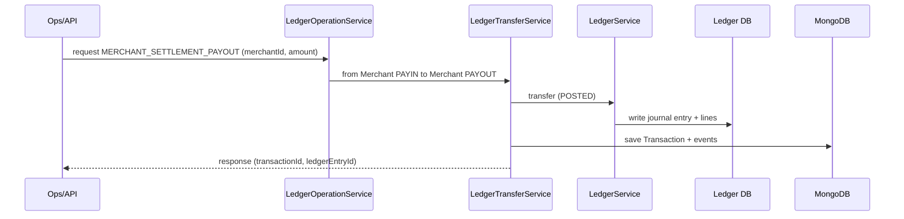

## MERCHANT_SETTLEMENT_BANK
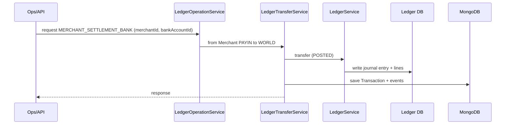

## MERCHANT_DEPOSIT
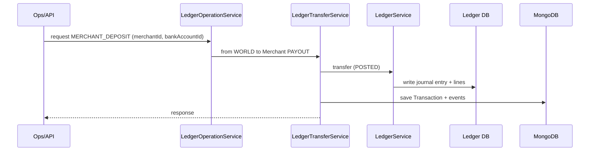

## MERCHANT_HOLD
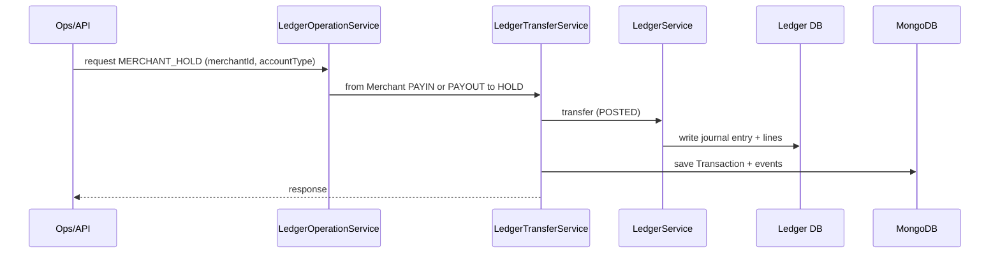

## MERCHANT_RELEASE
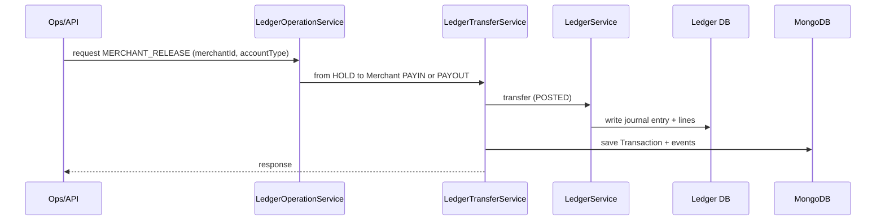

## INCOME_SETTLEMENT_TO_MERCHANT
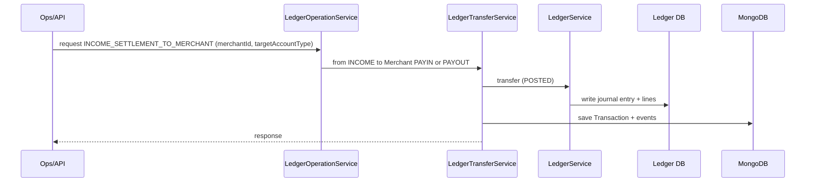

## LEGAL_ENTITY_SETTLEMENT
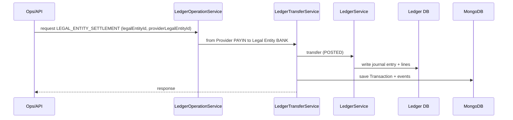

## LEGAL_ENTITY_DEPOSIT
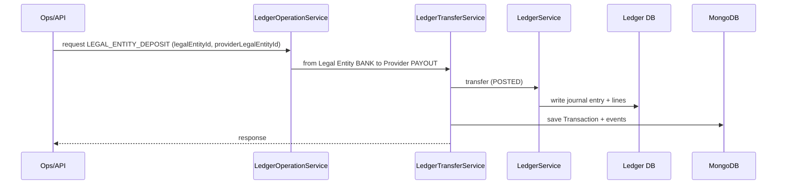

## LEGAL_ENTITY_DEDUCT
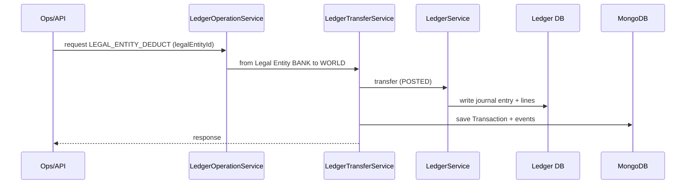

## PLE_SETTLEMENT
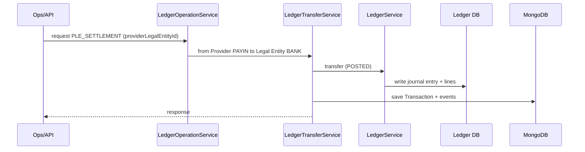

## PLE_DEPOSIT
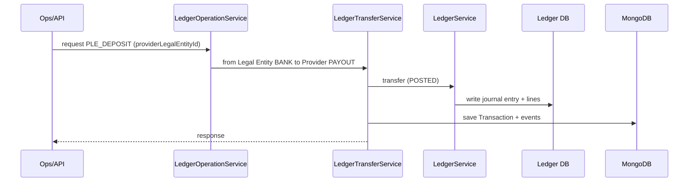

## PLE_EXPENSE_SETTLEMENT
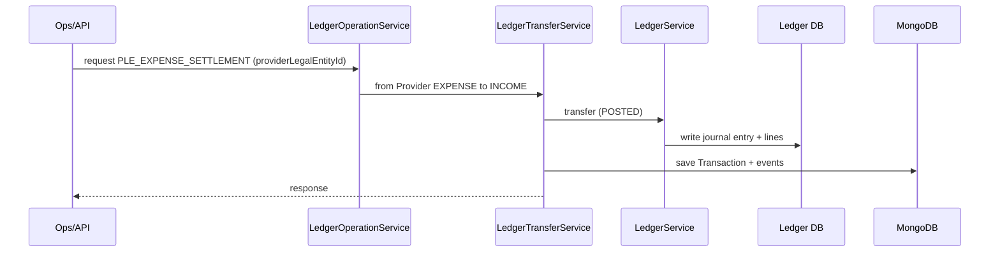

## PLE_EXPENSE_CHARGE
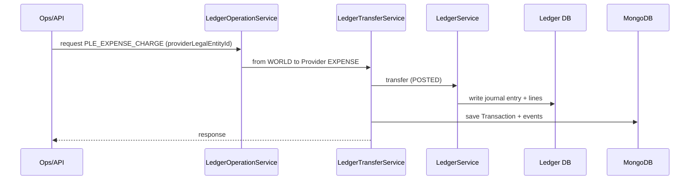

## PLE_PAYIN_FEE_CHARGE
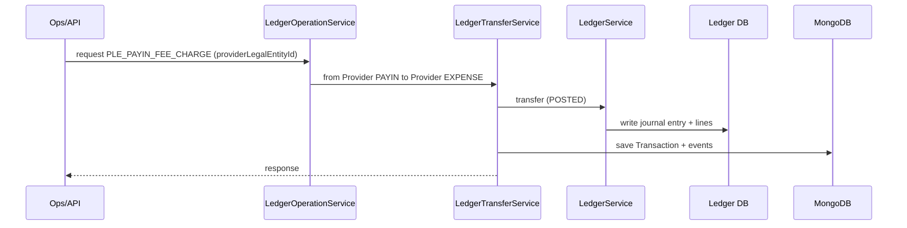

## PLE_PAYOUT_FEE_CHARGE
```mermaid
sequenceDiagram
  participant Ops as Ops/API
  participant LOS as LedgerOperationService
  participant LTS as LedgerTransferService
  participant LS as LedgerService
  participant LDB as Ledger DB
  participant MDB as MongoDB

  Ops->>LOS: request PLE_PAYOUT_FEE_CHARGE (providerLegalEntityId)
  LOS->>LTS: from Provider PAYOUT to Provider EXPENSE
  LTS->>LS: transfer (POSTED)
  LS->>LDB: write journal entry + lines
  LTS->>MDB: save Transaction + events
  LTS-->>Ops: response
```

---

# Per‑Provider Specifications

This section summarizes provider adapters from `src/provider-config/`.

| Provider | Capabilities | Credentials | Default Base URL | Webhook Parsing | Status Check | Notes |
|---|---|---|---|---|---|---|
| Dummy | Payin + Payout (simulated) | none | none | JSON payload, supports `ref_id`, `payment_id` | Always `PENDING` | Simulates webhook after 2s |
| EaseMyNeeds | Payin + Payout | `apiKey`, `apiSalt`, `baseUrl` | `https://dboard.easemyneeds.in/api/v1` | Encrypted payload supported (AES‑256‑CBC) | Supported for both payin and payout | Requires callback URL for payin |
| Payprime | Payout only | `apiToken`, `baseUrl` | `https://b2b.payprime.in/api/payout` | Supports array payloads and multiple id fields | Supported for payout | Payin not supported |
| SabioPay | Payin + Payout | `apiKey`, `apiSalt`, `baseUrl` | `https://pgbiz.sabiopg.in` | URL‑encoded form for payin, JSON for webhook | Supported for both | Duplicate merchant ref treated as PENDING |
| TPIPay | Payin + Payout | `apiKey`, `apiSalt`, `baseUrl` | `https://banking.mytpipay.com/api/upi-collection` | JSON based | Supported | Callback URL intentionally removed from payload |

---

# Class‑by‑Class LLD Tables

This section provides class/module‑level LLD tables for core components.

## Controllers

| Class | File | Responsibility | Key Methods | Dependencies |
|---|---|---|---|---|
| `PaymentController` | `src/controllers/payment/payment.controller.ts` | Payment endpoints, manual ops | `manualStatusUpdate`, `manualStatusSync`, `manualExpirePendingPreviousDay`, `manualProviderFeeSettlement` | `PaymentService`, `AuditService` |
| `WebhookController` | `src/controllers/payment/webhook.controller.ts` | Webhook ingestion | `handleWebhook` (implicit) | `WebhookWorkflow` |

## Workflows

| Class | File | Responsibility | Key Methods | Dependencies |
|---|---|---|---|---|
| `PayinWorkflow` | `src/workflows/payin.workflow.ts` | Payin orchestration | `execute` | `ProviderClient`, `PaymentLedgerService`, `TransactionMonitorService` |
| `PayoutWorkflow` | `src/workflows/payout.workflow.ts` | Payout orchestration | `execute` | `ProviderClient`, `PaymentLedgerService`, `TransactionMonitorService` |
| `WebhookWorkflow` | `src/workflows/webhook.workflow.ts` | Webhook processing | `execute` | `ProviderClient`, `PaymentLedgerService`, `MerchantCallbackService` |

## Services

| Class | File | Responsibility | Key Methods | Dependencies |
|---|---|---|---|---|
| `PaymentService` | `src/services/payment/payment.service.ts` | Transaction lifecycle and manual ops | `manualStatusUpdate`, `manualStatusSync`, `manualExpirePendingPreviousDay`, `manualProviderFeeSettlement` | `PaymentLedgerService`, `TransactionMonitorService`, `ProviderClient` |
| `PaymentLedgerService` | `src/services/payment/payment-ledger.service.ts` | Ledger posting for payin/payout | `processPayinCredit`, `commitPayout`, `voidPayout`, `reverseEntry` | `LedgerService` |
| `TransactionMonitorService` | `src/services/payment/transaction-monitor.service.ts` | Auto expiry and polling | `schedulePayinExpiry`, `schedulePayoutPolling`, `processPayoutStatusPoll` | `JobQueue`, `ProviderClient` |
| `LedgerTransferService` | `src/services/ledger/ledger-transfer.service.ts` | Creates ledger transfers | `createTransfer` | `LedgerService`, `AccountService` |
| `LedgerOperationService` | `src/services/ledger/ledger-operation.service.ts` | Predefined ledger operations | `createOperation` | `LedgerTransferService` |
| `LedgerEntryService` | `src/services/ledger/ledger-entry.service.ts` | Statements and reports | `getEntriesByAccountId`, `getAccountStatement` | `LedgerService` |
| `ReportService` | `src/services/common/report.service.ts` | CSV report generation | `generateReport` | `TransactionService`, `LedgerEntryService` |
| `AuditService` | `src/services/common/audit.service.ts` | Audit logging | `record` | `AuditLogModel` |
| `CacheService` | `src/services/common/cache.service.ts` | Redis caching | `getMerchant`, `getChannelById` | `redis`, `MerchantModel` |

## Middlewares

| Middleware | File | Responsibility |
|---|---|---|
| `paymentSecurityMiddleware` | `src/middlewares/payment-security.middleware.ts` | HMAC signature, IP whitelist |
| `authMiddleware` | `src/middlewares/auth.middleware.ts` | JWT auth + role |
| `contextMiddleware` | `src/middlewares/context.ts` | requestId/correlationId |
| `traceContext` | `src/middlewares/trace-id.ts` | trace/span propagation |
| `requestLogger` | `src/middlewares/request-logger.ts` | structured request logs |

## Provider Adapters

| Provider Class | File | Responsibility |
|---|---|---|
| `DummyProvider` | `src/provider-config/dummy.provider.ts` | Simulated provider |
| `EaseMyNeedsProvider` | `src/provider-config/easemyneeds.provider.ts` | Real provider integration |
| `PayprimeProvider` | `src/provider-config/payprime.provider.ts` | Payout integration |
| `SabioPayProvider` | `src/provider-config/sabiopay.provider.ts` | Payin/Payout integration |
| `TpipayProvider` | `src/provider-config/tpipay.provider.ts` | Payin/Payout integration |

---

---

# Low‑Level Sequence Diagrams (Payin/Payout/Webhook/Polling)

These diagrams expand the earlier HLD flows with code‑level components and internal services.

## 1. Payin Initiation — Low Level
```mermaid
sequenceDiagram
  participant M as Merchant
  participant R as Payment Routes
  participant SM as paymentSecurityMiddleware
  participant V as Zod Validator
  participant PC as PaymentController
  participant PS as PaymentService
  participant PW as PayinWorkflow
  participant PR as ProviderClient
  participant PP as Provider Adapter
  participant DB as MongoDB
  participant L as LedgerService
  participant Q as JobQueue

  M->>R: POST /api/payment/payin/initiate
  R->>SM: validate signature, IP, timestamp
  SM-->>R: ok
  R->>V: validate DTO
  V-->>R: ok
  R->>PC: handlePayin
  PC->>PS: initiatePayin(...)
  PS->>PW: execute(dto)
  PW->>DB: create Transaction (PENDING)
  PW->>PR: provider.handlePayin(req)
  PR->>PP: adapter.handlePayin()
  PP-->>PR: provider response
  PR-->>PW: normalized response
  alt status == SUCCESS
    PW->>L: ledger transfer POSTED
  else status == PENDING
    PW->>Q: schedule PAYIN_AUTO_EXPIRE
  end
  PW->>DB: update transaction + events
  PS-->>PC: response
  PC-->>M: response payload
```

## 2. Payin Webhook — Low Level
```mermaid
sequenceDiagram
  participant P as Provider
  participant WC as WebhookController
  participant WW as WebhookWorkflow
  participant PR as ProviderClient
  participant PA as Provider Adapter
  participant DB as MongoDB
  participant L as LedgerService
  participant CB as MerchantCallbackService
  participant POL as TransactionMonitorService

  P->>WC: POST /webhook/payin/:provider/:le
  WC->>WW: execute(rawBody)
  WW->>PR: parse + normalize webhook
  PR->>PA: adapter.handleWebhook()
  PA-->>PR: normalized payload
  PR-->>WW: status, ids, amount
  WW->>DB: find Transaction by transactionId/providerRef
  alt already final
    WW->>CB: notify merchant
  else
    WW->>DB: update status + events
    alt status SUCCESS
      WW->>L: ledger transfer POSTED
    else status FAILED/EXPIRED
      WW->>L: reverse/void if needed
    end
    WW->>CB: notify merchant
    WW->>POL: stop payout polling (if payout)
  end
```

## 3. Payout Initiation — Low Level
```mermaid
sequenceDiagram
  participant M as Merchant
  participant R as Payment Routes
  participant SM as paymentSecurityMiddleware
  participant V as Zod Validator
  participant PC as PaymentController
  participant PS as PaymentService
  participant PW as PayoutWorkflow
  participant L as LedgerService
  participant PR as ProviderClient
  participant PA as Provider Adapter
  participant DB as MongoDB
  participant POL as TransactionMonitorService

  M->>R: POST /api/payment/payout/initiate
  R->>SM: validate signature, IP, timestamp
  SM-->>R: ok
  R->>V: validate DTO
  V-->>R: ok
  R->>PC: handlePayout
  PC->>PS: initiatePayout(...)
  PS->>PW: execute(dto)
  PW->>DB: create Transaction (PENDING)
  PW->>L: ledger transfer PENDING (hold)
  PW->>PR: provider.handlePayout(req)
  PR->>PA: adapter.handlePayout()
  PA-->>PR: provider response
  PR-->>PW: normalized response
  alt status == SUCCESS
    PW->>L: commit ledger entry
  else status == FAILED
    PW->>L: void ledger entry
  else status == PENDING/PROCESSING
    PW->>POL: schedule payout polling
  end
  PW->>DB: update transaction + events
  PS-->>PC: response
  PC-->>M: response payload
```

## 4. Payout Status Polling — Low Level
```mermaid
sequenceDiagram
  participant POL as TransactionMonitorService
  participant Q as JobQueue
  participant W as Worker
  participant DB as MongoDB
  participant PR as ProviderClient
  participant PA as Provider Adapter
  participant L as LedgerService
  participant CB as MerchantCallbackService

  POL->>Q: enqueue PAYOUT_STATUS_POLL
  W->>Q: fetch job
  W->>POL: processPayoutStatusPoll
  POL->>DB: fetch transaction
  POL->>PR: provider.checkPayoutStatus()
  PR->>PA: adapter.checkPayoutStatus()
  PA-->>PR: status response
  PR-->>POL: normalized status
  alt status SUCCESS
    POL->>L: commit ledger
    POL->>DB: update transaction
    POL->>CB: notify merchant
  else status FAILED/EXPIRED
    POL->>L: void ledger
    POL->>DB: update transaction
    POL->>CB: notify merchant
  else status PENDING
    POL->>Q: schedule next poll
  end
```

## 5. Manual Status Update — Low Level
```mermaid
sequenceDiagram
  participant Admin as Admin
  participant R as Payment Routes
  participant V as Zod Validator
  participant PC as PaymentController
  participant PS as PaymentService
  participant PL as PaymentLedgerService
  participant L as LedgerService
  participant DB as MongoDB
  participant CB as MerchantCallbackService

  Admin->>R: POST /manual/status/update
  R->>V: validate DTO
  V-->>R: ok
  R->>PC: manualStatusUpdate
  PC->>PS: applyManualStatusUpdate
  PS->>DB: load transaction
  alt payin success
    PS->>PL: processPayinCredit (manual)
  else payin failed
    PS->>PL: reverseEntry
  else payout success
    PS->>PL: commitPayout or manualPostPayout
  else payout failed
    PS->>PL: voidPayout or reverseEntry
  end
  PS->>DB: update transaction + events
  PS->>CB: notify merchant
  PS-->>PC: response
  PC-->>Admin: response
```

## 6. Provider Fee Settlement — Low Level
```mermaid
sequenceDiagram
  participant Cron as Cron
  participant PFS as ProviderFeeSettlementService
  participant Q as JobQueue
  participant W as Worker
  participant L as LedgerService
  participant DB as MongoDB

  Cron->>PFS: enqueueEodSettlement
  PFS->>Q: enqueue PROVIDER_FEE_SETTLEMENT jobs
  W->>Q: fetch job
  W->>PFS: processPLESettlement(pleId, date)
  PFS->>L: ledger operations (fees)
  PFS->>DB: record transactions
```

---

---

# Ledger Cron Jobs (Detailed)

Ledger maintenance jobs are registered in `src/jobs/ledger.jobs.ts` and scheduled via cron expressions from `src/config/env.ts`.

## 1. Cron Schedule Summary

| Job | Env Variable | Default Schedule | Purpose |
|---|---|---|---|
| Sealer | `CRON_LEDGER_SEALER` | `*/5 * * * * *` | Seals ledger hash chain frequently |
| Snapshot | `CRON_LEDGER_SNAPSHOT` | `0 0 * * * *` | Periodic balance snapshots |
| Integrity Check | `CRON_LEDGER_INTEGRITY` | `0 0 */6 * * *` | Validates ledger chain integrity |
| Optimize DB | `CRON_LEDGER_OPTIMIZE` | `0 0 0 * * *` | Database optimization/maintenance |
| EOD Rebuild | `CRON_LEDGER_EOD` | `0 30 23 * * *` | End‑of‑day rebuild and consistency |

All jobs run in the worker process and log audit events via `AuditService`.

## 2. Execution Flow (High Level)

```mermaid
sequenceDiagram
  participant Cron as Cron Scheduler
  participant LJ as Ledger Jobs
  participant LS as LedgerService
  participant LDB as Ledger DB
  participant AL as AuditService

  Cron->>LJ: trigger job (sealer/snapshot/etc)
  LJ->>AL: audit start event
  LJ->>LS: run ledger job
  LS->>LDB: execute SQL operations
  LJ->>AL: audit completion event
```

## 3. Job Purposes (In Depth)

### 3.1 Ledger Sealer
- Runs frequently to seal the hash chain.
- Prevents tampering by linking journal entries with hashes.

### 3.2 Snapshot
- Takes periodic balance snapshots for fast history and rebuilds.

### 3.3 Integrity Check
- Scans the ledger chain to detect missing or corrupted entries.

### 3.4 Optimize DB
- Runs maintenance (indexes/vacuum) to keep query performance stable.

### 3.5 EOD Rebuild
- Rebuilds end‑of‑day derived data to ensure consistency.

---

---

# Testing Strategy (Detailed)

This section defines the recommended testing strategy for Wisipay Finetech 2.1. The repo currently does not include automated test suites; the items below are required for production‑grade reliability.

## 1. Unit Testing

Target areas:
- DTO validation (Zod schemas)
- Utility modules (date, money, crypto, JWT, ledger utils)
- Provider adapter parsing/normalization
- Ledger operation mapping (from/to account resolution)

Tooling (suggested):
- `vitest` or `jest` for TypeScript
- `ts-node` or `tsx` runner

## 2. Integration Testing

Target areas:
- PaymentService + PaymentLedgerService
- WebhookWorkflow with provider adapters
- TransactionMonitorService polling and expiry
- LedgerService with Postgres test container

Suggested approach:
- Spin up ephemeral Postgres + Mongo + Redis via Docker Compose
- Seed minimal data (merchant, provider, PLE, legal entity)
- Assert ledger postings and transaction states

## 3. End‑to‑End (E2E) Testing

Scenarios:
- Payin initiation -> webhook -> ledger posted -> callback sent
- Payout initiation -> pending -> polling -> success -> ledger committed
- Payout initiation -> failed -> ledger void
- Manual status update for payin/payout

Tools:
- Postman/newman or Playwright API

## 4. Contract and Provider Sandbox Testing

- Verify request/response contract for each provider
- Test webhook parsing for multiple payload formats
- Validate that provider failures are mapped consistently

Providers to test:
- Dummy (simulation)
- EaseMyNeeds
- Payprime
- SabioPay
- TPIPay

## 5. Ledger Integrity Tests

- Validate double‑entry balancing for each operation
- Validate that debit/credit rules are applied correctly
- Verify `PENDING -> POSTED` and `VOID/REVERSE` transitions
- Ensure no balance drift after batch processing

## 6. Load and Performance Tests

Targets:
- Payin/payout TPS limits
- Webhook burst handling
- Redis queue throughput

Suggested tooling:
- k6 / Artillery

## 7. Security Tests

- Signature verification failures (timestamp, signature mismatch)
- IP whitelist enforcement
- Secret encryption/decryption validation
- Rate limit / TPS enforcement

## 8. Observability Tests

- Verify logs contain `traceId`, `requestId`, `transactionId`
- Validate Prometheus metrics availability
- Ensure traces appear in Tempo/Grafana

## 9. Cron and Background Job Tests

- Ledger sealer/snapshot/integrity jobs run on schedule
- Payin expiry sweep job execution
- Provider fee settlement job enqueue and processing

## 10. Disaster Recovery Tests (TBD)

- Restore Postgres ledger from backup
- Restore Mongo transaction data
- Redis data reload

---

---

# Testing Strategy — Deep Dive and Test Matrix

This section expands the testing strategy with concrete scenarios, data sets, and expected outcomes suitable for QA and automation.

## 1. Test Environment Setup

Recommended local stack (Docker Compose):
- Postgres (ledger)
- MongoDB (transactions)
- Redis (queue/cache)
- API + Payment + Worker services

Suggested test config:
- Use isolated DB names for tests (e.g., `app_ledger_test`, `app_test`)
- Seed test merchants, providers, and PLEs
- Use Dummy provider for deterministic webhooks

## 2. Test Data Seed Plan

### 2.1 Seed Entities

- Merchant: active, onboarded, payin/payout enabled
- Provider: active, payin+payout capability
- Provider Legal Entity (PLE): active, webhook URLs set
- Legal Entity: active, bank account defined

### 2.2 Ledger Accounts

- Merchant PAYIN, PAYOUT, HOLD
- Provider PAYIN, PAYOUT, EXPENSE
- Legal Entity BANK
- WORLD (off‑balance)

## 3. Unit Test Matrix

| Area | Case | Input | Expected |
|---|---|---|---|
| Date utils | `getISTDayStart` | `2026-02-24` | returns IST midnight UTC equivalent |
| Ledger utils | `parseAccountId` | `LIABILITY:MERCHANT:MER-1:PAYIN` | entityType MERCHANT |
| Money utils | `toStorageAmount` | `100.25` | correct integer storage |
| JWT | `generateAuthToken` | payload | valid JWT string |
| Secret | `encryptSecret/decryptSecret` | secret | decrypt returns original |
| Provider status mapping | normalize | `FAILED` | maps to FAILED |

## 4. Integration Test Matrix

### 4.1 Payin Integration

| Scenario | Steps | Expected |
|---|---|---|
| Payin Success | initiate -> webhook SUCCESS | ledger posted, transaction SUCCESS |
| Payin Pending | initiate -> no webhook | status PENDING, auto expiry scheduled |
| Payin Auto‑Expire | pending beyond TTL | status EXPIRED, callback sent |

### 4.2 Payout Integration

| Scenario | Steps | Expected |
|---|---|---|
| Payout Success | initiate -> provider SUCCESS | ledger committed, transaction SUCCESS |
| Payout Pending | initiate -> provider PENDING | polling scheduled |
| Poll Success | polling returns SUCCESS | ledger committed, polling stopped |
| Poll Failure | polling returns FAILED | ledger voided, polling stopped |

### 4.3 Manual Ops Integration

| Scenario | Steps | Expected |
|---|---|---|
| Manual Payin Success | status update to SUCCESS | ledger posted, callback sent |
| Manual Payin Fail | status update to FAILED | ledger reversed, callback sent |
| Manual Payout Success | update to SUCCESS | commit or manual post |
| Manual Payout Fail | update to FAILED | void or reverse |

## 5. End‑to‑End Test Matrix

| Scenario | Steps | Expected |
|---|---|---|
| Payin full flow | initiate -> webhook -> callback | SUCCESS, ledger posted |
| Payout full flow | initiate -> polling -> callback | SUCCESS, ledger committed |
| Payin expiry | initiate -> wait TTL | EXPIRED, callback |
| Payout failure | initiate -> poll -> FAILED | ledger void |

## 6. Ledger Integrity Test Matrix

| Operation | Input | Expected Ledger Impact |
|---|---|---|
| MERCHANT_HOLD | payin hold | PAYIN decreases, HOLD increases |
| MERCHANT_RELEASE | hold release | HOLD decreases, PAYIN increases |
| PLE_PAYIN_FEE_CHARGE | fee charge | PAYIN decreases, EXPENSE increases |
| LEGAL_ENTITY_SETTLEMENT | settlement | Provider PAYIN decreases, LE BANK increases |

## 7. Provider Adapter Tests

- Validate request payload formation
- Validate signature/encryption if required
- Validate webhook parsing for edge cases
- Validate status polling mapping

Providers:
- Dummy: deterministic outcomes
- EaseMyNeeds: AES encrypted payloads
- SabioPay: form‑encoded payin, JSON webhook
- Payprime: payout only, status polling
- TPIPay: payin/payout, callback disabled

## 8. Security Test Matrix

| Scenario | Input | Expected |
|---|---|---|
| Invalid signature | wrong hash | 403 Forbidden |
| Timestamp too old | >60s skew | 403 Forbidden |
| IP not whitelisted | unknown IP | 403 Forbidden |
| Missing admin header | no x-admin-email | 400 BadRequest |

## 9. Load & Performance Targets (Suggested)

- Payin initiate: <500ms p95
- Payout initiate: <800ms p95
- Webhook processing: <300ms p95
- Queue throughput: 100 jobs/sec baseline

## 10. Observability Validation

- Ensure `traceId`/`spanId` appear in logs
- Validate Prometheus scrape endpoints
- Ensure Tempo traces visible in Grafana

## 11. Regression Suite

Mandatory regression checks:
- Payin success
- Payin expiry
- Payout success
- Payout failure
- Manual status update (payin + payout)
- Ledger balance checks

---

---

# Provider Payload Examples (Per Provider)

This section documents representative request/response and webhook payloads. Examples are aligned with provider adapters and may need adjustment to match live provider documentation.

## 1. Dummy Provider

### Payin Request (internal -> provider)
```json
{
  "transactionId": "TXN-1001",
  "amount": 1000,
  "remarks": "test"
}
```

### Payin Response
```json
{
  "status": "PENDING",
  "providerTransactionId": "DUMMY_PY_...",
  "result": "https://checkout.dummy.com/pay/TXN-1001"
}
```

### Webhook
```json
{
  "payment_id": "DUMMY_PY_...",
  "status": "SUCCESS",
  "amount": 1000,
  "ref_id": "TXN-1001",
  "utr": "SIM_..."
}
```

---

## 2. EaseMyNeeds

### Payin Request (encrypted payload)
```json
{
  "payload": "<AES-256-CBC base64>"
}
```

### Payin Response (normalized)
```json
{
  "status": "PENDING",
  "providerTransactionId": "EMN-123",
  "result": "https://.../payment-link"
}
```

### Webhook (encrypted or plaintext)
```json
{
  "payload": "<AES-256-CBC base64>"
}
```

---

## 3. Payprime

### Payout Request
```json
{
  "token": "<apiToken>",
  "pay_type": "transfer",
  "clientRefId": "TXN-2001",
  "amount": 5000,
  "mode": "IMPS",
  "note": "Payprime",
  "beneDetails": {
    "accountNumber": "1234567890",
    "name": "John Doe",
    "bankName": "HDFC",
    "ifsc": "HDFC0001234"
  }
}
```

### Payout Response (normalized)
```json
{
  "status": "PENDING",
  "providerTransactionId": "PP-ORDER-123",
  "message": "Payprime payout"
}
```

---

## 4. SabioPay

### Payin Request (form encoded)
```json
{
  "api_key": "<apiKey>",
  "order_id": "TXN-3001",
  "amount": "100.00",
  "currency": "INR",
  "description": "Payment",
  "name": "John",
  "email": "john@example.com",
  "phone": "9999999999",
  "return_url": "https://...",
  "city": "Mumbai",
  "country": "IND",
  "zip_code": "400001",
  "hash": "<sha256>"
}
```

### Payout Request
```json
{
  "amount": 5000,
  "beneficiary_account": "1234567890",
  "beneficiary_ifsc": "HDFC0001234",
  "beneficiary_name": "John Doe"
}
```

### Webhook
```json
{
  "order_id": "TXN-3001",
  "status": "SUCCESS",
  "amount": "100.00",
  "transaction_reference_number": "UTR123"
}
```

---

## 5. TPIPay

### Payin Request
```json
{
  "order_id": "TXN-4001",
  "amount": 1500,
  "customer_name": "John Doe",
  "customer_phone": "9999999999"
}
```

### Payout Request
```json
{
  "order_id": "TXN-4002",
  "amount": 2500,
  "beneficiary_name": "Jane Doe",
  "beneficiary_account": "1234567890",
  "beneficiary_ifsc": "HDFC0001234"
}
```

---

# Ledger SQL Walkthrough (Schema + Example)

## 1. Ledger Tables Summary

- `accounts`
- `journal_entries`
- `journal_lines`
- `balance_snapshots`
- `audit_logs`

## 2. Example Transfer

Scenario: Merchant PAYIN -> Merchant PAYOUT (internal settlement)

### Journal Entry
```sql
INSERT INTO journal_entries (id, description, status, external_ref)
VALUES ('JE-1', 'Settlement', 'POSTED', 'TXN-0001');
```

### Journal Lines
```sql
INSERT INTO journal_lines (id, entry_id, account_id, amount, balance_after)
VALUES
  ('JL-1', 'JE-1', 'LIABILITY:MERCHANT:MER-1:PAYIN',  -10000, 90000),
  ('JL-2', 'JE-1', 'LIABILITY:MERCHANT:MER-1:PAYOUT', 10000, 10000);
```

Debit/Credit interpretation:
- PAYIN (LIABILITY): negative amount reduces liability
- PAYOUT (LIABILITY): positive amount increases liability

---

# Full API Schemas (Detailed JSON)

## Payin Initiate Request
```json
{
  "amount": 1000,
  "orderId": "ORDER123456",
  "paymentMode": "UPI",
  "customerName": "John Doe",
  "customerEmail": "john@example.com",
  "customerPhone": "9999999999",
  "remarks": "optional",
  "redirectUrl": "https://merchant.com/return"
}
```

## Payin Initiate Response
```json
{
  "success": true,
  "data": {
    "orderId": "ORDER123456",
    "transactionId": "TXN-1001",
    "paymentUrl": "https://provider.com/pay/...",
    "amount": 1000,
    "status": "PENDING"
  }
}
```

## Payout Initiate Request
```json
{
  "amount": 1000,
  "orderId": "ORDER123456",
  "paymentMode": "IMPS",
  "beneficiaryName": "John Doe",
  "beneficiaryAccountNumber": "1234567890",
  "beneficiaryIfsc": "HDFC0001234",
  "beneficiaryBankName": "HDFC",
  "beneficiaryPhone": "9999999999",
  "remarks": "optional"
}
```

## Payout Initiate Response
```json
{
  "success": true,
  "data": {
    "transactionId": "TXN-2001",
    "orderId": "ORDER123456",
    "status": "PENDING",
    "utr": null
  }
}
```

## Manual Status Update Request
```json
{
  "orderId": "ORDER123456",
  "status": "SUCCESS",
  "utr": "UTR123",
  "providerTransactionId": "PROV123",
  "providerMsg": "manual fix",
  "reason": "ops update"
}
```

---

# Deployment Runbooks (Step‑by‑Step)

## 1. Deploy Databases Stack
```bash
cd Deployment/databases
docker compose --env-file ../clients/<client>/.env.stack up -d
```

## 2. Deploy Monitoring Stack
```bash
cd Deployment/monitoring
docker compose --env-file ../clients/<client>/.env.stack up -d
```

## 3. Deploy App Stack
```bash
cd Deployment/app
docker compose --env-file ../clients/<client>/.env.stack up -d
```

## 4. Validate Health
- API: `GET /health` on port 4000
- Payment: `GET /health` on port 4001

---

# Security/Compliance Mapping (Controls Checklist)

| Control | Implementation | Evidence |
|---|---|---|
| HMAC signing | payment-security middleware | Request logs + code |
| IP whitelist | merchant config | merchant record + logs |
| Audit trail | AuditService + AuditLogModel | Mongo audit logs |
| Encryption at rest | Merchant secrets AES‑GCM | secret.util.ts |
| Observability | OTel + Loki/Tempo | monitoring stack |

---

---

# Webhook Payload Samples (Per Provider)

These are representative payloads that align with provider adapters. Adjust to actual provider docs if they differ.

## Dummy Provider
```json
{
  "payment_id": "DUMMY_PY_123",
  "status": "SUCCESS",
  "amount": 1000,
  "ref_id": "TXN-1001",
  "transaction_id": "TXN-1001",
  "utr": "SIM_123456",
  "message": "Transaction successful"
}
```

## EaseMyNeeds (encrypted)
```json
{
  "payload": "<AES-256-CBC base64>"
}
```

Decrypted payload example (payin):
```json
{
  "payment_id": "EMN-123",
  "ref_id": "TXN-1001",
  "amount": "1000",
  "status": "SUCCESS",
  "payment_message": "Payment successful",
  "utr_number": "UTR123"
}
```

## Payprime (payout)
```json
{
  "order_id": "PP-ORDER-123",
  "txn_status": "SUCCESS",
  "amount": 5000,
  "utr": "UTR999",
  "clientRefId": "TXN-2001"
}
```

## SabioPay
```json
{
  "order_id": "TXN-3001",
  "status": "SUCCESS",
  "amount": "100.00",
  "transaction_reference_number": "UTR123"
}
```

## TPIPay
```json
{
  "order_id": "TXN-4001",
  "status": "SUCCESS",
  "amount": 1500,
  "utr": "UTR456"
}
```

---

# Ledger Reconciliation Example (Trial Balance + Statement)

This is an illustrative walkthrough of how a single payin and payout reflect in the ledger and reports.

## Example Scenario
1. Merchant payin of INR 1,000 (SUCCESS)
2. Merchant payout of INR 500 (SUCCESS)

## Expected Ledger Entries

### Payin (Merchant PAYIN credit)
- Merchant PAYIN account (LIABILITY) credited by 1,000
- Provider PAYIN account (ASSET) debited by 1,000

### Payout (Merchant PAYOUT debit)
- Merchant PAYOUT account (LIABILITY) debited by 500
- Provider PAYOUT account (ASSET) credited by 500

## Trial Balance Check
- Total debits = total credits across journal_lines
- Net change on merchant side reflects available balance

## Account Statement (Merchant PAYIN)
- Shows incoming credit and updated running balance

## Report Validation Steps
- Use `LedgerEntryService.getAccountStatement()` for period
- Verify running balances and totals

---

# Provider‑Specific Error Mapping (Illustrative)

This section lists common error patterns per provider based on adapter behavior.

| Provider | Error Pattern | System Mapping | Notes |
|---|---|---|---|
| Dummy | none | n/a | Simulation only |
| EaseMyNeeds | missing apiKey/apiSalt | FAILED | Credentials missing |
| EaseMyNeeds | response success=false | FAILED | Provider error message used |
| Payprime | statusFlag=false | FAILED | Treated as payout failure |
| SabioPay | duplicate merchant ref | PENDING | Treated as pending (idempotency) |
| SabioPay | error_code != 0 | FAILED | Provider error message used |
| TPIPay | provider errors | FAILED | Standard mapping |

---

# DB Index and Partitioning Rationale

## MongoDB

- `transactions`: index on `createdAt` for fast list and report sorting
- `transactions`: unique composite index on `providerId + providerRef` to avoid duplicates
- `merchants`: indexes on `status`, `role`, `createdAt`, and active service flags for admin search
- `provider_legal_entities`: unique composite index on `providerId + legalEntityId` for routing integrity
- `merchant_bank_accounts`: compound unique index on merchantId + accountNumber + ifsc to prevent duplicates

## Ledger (Postgres)

- `journal_lines` partitioned by `created_at` for large scale history
- `journal_entries` indexed by `posted_at`, `external_ref`, `correlation_id`, `value_date` for reconciliation queries
- `balance_snapshots` indexed by `account_id + created_at` for fast statement queries

---

# End‑to‑End Ops Playbook (Incident Handling)

## 1. Provider Outage
- Detect increased `provider.http.response` failures
- Pause routing for provider in config
- Enable fallback provider if configured
- Notify merchant support

## 2. Ledger Integrity Alert
- Run ledger integrity check job
- Inspect audit logs and hash chain
- Rebuild EOD if required

## 3. Webhook Backlog
- Check Redis delayed queue size
- Scale worker service
- Re‑enqueue failed tasks if safe

## 4. Payment Spike / TPS Limits
- Verify TPS configs
- Scale API/payment services horizontally
- Increase Redis resources

## 5. Database Performance Degradation
- Review slow queries
- Increase Postgres/Mongo resources
- Run optimize DB job

---

---

# Full API Catalog (Detailed)

This section enumerates **all routes** present in `src/routes/**` with request validation sources and typical behavior. Response formats follow the standard `{ success, data, error }` pattern used by controllers.

## 1. Auth APIs

### 1.1 Admin Auth (`/auth/admin`)

| Method | Path | DTO | Description |
|---|---|---|---|
| POST | `/auth/admin/create-super-admin` | `CreateAdminSchema` | Creates initial super admin |
| POST | `/auth/admin/login` | `LoginAdminSchema` | Admin login (password + optional deviceId) |
| POST | `/auth/admin/verify-login-otp` | `VerifyOtpSchema` | OTP verification |
| POST | `/auth/admin/forgot-password` | `ForgotPasswordSchema` | Issue reset token |
| POST | `/auth/admin/confirm-reset-password` | `ConfirmResetPasswordSchema` | Set new password |

Key fields (DTO):
- `CreateAdminSchema`: name, email, password?, role?
- `LoginAdminSchema`: email, password, deviceId?
- `VerifyOtpSchema`: email, otp(6), deviceId

### 1.2 Merchant Auth (`/auth/merchant`)

| Method | Path | DTO | Description |
|---|---|---|---|
| POST | `/auth/merchant/register` | `RegisterMerchantSchema` | Merchant signup |
| POST | `/auth/merchant/login` | `LoginMerchantSchema` | Merchant login |
| POST | `/auth/merchant/verify-otp` | `VerifyOtpSchema` | OTP verification |
| POST | `/auth/merchant/forgot-password` | `ForgotPasswordSchema` | Reset token |
| POST | `/auth/merchant/confirm-reset-password` | `ConfirmResetPasswordSchema` | Set new password |

### 1.3 Token Refresh

| Method | Path | DTO | Description |
|---|---|---|---|
| POST | `/auth/refresh` | (controller) | Refresh JWT token |

---

## 2. Payment APIs (Merchant‑Facing)

### 2.1 Payin Initiate
- `POST /api/payment/payin/initiate`
- Auth: merchant HMAC + timestamp + IP whitelist
- DTO: `InitiatePayinSchema`

### 2.2 Payout Initiate
- `POST /api/payment/payout/initiate`
- Auth: merchant HMAC + timestamp + IP whitelist
- DTO: `InitiatePayoutSchema`

### 2.3 Status
- `GET /api/payment/:orderId`
- `GET /api/payment/payin/status/:orderId`
- `GET /api/payment/payout/status/:orderId`

### 2.4 Manual Ops (Admin)
- `POST /api/payment/manual/status/update`
- `POST /api/payment/manual/status/sync`
- `POST /api/payment/manual/expire/pending-previous-day`
- `POST /api/payment/manual/provider-fee-settlement`

### 2.5 Webhooks
- `POST /webhook/:type/:provider/:legalentity`
- `POST /webhook/:type/:provider`
- `POST /webhook/debug`

---

## 3. Admin APIs (`/admin`)

All admin APIs require JWT auth + panel IP whitelist.

### 3.1 Admin Management

| Method | Path | DTO | Description |
|---|---|---|---|
| POST | `/admin/create-admin` | `CreateAdminSchema` | Create admin |
| PUT | `/admin/profile` | `UpdateAdminProfileSchema` | Update own profile |
| PUT | `/admin/:id/profile` | `UpdateAdminProfileSchema` | Update admin profile |
| GET | `/admin/list-admins` | `ListQuerySchema` | List admins |
| GET | `/admin/login-history` | (none) | Own login history |
| GET | `/admin/login-history-all` | `ListLoginHistorySchema` | All login history |
| GET | `/admin/dashboard/stats` | (none) | Admin dashboard stats |

### 3.2 Transactions (Admin)

| Method | Path | DTO | Description |
|---|---|---|---|
| GET | `/admin/transactions` | `TransactionListQuerySchema` | List transactions |
| GET | `/admin/transactions/by-ledger/:entryId` | (none) | Find by ledger entry |
| GET | `/admin/transactions/:id` | (none) | Transaction detail |
| POST | `/admin/transactions/:id/reverse` | `ReverseTransactionSchema` | Reverse transaction |
| POST | `/admin/transactions/:id/reverse-ledger` | `ReverseLedgerEntriesSchema` | Reverse ledger entry |
| POST | `/admin/transactions/:id/sync-status` | `AdminTransactionActionSchema` | Provider status sync |
| POST | `/admin/transactions/:id/resend-webhook` | `AdminTransactionActionSchema` | Resend webhook |

### 3.3 Merchant Management

| Method | Path | DTO | Description |
|---|---|---|---|
| GET | `/admin/merchants/list-merchants` | `ListQuerySchema` | List merchants |
| GET | `/admin/merchants/:id` | (none) | Merchant profile |
| GET | `/admin/merchants/:id/activity` | (none) | Merchant activity |
| GET | `/admin/merchants/:id/bank-accounts` | (none) | Merchant bank accounts |
| POST | `/admin/merchants/:id/onboard` | (none) | Onboard merchant |
| PUT | `/admin/merchants/:id/status` | (none) | Toggle merchant status |
| PUT | `/admin/merchants/:id/panel-ip-whitelist` | `UpdatePanelIpWhitelistSchema` | Update panel whitelist |
| PUT | `/admin/merchants/:id/profile` | `UpdateMerchantProfileSchema` | Update profile |
| PUT | `/admin/merchants/:id/payin-config` | `UpdateServiceConfigSchema` | Payin config |
| PUT | `/admin/merchants/:id/payout-config` | `UpdateServiceConfigSchema` | Payout config |
| PUT | `/admin/merchants/:id/routing` | (UpdateRoutingSchema) | Provider routing |
| POST | `/admin/merchants/:id/payin-config/fees` | `AddFeeTierSchema` | Add fee tier |
| DELETE | `/admin/merchants/:id/payin-config/fees` | `DeleteFeeTierSchema` | Delete fee tier |
| POST | `/admin/merchants/:id/payout-config/fees` | `AddFeeTierSchema` | Add fee tier |
| DELETE | `/admin/merchants/:id/payout-config/fees` | `DeleteFeeTierSchema` | Delete fee tier |
| GET | `/admin/merchants/:id/api-secret` | (none) | Get API secret |
| POST | `/admin/merchants/:id/rotate-api-secret` | (none) | Rotate API secret |
| PUT | `/admin/merchants/:id/toggle-api-secret` | `ToggleApiSecretSchema` | Enable/disable secret |

### 3.4 Provider Management

| Method | Path | DTO | Description |
|---|---|---|---|
| POST | `/admin/providers/` | `CreateProviderSchema` | Create provider |
| GET | `/admin/providers/` | (none) | List providers |
| GET | `/admin/providers/:id` | (none) | Provider detail |
| PUT | `/admin/providers/:id` | `UpdateProviderSchema` | Update provider |

### 3.5 Legal Entity Management

| Method | Path | DTO | Description |
|---|---|---|---|
| POST | `/admin/legal-entities/` | inline schema | Create legal entity |
| GET | `/admin/legal-entities/` | (none) | List legal entities |
| GET | `/admin/legal-entities/:id` | (none) | Legal entity detail |
| PUT | `/admin/legal-entities/:id` | inline schema | Update legal entity |

### 3.6 Provider Legal Entity (PLE)

| Method | Path | DTO | Description |
|---|---|---|---|
| POST | `/admin/provider-legal-entity/` | `CreateProviderLegalEntitySchema` | Create PLE |
| GET | `/admin/provider-legal-entity/` | (none) | List PLE |
| GET | `/admin/provider-legal-entity/:id` | (none) | PLE detail |
| PUT | `/admin/provider-legal-entity/:id/payin` | `UpdateProviderServiceConfigSchema` | Update payin config |
| PUT | `/admin/provider-legal-entity/:id/payout` | `UpdateProviderServiceConfigSchema` | Update payout config |
| POST | `/admin/provider-legal-entity/:id/payin/fees` | `AddProviderFeeTierSchema` | Add fee tier |
| DELETE | `/admin/provider-legal-entity/:id/payin/fees` | `DeleteProviderFeeTierSchema` | Delete fee tier |
| POST | `/admin/provider-legal-entity/:id/payout/fees` | `AddProviderFeeTierSchema` | Add fee tier |
| DELETE | `/admin/provider-legal-entity/:id/payout/fees` | `DeleteProviderFeeTierSchema` | Delete fee tier |

### 3.7 Merchant Bank Account (Admin)

| Method | Path | DTO | Description |
|---|---|---|---|
| GET | `/admin/merchant-bank-accounts/` | `ListMerchantBankAccountSchema` | List accounts |
| PUT | `/admin/merchant-bank-accounts/:id/status` | `UpdateMerchantBankAccountStatusSchema` | Approve/reject |
| PUT | `/admin/merchant-bank-accounts/:id/active` | `ToggleMerchantBankAccountActiveSchema` | Enable/disable |

### 3.8 Ledger (Admin)

| Method | Path | DTO | Description |
|---|---|---|---|
| POST | `/admin/ledger/transfers` | `CreateLedgerTransferSchema` | Manual ledger transfer |
| POST | `/admin/ledger/operations` | `CreateLedgerOperationSchema` | Predefined operation |
| GET | `/admin/ledger/accounts/:accountId/entries` | (none) | Ledger entries |
| GET | `/admin/ledger/accounts/:accountId/statement` | (none) | Account statement |
| GET | `/admin/ledger/accounts/:accountId/general-ledger` | (none) | General ledger |
| GET | `/admin/ledger/entries/:entryId` | (none) | Ledger entry detail |
| GET | `/admin/ledger/entries/:entryId/transaction` | (none) | Txn by entry |
| GET | `/admin/ledger/reports/trial-balance` | (none) | Trial balance |
| GET | `/admin/ledger/reports/balance-sheet` | (none) | Balance sheet |
| GET | `/admin/ledger/operations` | (none) | Operations list |
| GET | `/admin/ledger/operations/:entityType` | (none) | Ops by entity |

### 3.9 Reports (Admin)

| Method | Path | DTO | Description |
|---|---|---|---|
| POST | `/admin/reports/transactions` | (none) | Transaction report |
| POST | `/admin/reports/accounts/:accountId/statement` | (none) | Statement report |
| GET | `/admin/reports/` | (none) | List reports |
| GET | `/admin/reports/:reportId/download` | (none) | Download report |

### 3.10 Filters

| Method | Path | DTO | Description |
|---|---|---|---|
| GET | `/admin/filters/` | (none) | Get filter lists |

---

## 4. Merchant APIs (`/merchant`)

All merchant APIs require JWT auth + panel IP whitelist.

### 4.1 Merchant Profile and Dashboard

| Method | Path | DTO | Description |
|---|---|---|---|
| GET | `/merchant/profile/basic` | (none) | Merchant profile |
| GET | `/merchant/profile/payin` | (none) | Payin config |
| GET | `/merchant/profile/payout` | (none) | Payout config |
| PUT | `/merchant/profile` | `UpdateMerchantProfileSchema` | Update profile |
| GET | `/merchant/dashboard/stats` | (none) | Dashboard stats |
| PUT | `/merchant/config/callback-url` | (none) | Update callback URL |
| GET | `/merchant/api-keys` | (none) | Get API secret |
| POST | `/merchant/api-keys` | (none) | Rotate API secret |

### 4.2 Merchant Transactions

| Method | Path | DTO | Description |
|---|---|---|---|
| GET | `/merchant/transactions/` | `TransactionListQuerySchema` | List merchant txns |
| GET | `/merchant/transactions/:id` | (none) | Transaction detail |

### 4.3 Merchant Ledger

| Method | Path | DTO | Description |
|---|---|---|---|
| GET | `/merchant/ledger/accounts/:accountId/entries` | (none) | Ledger entries |
| GET | `/merchant/ledger/accounts/:accountId/statement` | (none) | Statement |
| GET | `/merchant/ledger/accounts/:accountId/general-ledger` | (none) | General ledger |
| GET | `/merchant/ledger/entries/:entryId` | (none) | Ledger entry detail |

### 4.4 Merchant Reports

| Method | Path | DTO | Description |
|---|---|---|---|
| POST | `/merchant/reports/transactions` | (none) | Transaction report |
| POST | `/merchant/reports/accounts/:accountId/statement` | (none) | Statement report |
| GET | `/merchant/reports/` | (none) | List reports |
| GET | `/merchant/reports/:reportId/download` | (none) | Download report |

### 4.5 Merchant Bank Accounts

| Method | Path | DTO | Description |
|---|---|---|---|
| POST | `/merchant/bank-accounts/` | `CreateMerchantBankAccountSchema` | Create bank account |
| GET | `/merchant/bank-accounts/` | `ListMerchantBankAccountSchema` | List bank accounts |
| PUT | `/merchant/bank-accounts/:id` | `UpdateMerchantBankAccountSchema` | Update bank account |

---

# Function Catalog (Working Functions)

This catalog lists **operational functions** that power the system. For full details see the referenced files.

## Controllers

- `AdminController`: create/update admin, dashboard stats, onboarding
- `MerchantController`: merchant auth and password flows
- `MerchantManagementController`: merchant configs, fees, routing
- `MerchantSelfController`: merchant self‑service profile/actions
- `LoginHistoryController`: list login history
- `TransactionController`: list/retrieve/reverse/sync/resend
- `LedgerController` (admin/merchant): ledger reports and entry lookups
- `ProviderController`: provider CRUD
- `ProviderLegalEntityController`: PLE CRUD and configs
- `LegalEntityController`: legal entity CRUD
- `MerchantBankAccountController` (admin/merchant)
- `ReportController`: report request/list/download
- `PaymentController`: payin/payout/manual ops
- `WebhookController`: webhook ingestion

## Services (Core)

- `PaymentService`: status changes, manual ops, provider sync
- `PaymentLedgerService`: ledger post/commit/void/reverse
- `TransactionMonitorService`: expiry and polling
- `LedgerTransferService`: create and validate transfers
- `LedgerOperationService`: predefined ledger ops
- `LedgerEntryService`: statements and reports
- `ProviderClient`: provider routing/execution
- `CacheService`: Redis cache
- `AuditService`: audit logs
- `ReportService`: CSV reports
- `ProviderFeeSettlementService`: settlements

## Utilities

- `date.util.ts`: IST conversion and day boundaries
- `money.util.ts`: storage/display conversions
- `ledger.utils.ts`: account id parsing and generation
- `secret.util.ts`: AES‑GCM secret encryption
- `jwt.ts`: token generation
- `job-queue.util.ts`: delayed job queue
- `webhook-queue.util.ts`: webhook queue
- `payment-errors.util.ts`: standardized error mapping

---

# Scenario Library (End‑to‑End Flows)

Each scenario includes purpose, preconditions, and flow summary.

## 1. Merchant Payin Success
- **Preconditions**: Merchant active, payin enabled
- **Flow**: initiate -> provider -> webhook SUCCESS -> ledger POSTED -> callback

## 2. Merchant Payin Expiry
- **Preconditions**: Pending payin
- **Flow**: initiate -> no webhook -> auto‑expire -> callback

## 3. Merchant Payout Success (Polling)
- **Preconditions**: Merchant active, payout enabled
- **Flow**: initiate -> provider pending -> poll -> SUCCESS -> ledger commit -> callback

## 4. Merchant Payout Failure
- **Flow**: initiate -> provider failed or poll failed -> ledger void -> callback

## 5. Admin Manual Status Update (Payin)
- **Flow**: admin update -> ledger post/reverse -> callback

## 6. Admin Manual Status Update (Payout)
- **Flow**: admin update -> commit/void/reverse -> callback

## 7. Provider Fee Settlement EOD
- **Flow**: cron -> enqueue jobs -> ledger ops -> reports

## 8. Merchant Ledger Report
- **Flow**: request report -> GeneratedReport -> download

## 9. Merchant Bank Account Approval
- **Flow**: merchant creates account -> admin approves -> account used in settlement

## 10. Provider/PLE Setup
- **Flow**: admin create provider -> create PLE -> configure fees/routing

---

---

# API Deep Dive — Endpoint‑by‑Endpoint (Detailed)

This section provides **per‑API** functionality, service path, steps, data flow, and example scenarios. Fields are taken from DTOs where available. Responses are based on observed patterns and may include additional fields depending on controller/service logic.

## 1. Auth APIs (Admin)

### 1.1 `POST /auth/admin/create-super-admin`

Purpose: Bootstrap a super admin account.

Request (DTO: `CreateAdminSchema`):
```json
{
  "name": "Super Admin",
  "email": "admin@example.com",
  "password": "StrongPass123",
  "role": "SUPER_ADMIN"
}
```

Steps:
1. Validate request body (Zod).
2. Controller creates admin record.
3. Password hashed (argon2id).
4. Admin record stored in MongoDB.

Data flow:
- MongoDB: `admins` collection insert.

Response (typical):
```json
{
  "success": true,
  "data": {
    "id": "ADM-0001",
    "email": "admin@example.com",
    "role": "SUPER_ADMIN"
  }
}
```

Scenario: First‑time system setup.

---

### 1.2 `POST /auth/admin/login`

Purpose: Admin login with password.

Request (DTO: `LoginAdminSchema`):
```json
{
  "email": "admin@example.com",
  "password": "StrongPass123",
  "deviceId": "device-123"
}
```

Steps:
1. Validate DTO.
2. Lookup admin by email.
3. Verify argon2 password.
4. Issue JWT and/or OTP flow.
5. Log login attempt.

Data flow:
- MongoDB: `admins` read, `login_history` insert.

Response (typical):
```json
{
  "success": true,
  "data": {
    "token": "<jwt>",
    "expiresIn": "7d"
  }
}
```

Scenario: Admin sign‑in from dashboard.

---

## 2. Auth APIs (Merchant)

### 2.1 `POST /auth/merchant/register`

Purpose: Merchant signup.

Request (DTO: `RegisterMerchantSchema`):
```json
{
  "name": "Merchant A",
  "email": "merchant@example.com",
  "password": "StrongPass123"
}
```

Steps:
1. Validate request.
2. Create merchant record.
3. Hash password.
4. Initialize payin/payout configs.

Data flow:
- MongoDB: `merchants` insert.

Response (typical):
```json
{
  "success": true,
  "data": {
    "id": "MER-0001",
    "email": "merchant@example.com"
  }
}
```

Scenario: Merchant onboarding.

---

### 2.2 `POST /auth/merchant/login`

Purpose: Merchant login.

Request (DTO: `LoginMerchantSchema`):
```json
{
  "email": "merchant@example.com",
  "password": "StrongPass123",
  "deviceId": "device-abc"
}
```

Steps:
1. Validate request.
2. Lookup merchant by email.
3. Verify password.
4. Issue JWT and/or OTP.
5. Log login history.

Data flow:
- MongoDB: `merchants` read, `login_history` insert.

Response (typical):
```json
{
  "success": true,
  "data": {
    "token": "<jwt>",
    "expiresIn": "7d"
  }
}
```

Scenario: Merchant sign‑in to dashboard.

---

## 3. Payment APIs (Merchant‑Facing)

### 3.1 `POST /api/payment/payin/initiate`

Purpose: Initiate a payin.

Request (DTO: `InitiatePayinSchema`):
```json
{
  "amount": 1000,
  "orderId": "ORDER123456",
  "paymentMode": "UPI",
  "customerName": "John Doe",
  "customerEmail": "john@example.com",
  "customerPhone": "9999999999",
  "remarks": "test",
  "redirectUrl": "https://merchant.com/return"
}
```

Steps:
1. Validate HMAC signature and IP whitelist.
2. Validate DTO.
3. Create transaction record (PENDING).
4. Call provider initiate.
5. Return payment URL and status.
6. Schedule auto‑expire if PENDING.

Data flow:
- MongoDB: `transactions` insert/update.
- Ledger (Postgres): ledger entry if success.
- Redis: auto‑expiry job if pending.

Response (from Payment API doc):
```json
{
  "success": true,
  "data": {
    "orderId": "ORDER123456",
    "transactionId": "TXN-1001",
    "paymentUrl": "https://provider.com/pay/...",
    "amount": 1000,
    "status": "PENDING"
  }
}
```

Scenario: Customer scans QR / initiates UPI.

---

### 3.2 `POST /api/payment/payout/initiate`

Purpose: Initiate a payout.

Request (DTO: `InitiatePayoutSchema`):
```json
{
  "amount": 1000,
  "orderId": "ORDER123456",
  "paymentMode": "IMPS",
  "beneficiaryName": "John Doe",
  "beneficiaryAccountNumber": "1234567890",
  "beneficiaryIfsc": "HDFC0001234",
  "beneficiaryBankName": "HDFC",
  "beneficiaryPhone": "9999999999",
  "remarks": "optional"
}
```

Steps:
1. Validate HMAC signature and IP whitelist.
2. Validate DTO.
3. Create transaction record (PENDING).
4. Create ledger hold (PENDING entry).
5. Call provider payout.
6. If PENDING, schedule polling.
7. If SUCCESS, commit ledger.
8. If FAILED, void ledger.

Data flow:
- MongoDB: `transactions` insert/update.
- Ledger (Postgres): PENDING/POSTED/VOID entries.
- Redis: polling job scheduling.

Response (from Payment API doc):
```json
{
  "success": true,
  "data": {
    "transactionId": "TXN-2001",
    "orderId": "ORDER123456",
    "status": "PENDING",
    "utr": null
  }
}
```

Scenario: Merchant disburses funds to beneficiary.

---

### 3.3 `GET /api/payment/:orderId` (Status)

Purpose: Retrieve transaction status.

Steps:
1. Validate HMAC signature.
2. Lookup transaction by `orderId`.
3. Return normalized response.

Data flow:
- MongoDB: `transactions` read.

---

### 3.4 Manual Ops (Admin)

#### `POST /api/payment/manual/status/update`

Request (DTO: `ManualStatusUpdateSchema`):
```json
{
  "orderId": "ORDER123456",
  "status": "SUCCESS",
  "utr": "UTR123",
  "providerTransactionId": "PROV123",
  "providerMsg": "manual fix",
  "reason": "ops update"
}
```

Steps:
1. Validate admin header and DTO.
2. Load transaction.
3. Apply status change.
4. Post/void/reverse ledger accordingly.
5. Notify merchant callback.

Data flow:
- MongoDB: `transactions` update.
- Ledger: post/void/reverse.

---

## 4. Admin APIs (Selected Examples)

### 4.1 `GET /admin/transactions`

Purpose: Admin transaction list with filters.

Query (DTO: `TransactionListQuerySchema`):
- `page`, `limit`, `status`, `merchantId`, `providerId`, `startDate`, `endDate`, etc.

Steps:
1. Validate auth and role.
2. Validate query DTO.
3. Query `transactions` with filters.
4. Return paginated list.

Data flow:
- MongoDB read.

---

### 4.2 `POST /admin/ledger/operations`

Purpose: Create predefined ledger operation.

Request (DTO: `CreateLedgerOperationSchema`):
```json
{
  "operation": "MERCHANT_SETTLEMENT_PAYOUT",
  "amount": 1000,
  "merchantId": "MER-0001",
  "valueDate": "2026-02-01"
}
```

Steps:
1. Validate auth and DTO.
2. Resolve from/to accounts based on operation.
3. Create ledger transfer.
4. Save transaction record.

Data flow:
- Ledger (Postgres) entry.
- MongoDB transaction record.

---

### 4.3 `POST /admin/reports/transactions`

Purpose: Generate transaction report.

Steps:
1. Validate admin auth.
2. Create report request.
3. Generate CSV asynchronously.
4. Store report metadata.

Data flow:
- MongoDB: `generated_reports` insert.
- File storage: report file path.

---

## 5. Merchant APIs (Selected Examples)

### 5.1 `GET /merchant/transactions`

Purpose: Merchant transaction list.

Query (DTO: `TransactionListQuerySchema`):
- `page`, `limit`, `status`, `orderId`, etc.

Steps:
1. Validate JWT and role.
2. Filter transactions by merchantId.
3. Return paginated list.

Data flow:
- MongoDB read.

---

### 5.2 `GET /merchant/ledger/accounts/:accountId/statement`

Purpose: Fetch account statement.

Steps:
1. Validate JWT and role.
2. Verify account ownership.
3. Query ledger entries and balances.
4. Return statement lines.

Data flow:
- Ledger (Postgres) read.
- MongoDB metadata (transactionId mapping).

---

# Per‑API Flow Scenarios (Expanded)

## A. Payin Success Flow
1. Merchant signs request with HMAC.
2. Payment service validates request.
3. Transaction created in MongoDB (PENDING).
4. Provider returns payment link.
5. Customer pays, provider sends webhook.
6. Webhook updates transaction to SUCCESS.
7. Ledger transfer posted.
8. Callback sent to merchant.

## B. Payout Pending + Polling Flow
1. Merchant initiates payout.
2. Ledger hold entry created.
3. Provider returns PENDING.
4. Polling job scheduled in Redis.
5. Worker polls provider until SUCCESS/FAILED.
6. Ledger commit or void executed.
7. Callback sent to merchant.

## C. Manual Status Update Flow
1. Admin submits manual update.
2. Transaction loaded.
3. Ledger reverse/commit/void applied.
4. Transaction updated.
5. Callback sent.

---

---

# Ultra‑Detailed API Handbook (Functionality, Services, Steps, Flow, Data Flow)

This section expands every API with working function references, services involved, step sequence, and data flow. It is intended as the primary knowledge‑transfer reference.

## 1. Auth APIs — Admin

### 1.1 POST `/auth/admin/create-super-admin`

Functionality: Create initial super admin for bootstrap.

Services/Functions:
- `AdminController.createSuperAdmin`
- `AdminModel` (insert)
- `argon2` hashing

Steps:
1. Validate `CreateAdminSchema`.
2. Hash password.
3. Insert admin record.
4. Return admin profile summary.

Data flow:
- MongoDB: `admins` insert.

Scenario + flow:
- Scenario: First setup.
- Flow: create admin -> store -> return id.

---

### 1.2 POST `/auth/admin/login`

Functionality: Admin login with password.

Services/Functions:
- `AdminController.login`
- `AdminModel` lookup
- `generateAuthToken`
- `LoginHistory` log

Steps:
1. Validate `LoginAdminSchema`.
2. Find admin by email.
3. Verify password.
4. Generate JWT.
5. Insert login history.

Data flow:
- MongoDB: `admins` read, `login_history` insert.

Scenario + flow:
- Scenario: Admin sign‑in.
- Flow: validate -> verify -> issue JWT.

---

### 1.3 POST `/auth/admin/verify-login-otp`

Functionality: OTP verification (if OTP flow enabled).

Services/Functions:
- `AdminController.verifyOtp`

Steps:
1. Validate `VerifyOtpSchema`.
2. Validate OTP.
3. Return session token.

Data flow:
- MongoDB/Redis: OTP verification (implementation dependent).

Scenario + flow:
- Scenario: OTP sign‑in.
- Flow: verify -> issue token.

---

### 1.4 POST `/auth/admin/forgot-password`

Functionality: Issue reset token.

Services/Functions:
- `AdminController.initiatePasswordReset`

Steps:
1. Validate `ForgotPasswordSchema`.
2. Generate reset token.
3. Send email.

Data flow:
- MongoDB: update reset token.
- Email provider: send reset mail.

Scenario + flow:
- Scenario: Admin forgot password.
- Flow: request -> token -> email.

---

### 1.5 POST `/auth/admin/confirm-reset-password`

Functionality: Set new password with token.

Services/Functions:
- `AdminController.confirmResetPassword`

Steps:
1. Validate `ConfirmResetPasswordSchema`.
2. Verify reset token.
3. Update password hash.

Data flow:
- MongoDB: `admins` update.

Scenario + flow:
- Scenario: Reset password.
- Flow: verify token -> update hash.

---

## 2. Auth APIs — Merchant

### 2.1 POST `/auth/merchant/register`

Functionality: Create merchant account.

Services/Functions:
- `MerchantController.registerMerchant`
- `MerchantModel` insert

Steps:
1. Validate `RegisterMerchantSchema`.
2. Hash password.
3. Insert merchant record.

Data flow:
- MongoDB: `merchants` insert.

Scenario + flow:
- Scenario: Merchant onboarding signup.
- Flow: create merchant -> return id.

---

### 2.2 POST `/auth/merchant/login`

Functionality: Merchant login.

Services/Functions:
- `MerchantController.login`
- `MerchantModel` lookup
- `generateAuthToken`
- `LoginHistory` log

Steps:
1. Validate `LoginMerchantSchema`.
2. Verify password.
3. Issue JWT.
4. Insert login history.

Data flow:
- MongoDB: `merchants` read, `login_history` insert.

Scenario + flow:
- Scenario: Merchant sign‑in to dashboard.
- Flow: verify -> token.

---

### 2.3 POST `/auth/merchant/verify-otp`

Functionality: OTP verification (if OTP flow enabled).

Services/Functions:
- `MerchantController.verifyOtp`

Steps:
1. Validate `VerifyOtpSchema`.
2. Verify OTP.
3. Return session token.

Data flow:
- Redis/Mongo OTP store (implementation dependent).

Scenario + flow:
- Scenario: OTP login.
- Flow: verify -> token.

---

### 2.4 POST `/auth/merchant/forgot-password`

Functionality: Issue reset token for merchant.

Services/Functions:
- `MerchantController.initiatePasswordReset`

Steps:
1. Validate `ForgotPasswordSchema`.
2. Create reset token.
3. Send email.

Data flow:
- MongoDB update + email.

Scenario + flow:
- Scenario: Merchant forgot password.
- Flow: request -> token -> email.

---

### 2.5 POST `/auth/merchant/confirm-reset-password`

Functionality: Confirm reset token and set new password.

Services/Functions:
- `MerchantController.confirmResetPassword`

Steps:
1. Validate `ConfirmResetPasswordSchema`.
2. Verify token.
3. Update password.

Data flow:
- MongoDB update.

Scenario + flow:
- Scenario: Merchant resets password.
- Flow: verify -> update.

---

### 2.6 POST `/auth/refresh`

Functionality: Refresh JWT token.

Services/Functions:
- `AuthController.refresh`

Steps:
1. Validate refresh token.
2. Issue new JWT.

Data flow:
- No DB update unless refresh tokens stored.

Scenario + flow:
- Scenario: Session refresh.
- Flow: refresh -> new token.

---

## 3. Payment APIs (Merchant‑Facing)

### 3.1 POST `/api/payment/payin/initiate`

Functionality: Initiate payin and return payment link.

Services/Functions:
- `paymentSecurityMiddleware`
- `PaymentController.initiatePayin`
- `PaymentService` → `PayinWorkflow`
- `ProviderClient` + provider adapter
- `PaymentLedgerService` (on success)

Steps:
1. Validate signature, timestamp, IP whitelist.
2. Validate DTO (`InitiatePayinSchema`).
3. Create transaction (PENDING).
4. Call provider payin.
5. If SUCCESS: post ledger.
6. If PENDING: schedule auto‑expiry.
7. Return response.

Data flow:
- MongoDB: `transactions` insert/update.
- Ledger (Postgres): entry if success.
- Redis: auto‑expiry job if pending.

Scenario + flow:
- Scenario: Customer pays via UPI.
- Flow: initiate -> provider -> webhook -> ledger post -> callback.

---

### 3.2 POST `/api/payment/payout/initiate`

Functionality: Initiate payout, create ledger hold, trigger provider.

Services/Functions:
- `paymentSecurityMiddleware`
- `PaymentController.initiatePayout`
- `PaymentService` → `PayoutWorkflow`
- `PaymentLedgerService` (hold/commit/void)
- `ProviderClient` + provider adapter
- `TransactionMonitorService` (polling)

Steps:
1. Validate signature, timestamp, IP whitelist.
2. Validate DTO (`InitiatePayoutSchema`).
3. Create transaction (PENDING).
4. Create ledger hold (PENDING entry).
5. Call provider payout.
6. If SUCCESS: commit ledger.
7. If FAILED: void ledger.
8. If PENDING: schedule polling.
9. Return response.

Data flow:
- MongoDB: `transactions` insert/update.
- Ledger (Postgres): PENDING/POSTED/VOID.
- Redis: polling job scheduling.

Scenario + flow:
- Scenario: Merchant disburses to bank account.
- Flow: initiate -> hold -> provider -> poll -> commit -> callback.

---

### 3.3 GET `/api/payment/:orderId`

Functionality: Get transaction status by orderId.

Services/Functions:
- `PaymentController.getDetails`
- `TransactionService` lookup

Steps:
1. Validate HMAC signature.
2. Lookup transaction.
3. Return status.

Data flow:
- MongoDB read.

Scenario + flow:
- Scenario: Merchant checks payment status.
- Flow: request -> lookup -> response.

---

### 3.4 GET `/api/payment/payin/status/:orderId`

Functionality: Payin‑specific status endpoint.

Services/Functions:
- `PaymentController.getPayinStatus`

Steps:
1. Validate HMAC signature.
2. Filter transaction by type=PAYIN.
3. Return status.

Data flow:
- MongoDB read.

Scenario + flow:
- Scenario: Merchant polling payin.
- Flow: request -> read -> response.

---

### 3.5 GET `/api/payment/payout/status/:orderId`

Functionality: Payout‑specific status endpoint.

Services/Functions:
- `PaymentController.getPayoutStatus`

Steps:
1. Validate HMAC signature.
2. Filter transaction by type=PAYOUT.
3. Return status.

Data flow:
- MongoDB read.

Scenario + flow:
- Scenario: Merchant polling payout.
- Flow: request -> read -> response.

---

### 3.6 POST `/api/payment/manual/status/update`

Functionality: Admin manual status update.

Services/Functions:
- `PaymentController.manualStatusUpdate`
- `PaymentService.applyManualStatusUpdate`
- `PaymentLedgerService`

Steps:
1. Validate admin header.
2. Validate DTO.
3. Load transaction.
4. Apply status change.
5. Ledger post/void/reverse.
6. Send callback.

Data flow:
- MongoDB update.
- Ledger operations.

Scenario + flow:
- Scenario: Ops correct failed payout.
- Flow: update -> ledger -> callback.

---

### 3.7 POST `/api/payment/manual/status/sync`

Functionality: Admin sync with provider.

Services/Functions:
- `PaymentController.manualStatusSync`
- `ProviderClient.checkStatus`

Steps:
1. Validate admin header.
2. Fetch transaction.
3. Call provider status API.
4. Apply status if not pending.

Data flow:
- MongoDB read/update.
- Provider API call.

Scenario + flow:
- Scenario: Ops sync provider status.
- Flow: query -> update -> callback.

---

### 3.8 POST `/api/payment/manual/expire/pending-previous-day`

Functionality: Expire stale payins for a date.

Services/Functions:
- `PaymentController.manualExpirePendingPreviousDay`
- `PaymentService.manualExpirePendingPreviousDay`

Steps:
1. Validate admin header.
2. Parse date (IST).
3. Find pending payins in date range.
4. Mark EXPIRED and notify.

Data flow:
- MongoDB update.

Scenario + flow:
- Scenario: Ops cleanup.
- Flow: expire -> callbacks.

---

### 3.9 POST `/api/payment/manual/provider-fee-settlement`

Functionality: Trigger fee settlement jobs.

Services/Functions:
- `PaymentController.manualProviderFeeSettlement`
- `ProviderFeeSettlementService.enqueueSettlementForDate`

Steps:
1. Validate admin header.
2. Parse date.
3. Enqueue settlement jobs.

Data flow:
- Redis job queue.

Scenario + flow:
- Scenario: Manual settlement run.
- Flow: enqueue -> worker process.

---

### 3.10 POST `/webhook/:type/:provider/:legalentity`

Functionality: Provider webhook ingestion.

Services/Functions:
- `WebhookController.handleProviderWebhook`
- `WebhookWorkflow.execute`
- `ProviderClient.handleWebhook`
- `PaymentLedgerService`

Steps:
1. Parse payload.
2. Resolve transaction.
3. Update status and ledger.
4. Stop polling if payout.
5. Send callback.

Data flow:
- MongoDB update.
- Ledger operations.

Scenario + flow:
- Scenario: Provider sends success webhook.
- Flow: parse -> update -> ledger -> callback.

---

## 4. Admin APIs (All Endpoints)

### 4.1 Admin Management

#### GET `/admin/list-admins`
Functionality: Paginated admin list.
Steps: validate auth -> apply filters -> list.
Data flow: MongoDB read.

#### POST `/admin/create-admin`
Functionality: Create admin.
Steps: validate role -> DTO -> insert admin.
Data flow: MongoDB insert.

#### PUT `/admin/profile`
Functionality: Update own admin profile.
Steps: validate auth -> DTO -> update admin.
Data flow: MongoDB update.

#### PUT `/admin/:id/profile`
Functionality: Update another admin profile.
Steps: validate role -> DTO -> update admin.
Data flow: MongoDB update.

#### PUT `/admin/:id/status`
Functionality: Toggle admin status.
Steps: validate role -> update status.
Data flow: MongoDB update.

#### PATCH `/admin/:id/role`
Functionality: Update admin role.
Steps: validate role -> DTO -> update.
Data flow: MongoDB update.

#### PUT `/admin/:id/panel-ip-whitelist`
Functionality: Update panel IP whitelist.
Steps: validate role -> DTO -> update.
Data flow: MongoDB update.

#### GET `/admin/login-history`
Functionality: Own login history.
Steps: validate auth -> query history.
Data flow: MongoDB read.

#### GET `/admin/login-history-all`
Functionality: All login history with filters.
Steps: validate role -> apply filters.
Data flow: MongoDB read.

#### GET `/admin/dashboard/stats`
Functionality: Admin dashboard analytics.
Steps: validate role -> fetch aggregated stats.
Data flow: MongoDB aggregation.

---

### 4.2 Admin Transactions

#### GET `/admin/transactions`
Functionality: Filtered transaction list.
Steps: validate role -> parse query -> list.
Data flow: MongoDB read.

#### GET `/admin/transactions/:id`
Functionality: Transaction detail.
Steps: validate role -> fetch transaction.
Data flow: MongoDB read.

#### GET `/admin/transactions/by-ledger/:entryId`
Functionality: Find transaction by ledger entry.
Steps: validate role -> lookup by ledgerEntryId.
Data flow: MongoDB read.

#### POST `/admin/transactions/:id/reverse`
Functionality: Reverse transaction.
Steps: validate role -> DTO -> ledger reverse -> update txn.
Data flow: Ledger + MongoDB.

#### POST `/admin/transactions/:id/reverse-ledger`
Functionality: Reverse ledger entries.
Steps: validate role -> DTO -> reverse specified entries.
Data flow: Ledger + MongoDB.

#### POST `/admin/transactions/:id/sync-status`
Functionality: Sync provider status.
Steps: validate role -> call provider -> update.
Data flow: Provider API + MongoDB.

#### POST `/admin/transactions/:id/resend-webhook`
Functionality: Resend merchant callback.
Steps: validate role -> trigger callback.
Data flow: HTTP callback.

---

### 4.3 Admin Merchant Management

#### GET `/admin/merchants/list-merchants`
Functionality: List merchants.
Steps: validate role -> list.
Data flow: MongoDB read.

#### GET `/admin/merchants/:id`
Functionality: Merchant profile.
Steps: validate role -> fetch.
Data flow: MongoDB read.

#### GET `/admin/merchants/:id/activity`
Functionality: Merchant activity summary.
Steps: validate role -> aggregate.
Data flow: MongoDB aggregation.

#### GET `/admin/merchants/:id/bank-accounts`
Functionality: Merchant bank accounts.
Steps: validate role -> list accounts.
Data flow: MongoDB read.

#### POST `/admin/merchants/:id/onboard`
Functionality: Mark merchant onboarded.
Steps: validate role -> update flag.
Data flow: MongoDB update.

#### PUT `/admin/merchants/:id/status`
Functionality: Enable/disable merchant.
Steps: validate role -> update.
Data flow: MongoDB update.

#### PUT `/admin/merchants/:id/panel-ip-whitelist`
Functionality: Update panel/payin/payout IP whitelist.
Steps: validate role -> DTO -> update.
Data flow: MongoDB update.

#### PUT `/admin/merchants/:id/profile`
Functionality: Update merchant profile.
Steps: validate role -> DTO -> update.
Data flow: MongoDB update.

#### PUT `/admin/merchants/:id/payin-config`
Functionality: Update payin config.
Steps: validate role -> DTO -> update.
Data flow: MongoDB update.

#### PUT `/admin/merchants/:id/payout-config`
Functionality: Update payout config.
Steps: validate role -> DTO -> update.
Data flow: MongoDB update.

#### PUT `/admin/merchants/:id/routing`
Functionality: Update provider routing.
Steps: validate role -> DTO -> update routing.
Data flow: MongoDB update.

#### POST `/admin/merchants/:id/payin-config/fees`
Functionality: Add payin fee tier.
Steps: validate role -> DTO -> update fees array.
Data flow: MongoDB update.

#### DELETE `/admin/merchants/:id/payin-config/fees`
Functionality: Delete payin fee tier.
Steps: validate role -> DTO -> remove tier.
Data flow: MongoDB update.

#### POST `/admin/merchants/:id/payout-config/fees`
Functionality: Add payout fee tier.
Steps: validate role -> DTO -> update fees array.
Data flow: MongoDB update.

#### DELETE `/admin/merchants/:id/payout-config/fees`
Functionality: Delete payout fee tier.
Steps: validate role -> DTO -> remove tier.
Data flow: MongoDB update.

#### GET `/admin/merchants/:id/api-secret`
Functionality: Retrieve merchant API secret.
Steps: validate role -> decrypt secret.
Data flow: MongoDB read + decrypt.

#### POST `/admin/merchants/:id/rotate-api-secret`
Functionality: Rotate merchant secret.
Steps: validate role -> generate new secret -> encrypt -> save.
Data flow: MongoDB update.

#### PUT `/admin/merchants/:id/toggle-api-secret`
Functionality: Enable/disable merchant API secret.
Steps: validate role -> DTO -> update.
Data flow: MongoDB update.

---

### 4.4 Admin Providers

#### POST `/admin/providers/`
Functionality: Create provider.
Steps: validate role -> DTO -> insert.
Data flow: MongoDB insert.

#### GET `/admin/providers/`
Functionality: List providers.
Steps: validate role -> list.
Data flow: MongoDB read.

#### GET `/admin/providers/:id`
Functionality: Provider detail.
Steps: validate role -> fetch.
Data flow: MongoDB read.

#### PUT `/admin/providers/:id`
Functionality: Update provider.
Steps: validate role -> DTO -> update.
Data flow: MongoDB update.

---

### 4.5 Admin Legal Entities

#### POST `/admin/legal-entities/`
Functionality: Create legal entity.
Steps: validate role -> inline DTO -> insert.
Data flow: MongoDB insert.

#### GET `/admin/legal-entities/`
Functionality: List legal entities.
Steps: validate role -> list.
Data flow: MongoDB read.

#### GET `/admin/legal-entities/:id`
Functionality: Legal entity detail.
Steps: validate role -> fetch.
Data flow: MongoDB read.

#### PUT `/admin/legal-entities/:id`
Functionality: Update legal entity.
Steps: validate role -> inline DTO -> update.
Data flow: MongoDB update.

---

### 4.6 Admin Provider Legal Entity (PLE)

#### POST `/admin/provider-legal-entity/`
Functionality: Create PLE.
Steps: validate auth -> DTO -> insert.
Data flow: MongoDB insert.

#### GET `/admin/provider-legal-entity/`
Functionality: List PLEs.
Steps: validate auth -> list.
Data flow: MongoDB read.

#### GET `/admin/provider-legal-entity/:id`
Functionality: PLE detail.
Steps: validate auth -> fetch.
Data flow: MongoDB read.

#### PUT `/admin/provider-legal-entity/:id/payin`
Functionality: Update payin config for PLE.
Steps: validate auth -> DTO -> update.
Data flow: MongoDB update.

#### PUT `/admin/provider-legal-entity/:id/payout`
Functionality: Update payout config for PLE.
Steps: validate auth -> DTO -> update.
Data flow: MongoDB update.

#### POST `/admin/provider-legal-entity/:id/payin/fees`
Functionality: Add payin fee tier.
Steps: validate auth -> DTO -> update.
Data flow: MongoDB update.

#### DELETE `/admin/provider-legal-entity/:id/payin/fees`
Functionality: Delete payin fee tier.
Steps: validate auth -> DTO -> update.
Data flow: MongoDB update.

#### POST `/admin/provider-legal-entity/:id/payout/fees`
Functionality: Add payout fee tier.
Steps: validate auth -> DTO -> update.
Data flow: MongoDB update.

#### DELETE `/admin/provider-legal-entity/:id/payout/fees`
Functionality: Delete payout fee tier.
Steps: validate auth -> DTO -> update.
Data flow: MongoDB update.

---

### 4.7 Admin Merchant Bank Accounts

#### GET `/admin/merchant-bank-accounts/`
Functionality: List merchant bank accounts.
Steps: validate role -> query filters -> list.
Data flow: MongoDB read.

#### PUT `/admin/merchant-bank-accounts/:id/status`
Functionality: Approve/reject.
Steps: validate role -> DTO -> update status.
Data flow: MongoDB update.

#### PUT `/admin/merchant-bank-accounts/:id/active`
Functionality: Enable/disable account.
Steps: validate role -> DTO -> update.
Data flow: MongoDB update.

---

### 4.8 Admin Ledger

#### POST `/admin/ledger/transfers`
Functionality: Manual ledger transfer.
Steps: validate role -> DTO -> ledger transfer -> transaction saved.
Data flow: Ledger + MongoDB.

#### POST `/admin/ledger/operations`
Functionality: Predefined operation.
Steps: resolve accounts -> ledger transfer -> transaction saved.
Data flow: Ledger + MongoDB.

#### GET `/admin/ledger/accounts/:accountId/entries`
Functionality: Ledger entries with filters.
Steps: parse query -> fetch entries.
Data flow: Ledger read.

#### GET `/admin/ledger/accounts/:accountId/statement`
Functionality: Account statement.
Steps: parse dates -> statement generation.
Data flow: Ledger read.

#### GET `/admin/ledger/accounts/:accountId/general-ledger`
Functionality: Period summary.
Steps: parse dates -> report.
Data flow: Ledger read.

#### GET `/admin/ledger/entries/:entryId`
Functionality: Entry details.
Steps: lookup entry.
Data flow: Ledger read.

#### GET `/admin/ledger/entries/:entryId/transaction`
Functionality: Transaction by ledger entry.
Steps: lookup transaction.
Data flow: MongoDB read.

#### GET `/admin/ledger/reports/trial-balance`
Functionality: Trial balance report.
Steps: generate report.
Data flow: Ledger read.

#### GET `/admin/ledger/reports/balance-sheet`
Functionality: Balance sheet report.
Steps: generate report.
Data flow: Ledger read.

#### GET `/admin/ledger/operations`
Functionality: Operation list by entity type.
Steps: fetch metadata.
Data flow: static metadata.

#### GET `/admin/ledger/operations/:entityType`
Functionality: Operation list for entity.
Steps: validate entityType -> return operations.
Data flow: static metadata.

---

### 4.9 Admin Reports

#### POST `/admin/reports/transactions`
Functionality: Generate transaction report.
Steps: capture filters -> request report -> async generation.
Data flow: MongoDB insert (generated_reports) + file output.

#### POST `/admin/reports/accounts/:accountId/statement`
Functionality: Generate account statement report.
Steps: parse dates -> request report.
Data flow: MongoDB insert + file output.

#### GET `/admin/reports/`
Functionality: List reports.
Steps: query reports.
Data flow: MongoDB read.

#### GET `/admin/reports/:reportId/download`
Functionality: Download report file.
Steps: validate access -> stream file.
Data flow: file system.

---

### 4.10 Admin Filters

#### GET `/admin/filters/`
Functionality: Get filter lists for UI.
Steps: compute/return lists.
Data flow: MongoDB read/aggregation.

---

## 5. Merchant APIs (All Endpoints)

### 5.1 Merchant Profile/Dashboard

#### GET `/merchant/profile/basic`
Functionality: Basic profile.
Steps: validate auth -> fetch profile.
Data flow: MongoDB read.

#### GET `/merchant/profile/payin`
Functionality: Payin config.
Steps: validate auth -> fetch payin config.
Data flow: MongoDB read.

#### GET `/merchant/profile/payout`
Functionality: Payout config.
Steps: validate auth -> fetch payout config.
Data flow: MongoDB read.

#### PUT `/merchant/profile`
Functionality: Update displayName.
Steps: validate auth -> update profile.
Data flow: MongoDB update.

#### GET `/merchant/dashboard/stats`
Functionality: Merchant dashboard analytics.
Steps: parse date range -> compute stats.
Data flow: MongoDB aggregation.

#### PUT `/merchant/config/callback-url`
Functionality: Update callback URL.
Steps: parse body (type,url) -> update config.
Data flow: MongoDB update.

#### GET `/merchant/api-keys`
Functionality: Get API secret.
Steps: validate auth -> decrypt secret.
Data flow: MongoDB read + decrypt.

#### POST `/merchant/api-keys`
Functionality: Rotate API secret.
Steps: generate secret -> encrypt -> update.
Data flow: MongoDB update.

---

### 5.2 Merchant Transactions

#### GET `/merchant/transactions/`
Functionality: List merchant transactions.
Steps: validate auth -> filter by merchantId -> list.
Data flow: MongoDB read.

#### GET `/merchant/transactions/:id`
Functionality: Transaction detail.
Steps: validate auth -> fetch txn.
Data flow: MongoDB read.

---

### 5.3 Merchant Ledger

#### GET `/merchant/ledger/accounts/:accountId/entries`
Functionality: Ledger entries for merchant account.
Steps: validate ownership -> list entries.
Data flow: Ledger read.

#### GET `/merchant/ledger/accounts/:accountId/statement`
Functionality: Account statement.
Steps: validate ownership -> statement.
Data flow: Ledger read.

#### GET `/merchant/ledger/accounts/:accountId/general-ledger`
Functionality: General ledger summary.
Steps: validate ownership -> summary.
Data flow: Ledger read.

#### GET `/merchant/ledger/entries/:entryId`
Functionality: Ledger entry detail.
Steps: validate ownership -> entry details.
Data flow: Ledger read.

---

### 5.4 Merchant Reports

#### POST `/merchant/reports/transactions`
Functionality: Generate transaction report.
Steps: request report -> async generation.
Data flow: MongoDB + file output.

#### POST `/merchant/reports/accounts/:accountId/statement`
Functionality: Generate statement report.
Steps: request report -> async generation.
Data flow: MongoDB + file output.

#### GET `/merchant/reports/`
Functionality: List reports.
Steps: query reports.
Data flow: MongoDB read.

#### GET `/merchant/reports/:reportId/download`
Functionality: Download report.
Steps: validate ownership -> stream file.
Data flow: file system.

---

### 5.5 Merchant Bank Accounts

#### POST `/merchant/bank-accounts/`
Functionality: Create bank account.
Steps: validate DTO -> insert account.
Data flow: MongoDB insert.

#### GET `/merchant/bank-accounts/`
Functionality: List bank accounts.
Steps: validate auth -> list accounts.
Data flow: MongoDB read.

#### PUT `/merchant/bank-accounts/:id`
Functionality: Update bank account.
Steps: validate DTO -> update.
Data flow: MongoDB update.

---

End of ultra‑detailed API handbook.

---

# Full Request/Response Schemas (Admin + Merchant + Payment)

This section lists **every API** with request/response JSON examples, query params, functional logic, and data flow. Examples are representative and may include additional fields depending on controller logic.

## Common Response Shape

Most endpoints follow one of these shapes:

```json
{ "success": true, "data": { /* payload */ } }
```

```json
{ "success": false, "message": "Error message", "error": "Details" }
```

---

## A. Payment APIs (Merchant Facing)

### A.1 POST `/api/payment/payin/initiate`

Headers:
- `x-merchant-id`
- `x-timestamp`
- `x-signature`

Request:
```json
{
  "amount": 1000,
  "orderId": "ORDER123456",
  "paymentMode": "UPI",
  "customerName": "John Doe",
  "customerEmail": "john@example.com",
  "customerPhone": "9999999999",
  "remarks": "test",
  "redirectUrl": "https://merchant.com/return"
}
```

Response:
```json
{
  "success": true,
  "data": {
    "orderId": "ORDER123456",
    "transactionId": "TXN-1001",
    "paymentUrl": "https://provider.com/pay/...",
    "amount": 1000,
    "status": "PENDING"
  }
}
```

Functional logic:
- Validates signature/IP, creates transaction, calls provider, schedules expiry if pending.

Data flow:
- MongoDB `transactions` insert/update
- Redis job enqueue (expiry)

---

### A.2 POST `/api/payment/payout/initiate`

Headers:
- `x-merchant-id`, `x-timestamp`, `x-signature`

Request:
```json
{
  "amount": 1000,
  "orderId": "ORDER123456",
  "paymentMode": "IMPS",
  "beneficiaryName": "John Doe",
  "beneficiaryAccountNumber": "1234567890",
  "beneficiaryIfsc": "HDFC0001234",
  "beneficiaryBankName": "HDFC",
  "beneficiaryPhone": "9999999999",
  "remarks": "optional"
}
```

Response:
```json
{
  "success": true,
  "data": {
    "transactionId": "TXN-2001",
    "orderId": "ORDER123456",
    "status": "PENDING",
    "utr": null
  }
}
```

Functional logic:
- Creates transaction, ledger hold, calls provider, schedules polling.

Data flow:
- MongoDB `transactions` update
- Ledger (Postgres) PENDING entry
- Redis polling job

---

### A.3 GET `/api/payment/:orderId`

Headers:
- `x-merchant-id`, `x-timestamp`, `x-signature`

Query: none

Response:
```json
{
  "success": true,
  "data": {
    "orderId": "ORDER123456",
    "transactionId": "TXN-1001",
    "status": "SUCCESS",
    "amount": 1000
  }
}
```

---

### A.4 GET `/api/payment/payin/status/:orderId`

Same headers as above.

Response:
```json
{
  "success": true,
  "data": {
    "orderId": "ORDER123456",
    "transactionId": "TXN-1001",
    "status": "SUCCESS",
    "amount": 1000,
    "utr": "UTR123"
  }
}
```

---

### A.5 GET `/api/payment/payout/status/:orderId`

Response:
```json
{
  "success": true,
  "data": {
    "orderId": "ORDER123456",
    "transactionId": "TXN-2001",
    "status": "PENDING",
    "utr": null
  }
}
```

---

### A.6 POST `/api/payment/manual/status/update`

Headers:
- `x-admin-email`

Request:
```json
{
  "orderId": "ORDER123456",
  "status": "SUCCESS",
  "utr": "UTR123",
  "providerTransactionId": "PROV123",
  "providerMsg": "manual fix",
  "reason": "ops update"
}
```

Response:
```json
{ "success": true, "data": { "orderId": "ORDER123456", "status": "SUCCESS" } }
```

---

### A.7 POST `/api/payment/manual/status/sync`

Headers:
- `x-admin-email`

Request:
```json
{
  "transactionId": "TXN-2001"
}
```

Response:
```json
{ "success": true, "data": { "transactionId": "TXN-2001", "status": "SUCCESS" } }
```

---

### A.8 POST `/api/payment/manual/expire/pending-previous-day`

Headers:
- `x-admin-email`

Request:
```json
{
  "date": "2026-02-23",
  "reason": "ops cleanup"
}
```

Response:
```json
{ "success": true, "data": { "date": "2026-02-23", "count": 12 } }
```

---

### A.9 POST `/api/payment/manual/provider-fee-settlement`

Headers:
- `x-admin-email`

Request:
```json
{ "date": "2026-02-23" }
```

Response:
```json
{ "success": true, "data": { "date": "2026-02-23", "enqueued": 12, "skipped": 3 } }
```

---

### A.10 Webhooks

#### POST `/webhook/:type/:provider/:legalentity`

Body: provider payload

Response:
```json
{ "success": true }
```

---

## B. Admin APIs (Full)

### B.1 POST `/admin/create-admin`

Request:
```json
{
  "name": "Admin User",
  "email": "admin2@example.com",
  "password": "Password123",
  "role": "SUPPORT"
}
```

Response:
```json
{ "success": true, "data": { "id": "ADM-0002", "email": "admin2@example.com" } }
```

---

### B.2 GET `/admin/list-admins`

Query example:
```
/admin/list-admins?page=1&limit=20&search=admin
```

Response (example):
```json
{ "success": true, "data": { "items": [ { "id": "ADM-1", "email": "admin@example.com" } ], "page": 1, "limit": 20, "total": 1 } }
```

---

### B.3 GET `/admin/login-history`

Query: none

Response:
```json
{ "success": true, "data": [ { "email": "admin@example.com", "status": "SUCCESS" } ] }
```

---

### B.4 GET `/admin/login-history-all`

Query example:
```
/admin/login-history-all?page=1&limit=50&status=SUCCESS&startDate=2026-02-01&endDate=2026-02-24
```

Response:
```json
{ "success": true, "data": { "items": [ { "email": "admin@example.com", "status": "SUCCESS" } ], "page": 1, "limit": 50, "total": 1 } }
```

---

### B.5 GET `/admin/dashboard/stats`

Response:
```json
{ "success": true, "data": { "totalPayins": 1000, "totalPayouts": 500 } }
```

---

### B.6 GET `/admin/transactions`

Query example:
```
/admin/transactions?page=1&limit=20&status=SUCCESS&merchantId=MER-1&startDate=2026-02-01&endDate=2026-02-24
```

Response:
```json
{ "success": true, "data": { "items": [ { "id": "TXN-1", "status": "SUCCESS" } ], "page": 1, "limit": 20, "total": 1 } }
```

---

### B.7 GET `/admin/transactions/:id`

Response:
```json
{ "success": true, "data": { "id": "TXN-1", "status": "SUCCESS", "amount": 1000 } }
```

---

### B.8 POST `/admin/transactions/:id/reverse`

Request:
```json
{ "ledgerEntryId": "LE-1", "reason": "chargeback" }
```

Response:
```json
{ "success": true, "data": { "id": "TXN-1", "status": "REVERSED" } }
```

---

### B.9 POST `/admin/transactions/:id/reverse-ledger`

Request:
```json
{ "ledgerEntryIds": ["LE-1"], "includePrimary": true, "includeManual": true, "reason": "audit" }
```

Response:
```json
{ "success": true, "data": { "reversed": ["LE-1"] } }
```

---

### B.10 POST `/admin/transactions/:id/sync-status`

Request:
```json
{ "reason": "manual sync", "confirm": true }
```

Response:
```json
{ "success": true, "data": { "id": "TXN-1", "status": "SUCCESS" } }
```

---

### B.11 POST `/admin/transactions/:id/resend-webhook`

Request:
```json
{ "reason": "callback missed" }
```

Response:
```json
{ "success": true, "data": { "id": "TXN-1", "webhook": "resent" } }
```

---

### B.12 Merchant Management

#### GET `/admin/merchants/list-merchants`

Query example:
```
/admin/merchants/list-merchants?page=1&limit=20&search=acme
```

Response:
```json
{ "success": true, "data": { "items": [ { "id": "MER-1", "name": "Acme" } ], "page": 1, "limit": 20, "total": 1 } }
```

#### GET `/admin/merchants/:id`
Response:
```json
{ "success": true, "data": { "id": "MER-1", "name": "Acme" } }
```

#### GET `/admin/merchants/:id/activity`
Response:
```json
{ "success": true, "data": { "recentTransactions": 50 } }
```

#### GET `/admin/merchants/:id/bank-accounts`
Response:
```json
{ "success": true, "data": [ { "id": "WA-1", "status": "APPROVED" } ] }
```

#### POST `/admin/merchants/:id/onboard`
Response:
```json
{ "success": true, "data": { "id": "MER-1", "isOnboard": true } }
```

#### PUT `/admin/merchants/:id/status`
Response:
```json
{ "success": true, "data": { "id": "MER-1", "status": false } }
```

#### PUT `/admin/merchants/:id/panel-ip-whitelist`
Request:
```json
{ "panelIpWhitelist": ["1.1.1.1"], "isPanelIpWhitelistEnabled": true }
```
Response:
```json
{ "success": true, "data": { "id": "MER-1" } }
```

#### PUT `/admin/merchants/:id/profile`
Request:
```json
{ "displayName": "Acme Pvt Ltd" }
```
Response:
```json
{ "success": true, "data": { "id": "MER-1", "displayName": "Acme Pvt Ltd" } }
```

#### PUT `/admin/merchants/:id/payin-config`
Request:
```json
{ "isActive": true, "tps": 10, "dailyLimit": 5000000 }
```
Response:
```json
{ "success": true, "data": { "id": "MER-1" } }
```

#### PUT `/admin/merchants/:id/payout-config`
Request:
```json
{ "isActive": true, "tps": 5, "dailyLimit": 3000000 }
```

#### PUT `/admin/merchants/:id/routing`
Request:
```json
{
  "payinRouting": { "providerId": "provider_x", "legalEntityId": "le_1" },
  "payoutRouting": { "providerId": "provider_y", "legalEntityId": "le_2" }
}
```

#### POST `/admin/merchants/:id/payin-config/fees`
Request:
```json
{ "fromAmount": 0, "toAmount": 10000, "charge": { "flat": 10, "percentage": 1, "taxRate": 18, "strategy": "SUM" } }
```

#### DELETE `/admin/merchants/:id/payin-config/fees`
Request:
```json
{ "fromAmount": 0 }
```

#### POST `/admin/merchants/:id/payout-config/fees`
Request:
```json
{ "fromAmount": 0, "toAmount": 10000, "charge": { "flat": 10, "percentage": 1, "taxRate": 18, "strategy": "SUM" } }
```

#### DELETE `/admin/merchants/:id/payout-config/fees`
Request:
```json
{ "fromAmount": 0 }
```

#### GET `/admin/merchants/:id/api-secret`
Response:
```json
{ "success": true, "data": { "apiSecret": "<secret>" } }
```

#### POST `/admin/merchants/:id/rotate-api-secret`
Response:
```json
{ "success": true, "data": { "apiSecret": "<new-secret>" } }
```

#### PUT `/admin/merchants/:id/toggle-api-secret`
Request:
```json
{ "enabled": true }
```

---

### B.13 Providers

#### POST `/admin/providers/`
Request:
```json
{ "name": "ProviderX", "type": "GATEWAY", "isActive": true, "capabilities": { "payin": true, "payout": true } }
```

#### GET `/admin/providers/`
Response:
```json
{ "success": true, "data": [ { "id": "providerx", "name": "ProviderX" } ] }
```

#### PUT `/admin/providers/:id`
Request:
```json
{ "displayName": "Provider X", "isActive": true }
```

---

### B.14 Legal Entities

#### POST `/admin/legal-entities/`
Request:
```json
{ "name": "LE1", "identifier": "CIN123", "gstin": "GSTIN123" }
```

#### GET `/admin/legal-entities/`
Response:
```json
{ "success": true, "data": [ { "id": "le1", "name": "LE1" } ] }
```

#### PUT `/admin/legal-entities/:id`
Request:
```json
{ "displayName": "Legal Entity 1" }
```

---

### B.15 Provider Legal Entities (PLE)

#### POST `/admin/provider-legal-entity/`
Request:
```json
{ "providerId": "provider_x", "legalEntityId": "le_1", "isActive": true }
```

#### PUT `/admin/provider-legal-entity/:id/payin`
Request:
```json
{ "isActive": true, "tps": 10, "dailyLimit": 100000, "pollImmediately": false }
```

#### POST `/admin/provider-legal-entity/:id/payin/fees`
Request:
```json
{ "fromAmount": 0, "toAmount": 5000, "charge": { "flat": 5, "percentage": 0.5, "taxRate": 18, "strategy": "SUM" } }
```

---

### B.16 Merchant Bank Accounts

#### GET `/admin/merchant-bank-accounts/`
Query example:
```
/admin/merchant-bank-accounts?page=1&limit=20&merchantId=MER-1&status=APPROVED
```

#### PUT `/admin/merchant-bank-accounts/:id/status`
Request:
```json
{ "status": "APPROVED", "rejectReason": null }
```

#### PUT `/admin/merchant-bank-accounts/:id/active`
Request:
```json
{ "isActive": true }
```

---

### B.17 Ledger (Admin)

#### POST `/admin/ledger/transfers`
Request:
```json
{
  "amount": 1000,
  "from": { "accountId": "LIABILITY:MERCHANT:MER-1:PAYIN" },
  "to": { "world": true },
  "remarks": "settlement"
}
```

#### POST `/admin/ledger/operations`
Request:
```json
{ "operation": "MERCHANT_SETTLEMENT_BANK", "amount": 1000, "merchantId": "MER-1" }
```

#### GET `/admin/ledger/accounts/:accountId/entries`
Query example:
```
/admin/ledger/accounts/LIABILITY:MERCHANT:MER-1:PAYIN/entries?page=1&limit=20&status=POSTED
```

#### GET `/admin/ledger/entries/:entryId`
Response:
```json
{ "success": true, "data": { "id": "LE-1", "status": "POSTED" } }
```

#### GET `/admin/ledger/reports/trial-balance`
Response:
```json
{ "success": true, "data": { "assets": "...", "liabilities": "..." } }
```

---

### B.18 Reports (Admin)

#### POST `/admin/reports/transactions`
Query example:
```
/admin/reports/transactions?startDate=2026-02-01&endDate=2026-02-24
```

Response:
```json
{ "success": true, "data": { "reportId": "REP-1" } }
```

#### GET `/admin/reports/:reportId/download`
Response: CSV file stream.

---

## C. Merchant APIs (Full)

### C.1 Merchant Bank Accounts

#### POST `/merchant/bank-accounts/`
Request:
```json
{ "accountNumber": "123456", "ifsc": "HDFC0001234", "bankName": "HDFC", "beneficiaryName": "John" }
```

#### GET `/merchant/bank-accounts/`
Query example:
```
/merchant/bank-accounts?page=1&limit=20&status=APPROVED
```

#### PUT `/merchant/bank-accounts/:id`
Request:
```json
{ "bankName": "ICICI" }
```

---

### C.2 Merchant Transactions

#### GET `/merchant/transactions/`
Query example:
```
/merchant/transactions?page=1&limit=20&status=SUCCESS&startDate=2026-02-01&endDate=2026-02-24
```

#### GET `/merchant/transactions/:id`
Response:
```json
{ "success": true, "data": { "id": "TXN-1", "status": "SUCCESS" } }
```

---

### C.3 Merchant Ledger

#### GET `/merchant/ledger/accounts/:accountId/entries`
Query example:
```
/merchant/ledger/accounts/LIABILITY:MERCHANT:MER-1:PAYIN/entries?page=1&limit=20
```

#### GET `/merchant/ledger/accounts/:accountId/statement`
Query example:
```
/merchant/ledger/accounts/LIABILITY:MERCHANT:MER-1:PAYIN/statement?startDate=2026-02-01&endDate=2026-02-24
```

---

### C.4 Merchant Reports

#### POST `/merchant/reports/transactions`
Query example:
```
/merchant/reports/transactions?startDate=2026-02-01&endDate=2026-02-24
```

#### GET `/merchant/reports/:reportId/download`
Response: CSV file stream.

---

### C.5 Merchant Profile

#### GET `/merchant/profile/basic`
Response:
```json
{ "success": true, "data": { "id": "MER-1", "name": "Acme" } }
```

#### PUT `/merchant/profile`
Request:
```json
{ "displayName": "Acme Pvt Ltd" }
```

#### PUT `/merchant/config/callback-url`
Request:
```json
{ "type": "PAYIN", "url": "https://merchant.com/callback" }
```

---

End of full request/response documentation.

---

## D. Per-Function Logic Breakdown (Controllers & Services)
This section mirrors code order. Each numbered step reflects the execution sequence in the function.

### D.1 Controllers

#### AdminController (`Backend-2.1/src/controllers/admin/auth.controller.ts`)
`createAdmin`
Steps:
1. Build audit context from request.
2. Read validated body as `CreateAdminDTO`.
3. Call `AdminService.createAdmin`.
4. Return `respond` with HTTP 201.

`createSuperAdmin`
Steps:
1. Build audit context.
2. Read validated body as `CreateAdminDTO`.
3. Call `AdminService.createSuperAdmin`.
4. Return `respond` with HTTP 201.

`login`
Steps:
1. Build audit context.
2. Read validated body as `LoginAdminDTO`.
3. Call `AdminService.login`.
4. Return `respond`.

`verifyOtp`
Steps:
1. Build audit context.
2. Read validated body (OTP payload).
3. Call `AdminService.verifyLoginOtp`.
4. Return `respond`.

`getAdminProfile`
Steps:
1. Read `id` from route params.
2. Call `AdminService.getAdminById`.
3. Return `respond`.

`getAdminList`
Steps:
1. Read validated query as `ListQueryDTO`.
2. Read raw query for `role` and `status`.
3. Call `AdminService.getAdminList` with merged filters.
4. Return `respond`.

`toggleAdminStatus`
Steps:
1. Build audit context.
2. Read admin `id` param.
3. Call `AdminService.toggleAdminStatus`.
4. Return `respond`.

`updateAdminRole`
Steps:
1. Build audit context.
2. Read admin `id` param and validated body.
3. Call `AdminService.updateAdminRole` with `newRole`.
4. Return `respond`.

`initiatePasswordReset`
Steps:
1. Build audit context.
2. Read email from validated body and `origin` header.
3. Call `AdminService.initiatePasswordReset`.
4. Return `respond` with HTTP 202.

`confirmResetPassword`
Steps:
1. Build audit context.
2. Read `token` and `newPassword` from validated body.
3. Call `AdminService.confirmPasswordReset`.
4. Return `respond`.

`updateIpWhitelist`
Steps:
1. Build audit context.
2. Read admin `id` param and validated body.
3. Call `AdminService.updateIpWhitelist`.
4. Return `respond`.

`updateAdminProfile`
Steps:
1. Build audit context.
2. Read target admin `id` param and validated body.
3. Call `AdminService.updateProfile`.
4. Return `respond`.

`updateOwnProfile`
Steps:
1. Build audit context.
2. Read authenticated user id from context.
3. If missing, return Unauthorized via `respond(err(...))`.
4. Call `AdminService.updateProfile` for self.
5. Return `respond`.

`getDashboardStats`
Steps:
1. Read `startDate`, `endDate`, `bucket` query params.
2. Read query arrays `merchantId`, `providerId`, `legalEntityId`.
3. Cast bucket to `hourly|daily`.
4. Call `DashboardService.getStats`.
5. Return `respond`.

`onboardMerchant`
Steps:
1. Build audit context.
2. Read merchant `id` param.
3. Call `AdminService.onboardMerchant`.
4. Return `respond`.

#### FilterController (`Backend-2.1/src/controllers/admin/filter.controller.ts`)
`getFilters`
Steps:
1. Fetch merchants, providers, legal entities in parallel.
2. Build `transactionTypes`, `transactionStatuses`, `transactionFlags` from enum values.
3. Normalize merchant display names.
4. Return `respond` with aggregated filters.

#### Admin Ledger Controller (`Backend-2.1/src/controllers/admin/ledger.controller.ts`)
`getLedgerEntries`
Steps:
1. Read `accountId` param, validate presence.
2. Parse pagination and filter query params into `GetEntriesOptions`.
3. Call `LedgerEntryService.getEntriesByAccountId`.
4. Return JSON with `success=true`.
5. On error, return HTTP 500 with message.

`getLedgerEntry`
Steps:
1. Read `entryId` param, validate presence.
2. Call `LedgerEntryService.getEntryById`.
3. If missing, return 404.
4. Return entry JSON.
5. On error, return HTTP 500.

`getTransactionByLedgerEntryId`
Steps:
1. Read `entryId` param, validate presence.
2. Call `TransactionService.getDetailsByLedgerEntryId`.
3. If result is error, map error to HTTP status and message.
4. Return transaction JSON on success.
5. On error, return HTTP 500.

`getAccountStatement`
Steps:
1. Read `accountId` param and `startDate/endDate/limit` query.
2. Call `LedgerEntryService.getAccountStatement` with default limit 100.
3. Return statement JSON.
4. On error, return HTTP 500.

`getGeneralLedger`
Steps:
1. Read `accountId` param and `startDate/endDate` query.
2. Call `LedgerEntryService.getGeneralLedger`.
3. Return GL JSON.
4. On error, return HTTP 500.

`getTrialBalance`
Steps:
1. Call `LedgerEntryService.getTrialBalance`.
2. Return JSON.
3. On error, return HTTP 500.

`getBalanceSheet`
Steps:
1. Call `LedgerEntryService.getBalanceSheet`.
2. Return JSON.
3. On error, return HTTP 500.

`createLedgerTransfer`
Steps:
1. Read validated body as `CreateLedgerTransferDTO`.
2. Build actor from request context.
3. Call `LedgerTransferService.createTransfer`.
4. Return JSON with `success=true`.

`createLedgerOperation`
Steps:
1. Read validated body as `CreateLedgerOperationDTO`.
2. Build actor from request context.
3. Call `LedgerOperationService.createOperation`.
4. Return JSON with `success=true`.

`getOperationsByEntityType`
Steps:
1. Read and uppercase `entityType` param.
2. Validate entityType against allowed list.
3. Read `accountType` query param.
4. Call `getOperationsByEntityType` from metadata service.
5. Return operations list and count.
6. On error, return HTTP 500.

`getAllOperations`
Steps:
1. Call `getAllEntityTypes` from metadata service.
2. Return list of entity types and operations.
3. On error, return HTTP 500.

#### LegalEntityController (`Backend-2.1/src/controllers/admin/legal-entity.controller.ts`)
`create`
Steps:
1. Build audit context.
2. Read validated body or raw JSON.
3. Validate with inline Zod schema.
4. If validation fails, return 400 with field errors.
5. Call `LegalEntityService.create` with validated data.
6. Return `respond` with HTTP 201.

`list`
Steps:
1. Read query params.
2. Call `LegalEntityService.list`.
3. Return `respond`.

`getById`
Steps:
1. Read `id` param.
2. Call `LegalEntityService.getById`.
3. Return `respond`.

`update`
Steps:
1. Build audit context.
2. Read `id` param.
3. Read validated body or raw JSON.
4. Call `LegalEntityService.update`.
5. Return `respond`.

#### AdminMerchantBankAccountController (`Backend-2.1/src/controllers/admin/merchant-bank-account.controller.ts`)
`list`
Steps:
1. Read query params.
2. Call `AdminMerchantBankAccountService.list`.
3. Return `respond`.

`updateStatus`
Steps:
1. Build audit context.
2. Read admin id from context and bank account id param.
3. Read validated body with status and rejectReason.
4. Call `AdminMerchantBankAccountService.updateStatus`.
5. Return `respond`.

`toggleActive`
Steps:
1. Build audit context.
2. Read bank account id param and validated body.
3. Call `AdminMerchantBankAccountService.toggleActive`.
4. Return `respond`.

#### MerchantManagementController (`Backend-2.1/src/controllers/admin/merchant-management.controller.ts`)
`getMerchantList`
Steps:
1. Read pagination and filter query.
2. Call `MerchantManagementService.getMerchantList` with normalized params.
3. Return `respond`.

`getMerchantProfile`
Steps:
1. Read `id` param.
2. Call `MerchantManagementService.getMerchantById`.
3. Return `respond`.

`toggleMerchantStatus`
Steps:
1. Read `id` param.
2. Build audit context.
3. Call `MerchantManagementService.toggleMerchantStatus`.
4. Return `respond`.

`updateIpWhitelist`
Steps:
1. Read `id` param.
2. Read JSON body.
3. Build audit context.
4. Call `MerchantManagementService.updateIpWhitelist`.
5. Return `respond`.

`updateProfile`
Steps:
1. Read `id` param.
2. Read JSON body.
3. Build audit context.
4. Call `MerchantManagementService.updateProfile`.
5. Return `respond`.

`updatePayinConfig`
Steps:
1. Read `id` param.
2. Read JSON body.
3. Build audit context.
4. Call `MerchantManagementService.updatePayinConfig`.
5. Return `respond`.

`updatePayoutConfig`
Steps:
1. Read `id` param.
2. Read JSON body.
3. Build audit context.
4. Call `MerchantManagementService.updatePayoutConfig`.
5. Return `respond`.

`addPayinFee`
Steps:
1. Read `id` param.
2. Read JSON body.
3. Build audit context.
4. Call `MerchantManagementService.addPayinFeeTier`.
5. Return `respond`.

`deletePayinFee`
Steps:
1. Read `id` param.
2. Read JSON body.
3. Build audit context.
4. Call `MerchantManagementService.deletePayinFeeTier`.
5. Return `respond`.

`addPayoutFee`
Steps:
1. Read `id` param.
2. Read JSON body.
3. Build audit context.
4. Call `MerchantManagementService.addPayoutFeeTier`.
5. Return `respond`.

`deletePayoutFee`
Steps:
1. Read `id` param.
2. Read JSON body.
3. Build audit context.
4. Call `MerchantManagementService.deletePayoutFeeTier`.
5. Return `respond`.

`updateRouting`
Steps:
1. Read `id` param.
2. Read JSON body.
3. Build audit context.
4. Call `MerchantManagementService.updateRouting`.
5. Return `respond`.

`rotateApiSecret`
Steps:
1. Read `id` param.
2. Build audit context.
3. Call `MerchantManagementService.rotateApiSecret`.
4. Return `respond`.

`getApiSecret`
Steps:
1. Read `id` param.
2. Call `MerchantManagementService.getApiSecret`.
3. Return `respond`.

`toggleApiSecret`
Steps:
1. Read `id` param.
2. Read JSON body `{ enabled }`.
3. Build audit context.
4. Call `MerchantManagementService.toggleApiSecret`.
5. Return `respond`.

`getBankAccounts`
Steps:
1. Read `id` param.
2. Call `AdminMerchantBankAccountService.list` filtered by merchantId.
3. Return `respond`.

`getMerchantActivity`
Steps:
1. Read `id` param.
2. Call `MerchantManagementService.getMerchantActivity`.
3. Return `respond`.

#### ProviderLegalEntityController (`Backend-2.1/src/controllers/admin/provider-legal-entity.controller.ts`)
`create`
Steps:
1. Build audit context.
2. Read validated body as `CreateProviderLegalEntityDTO`.
3. Call `ProviderLegalEntityService.create`.
4. Return `respond` with HTTP 201.

`list`
Steps:
1. Read query.
2. Call `ProviderLegalEntityService.list`.
3. Return `respond`.

`getById`
Steps:
1. Read `id` param.
2. Call `ProviderLegalEntityService.getById`.
3. Return `respond`.

`updatePayinConfig`
Steps:
1. Build audit context.
2. Read `id` param and validated body.
3. Call `ProviderLegalEntityService.updatePayinConfig`.
4. Return `respond`.

`addPayinFee`
Steps:
1. Build audit context.
2. Read `id` param and validated body.
3. Call `ProviderLegalEntityService.addPayinFeeTier`.
4. Return `respond`.

`deletePayinFee`
Steps:
1. Build audit context.
2. Read `id` param and validated body.
3. Call `ProviderLegalEntityService.deletePayinFeeTier`.
4. Return `respond`.

`updatePayoutConfig`
Steps:
1. Build audit context.
2. Read `id` param and validated body.
3. Call `ProviderLegalEntityService.updatePayoutConfig`.
4. Return `respond`.

`addPayoutFee`
Steps:
1. Build audit context.
2. Read `id` param and validated body.
3. Call `ProviderLegalEntityService.addPayoutFeeTier`.
4. Return `respond`.

`deletePayoutFee`
Steps:
1. Build audit context.
2. Read `id` param and validated body.
3. Call `ProviderLegalEntityService.deletePayoutFeeTier`.
4. Return `respond`.

#### ProviderController (`Backend-2.1/src/controllers/admin/provider.controller.ts`)
`create`
Steps:
1. Build audit context.
2. Read validated body.
3. Call `ProviderService.create`.
4. Return `respond` with HTTP 201.

`list`
Steps:
1. Read query.
2. Call `ProviderService.list`.
3. Return `respond`.

`getById`
Steps:
1. Read `id` param.
2. Call `ProviderService.getById`.
3. Return `respond`.

`update`
Steps:
1. Build audit context.
2. Read `id` param and validated body.
3. Call `ProviderService.update`.
4. Return `respond`.

#### AuthController (`Backend-2.1/src/controllers/auth.controller.ts`)
`refresh`
Steps:
1. Read `Authorization` header and validate Bearer format.
2. Decode JWT to extract user id and role.
3. Verify JWT signature with secret.
4. Load user from repository based on role category.
5. Check user status.
6. Generate new token and return.
7. On any error, return Unauthorized.

#### ReportController (`Backend-2.1/src/controllers/common/report.controller.ts`)
`requestTransactionReport`
Steps:
1. Read owner id and user from context.
2. Read filters from query.
3. For merchants, force merchantId in filters.
4. Call `ReportService.requestReport`.
5. Return 200 with `reportId`.

`requestStatementReport`
Steps:
1. Read owner id and user from context.
2. Read `accountId` param and `startDate/endDate`.
3. Call `ReportService.requestReport` for ledger statement.
4. Return 200 with `reportId`.

`listMyReports`
Steps:
1. Read owner id from context.
2. Call `ReportService.listReports`.
3. Return report list.

`downloadReport`
Steps:
1. Read owner id and report id.
2. Load report from DB, validate file path.
3. Validate file exists and stream it with CSV headers.
4. Return stream or error.

#### LoginHistoryController (`Backend-2.1/src/controllers/login-history.controller.ts`)
`getOwnHistory`
Steps:
1. Read id and role from context.
2. Map role to `ActorType`.
3. Build query from request params.
4. Call `LoginHistoryService.listHistory`.
5. Return JSON or mapped error response.

`getAllHistory`
Steps:
1. Build query from request params.
2. Call `LoginHistoryService.listHistory`.
3. Return JSON or mapped error response.

#### MerchantController (`Backend-2.1/src/controllers/merchant/auth.controller.ts`)
`registerMerchant`
Steps:
1. Build audit context.
2. Read validated body.
3. Call `MerchantService.registerMerchant`.
4. Return `respond` with HTTP 201.

`login`
Steps:
1. Build audit context.
2. Read validated body.
3. Call `MerchantService.login`.
4. Return `respond`.

`verifyOtp`
Steps:
1. Build audit context.
2. Read validated body (OTP payload).
3. Call `MerchantService.verifyLoginOtp`.
4. Return `respond`.

`initiatePasswordReset`
Steps:
1. Build audit context.
2. Read email and origin.
3. Call `MerchantService.initiatePasswordReset`.
4. Return `respond` with HTTP 202.

`confirmResetPassword`
Steps:
1. Build audit context.
2. Read token and newPassword.
3. Call `MerchantService.confirmPasswordReset`.
4. Return `respond`.

#### MerchantBankAccountController (`Backend-2.1/src/controllers/merchant/bank-account.controller.ts`)
`create`
Steps:
1. Build audit context.
2. Read merchant id from context.
3. Read validated body.
4. Call `MerchantBankAccountService.create`.
5. Return `respond` with HTTP 201.

`list`
Steps:
1. Read merchant id from context.
2. Read query.
3. Call `MerchantBankAccountService.list`.
4. Return `respond`.

`update`
Steps:
1. Build audit context.
2. Read merchant id and bank account id.
3. Read validated body.
4. Call `MerchantBankAccountService.update`.
5. Return `respond`.

#### Merchant Ledger Controller (`Backend-2.1/src/controllers/merchant/ledger.controller.ts`)
`getMyLedgerEntries`
Steps:
1. Read merchant id and account id.
2. Validate account id.
3. Call `LedgerEntryService.verifyMerchantOwnership`.
4. If not owned, return 403.
5. Build query options and call `getEntriesByAccountId`.
6. Return JSON; on error, return 500.

`getMyLedgerEntry`
Steps:
1. Read merchant id and entry id.
2. Validate entry id.
3. Call `LedgerEntryService.getEntryById`.
4. Ensure any line accountId contains merchant id; else 403.
5. Return entry JSON; on error, 500.

`getMyAccountStatement`
Steps:
1. Read merchant id and account id.
2. Verify ownership.
3. Call `LedgerEntryService.getAccountStatement`.
4. Return statement JSON; on error, 500.

`getMyGeneralLedger`
Steps:
1. Read merchant id and account id.
2. Verify ownership.
3. Call `LedgerEntryService.getGeneralLedger`.
4. Return GL JSON; on error, 500.

#### MerchantSelfController (`Backend-2.1/src/controllers/merchant/merchant-self.controller.ts`)
`getOwnBasicProfile`
Steps:
1. Read merchant id from context.
2. If missing, return Unauthorized.
3. Call `MerchantSelfService.getOwnBasicProfile`.
4. Return `respond`.

`getOwnPayinConfig`
Steps:
1. Read merchant id.
2. If missing, return Unauthorized.
3. Call `MerchantSelfService.getOwnPayinConfig`.
4. Return `respond`.

`getOwnPayoutConfig`
Steps:
1. Read merchant id.
2. If missing, return Unauthorized.
3. Call `MerchantSelfService.getOwnPayoutConfig`.
4. Return `respond`.

`getOwnApiKeys`
Steps:
1. Read merchant id.
2. If missing, return Unauthorized.
3. Call `MerchantSelfService.getOwnApiKeys`.
4. Return `respond`.

`getOwnApiSecret`
Steps:
1. Read merchant id.
2. If missing, return Unauthorized.
3. Call `MerchantSelfService.getOwnApiSecret`.
4. Return `respond`.

`updateCallbackUrl`
Steps:
1. Read merchant id.
2. If missing, return Unauthorized.
3. Read JSON body `{ type, url }`.
4. Validate presence of type and url.
5. Call `MerchantSelfService.updateCallbackUrl`.
6. Return `respond`.

`rotateApiSecret`
Steps:
1. Read merchant id.
2. If missing, return Unauthorized.
3. Build audit context.
4. Call `MerchantSelfService.rotateApiSecret`.
5. Return `respond`.

`updateProfile`
Steps:
1. Read merchant id.
2. If missing, return Unauthorized.
3. Read body `{ displayName? }`.
4. Build audit context.
5. Call `MerchantSelfService.updateSelfProfile`.
6. Return `respond`.

`getDashboardStats`
Steps:
1. Read merchant id.
2. If missing, return Unauthorized.
3. Read `startDate/endDate/bucket` query.
4. Parse date range in IST or default to today.
5. Enforce max 7-day range for daily view.
6. Call `AnalyticsService.getDetailedDashboardStats` with filters.
7. Return JSON or error.

#### PaymentController (`Backend-2.1/src/controllers/payment/payment.controller.ts`)
`payin`
Steps:
1. Read request body and merchant from middleware.
2. If merchant missing, throw InternalError.
3. Call `PaymentService.createPayin`.
4. Return success JSON.
5. On error, write audit log and map `PaymentError` to merchant payload.
6. Handle duplicate orderId as Conflict; otherwise throw InternalError.

`payinUat`
Steps:
1. Read body and merchant.
2. Call `uatPaymentService.createPayin`.
3. Return success JSON.
4. On error, write audit log and map `PaymentError`.

`payout`
Steps:
1. Read body and merchant.
2. Call `PaymentService.createPayout`.
3. Return success JSON.
4. On error, write audit log and map `PaymentError`.

`payoutUat`
Steps:
1. Read body and merchant.
2. Call `uatPaymentService.createPayout`.
3. Return success JSON.
4. On error, write audit log and map `PaymentError`.

`checkStatus`
Steps:
1. Read orderId param and merchant from context.
2. Call `PaymentService.getStatus`.
3. Return success JSON; otherwise throw InternalError.

`checkStatusUat`
Steps:
1. Read orderId param and merchant.
2. Call `uatPaymentService.getStatus`.
3. Return JSON; otherwise throw InternalError.

`checkPayinStatusUat` / `checkPayoutStatusUat`
Steps:
1. Read orderId param and merchant.
2. Call `uatPaymentService.getStatusByType`.
3. Return JSON; otherwise throw InternalError.

`checkPayinStatus` / `checkPayoutStatus`
Steps:
1. Read orderId param and merchant.
2. Call `PaymentService.getStatusByType` with type.
3. Return JSON; otherwise throw InternalError.

`manualStatusUpdate`
Steps:
1. Read body and `x-admin-email` header.
2. Validate admin email presence.
3. Call `PaymentService.manualStatusUpdate`.
4. Return JSON.
5. On error, audit log and map `PaymentError`.

`manualStatusSync`
Steps:
1. Read body and `x-admin-email`.
2. Call `PaymentService.manualStatusSync`.
3. Return JSON.
4. On error, audit log and map `PaymentError`.

`manualExpirePendingPreviousDay`
Steps:
1. Read body and `x-admin-email`.
2. Call `PaymentService.manualExpirePendingPreviousDay`.
3. Return JSON.
4. On error, audit log and map `PaymentError`.

`manualProviderFeeSettlement`
Steps:
1. Read body and `x-admin-email`.
2. Call `PaymentService.manualProviderFeeSettlement`.
3. Return JSON.
4. On error, audit log and map `PaymentError`.

#### ProviderProxyController (`Backend-2.1/src/controllers/payment/provider-proxy.controller.ts`)
Helper functions (`tokenizeCurl`, `parseCurlHeader`, `parseCurlCommand`, `normalizeHeaders`, `normalizeBody`, `normalizeUrl`, `normalizeProxyRequest`, `redactHeaders`, `safeStringify`, `truncate`)
Steps:
1. Parse curl or JSON-like payload into normalized request.
2. Normalize headers/body/url; redact sensitive headers for logs.
3. Truncate long payloads for logging safety.

`proxy`
Steps:
1. Read raw body text.
2. If body is curl string, parse; else parse JSON.
3. Normalize into `NormalizedProxyRequest`.
4. Build Axios config with timeout and text response.
5. Execute request and log response with redacted headers.
6. Return wrapped response JSON.
7. On error, log and throw InternalError.

#### WebhookController (`Backend-2.1/src/controllers/payment/webhook.controller.ts`)
`handleProviderWebhook`
Steps:
1. Read type/provider/legalentity params.
2. Read raw body text and create webhookId.
3. Log receipt with headers and body.
4. Enqueue to `WebhookQueue` for async processing.
5. Return 200 accepted or 500 on error.

`handleDebugWebhook`
Steps:
1. Read optional `tag` param.
2. Read raw body and headers.
3. Log debug payload with timestamp.
4. Return captured response.

#### TransactionController (`Backend-2.1/src/controllers/transaction.controller.ts`)
`listAdmin`
Steps:
1. Read validated query.
2. Call `TransactionService.list`.
3. Return `respond`.

`listMerchant`
Steps:
1. Read merchant id and role.
2. Merge query with forced `merchantId`.
3. Call `TransactionService.list`.
4. Return `respond`.

`getDetails`
Steps:
1. Read id param and role.
2. Detect `isLedgerId` from query.
3. Scope by merchantId if role is MERCHANT.
4. Call `TransactionService.getDetails` or `getDetailsByLedgerEntryId`.
5. Return `respond`.

`getDetailsByLedgerEntryId`
Steps:
1. Read entryId param.
2. Call `TransactionService.getDetailsByLedgerEntryId`.
3. Return `respond`.

`reverseAdmin`
Steps:
1. Read transaction id and validated body.
2. Build actor from context.
3. Call `TransactionService.reverseTransaction`.
4. Return `respond`.

`reverseLedgerAdmin`
Steps:
1. Read transaction id and validated body.
2. Build actor from context.
3. Call `TransactionService.reverseLedgerEntries`.
4. Return `respond`.

`syncStatusAdmin`
Steps:
1. Read transaction id and validated body.
2. Build actor from context.
3. Call `TransactionService.syncStatus`.
4. Return `respond`.

`resendWebhookAdmin`
Steps:
1. Read transaction id and validated body.
2. Build actor from context.
3. Call `TransactionService.resendWebhook`.
4. Return `respond`.

### D.2 Services

#### AdminService (`Backend-2.1/src/services/admin/auth.service.ts`)
`createSuperAdmin`
Steps:
1. Ensure no admin exists yet.
2. Ensure email is not a merchant.
3. Generate temp password and force SUPER_ADMIN role.
4. Generate custom admin id.
5. Create admin in DB, mask password.
6. Attempt to create system World/Income ledger accounts.
7. Send welcome email (log failures, do not block).
8. Write audit log.
9. Return ok(admin).

`createAdmin`
Steps:
1. Reject SUPER_ADMIN role.
2. Ensure admin and merchant email uniqueness.
3. Generate temp password and default role SUPPORT.
4. Generate custom id.
5. Create admin, mask password.
6. Send welcome email (non-blocking).
7. Write audit log.
8. Return ok(admin).

`login`
Steps:
1. Lookup admin by email; if missing, audit and log login attempt.
2. Validate IP whitelist.
3. Reject inactive admin.
4. Verify password.
5. Resolve deviceId; if unknown, issue OTP, store in Redis, email OTP.
6. If known device, issue JWT and return admin+token.
7. Record audit and login history.

`verifyLoginOtp`
Steps:
1. Lookup admin.
2. Validate IP whitelist.
3. Validate OTP from Redis.
4. Clear OTP, cache deviceId for 30 days.
5. Generate JWT and return.
6. Record audit and login history.

`getAdminById`
Steps:
1. Try Redis cache for profile and api keys.
2. On cache hit, return merged object.
3. On miss, load admin from DB.
4. Prepare profile and api key subsets.
5. Cache both subsets.
6. Return admin.

`getAdminList`
Steps:
1. Build filter from role and status.
2. Query repository with search fields.
3. Sanitize passwords.
4. Return data and meta.

`toggleAdminStatus`
Steps:
1. Load admin by id.
2. Reject SUPER_ADMIN toggles.
3. Flip status and update.
4. Audit log, invalidate cache.
5. Return updated admin.

`updateAdminRole`
Steps:
1. Reject SUPER_ADMIN role changes.
2. Load admin, reject SUPER_ADMIN.
3. Update role in DB.
4. Audit log and invalidate cache.
5. Return updated admin.

`initiatePasswordReset`
Steps:
1. Load admin by email.
2. Validate IP whitelist.
3. Generate reset token and store in Redis.
4. Build reset link using origin or env.
5. Send email.
6. Audit log.

`confirmPasswordReset`
Steps:
1. Resolve token from Redis to email.
2. Load admin by email.
3. Hash new password and update.
4. Delete token from Redis.
5. Audit log and invalidate cache.

`updateIpWhitelist`
Steps:
1. Load admin by id.
2. Update whitelist fields.
3. Audit log with previous and new values.
4. Invalidate cache.
5. Return updated admin.

`updateProfile`
Steps:
1. Load admin.
2. Build updates (displayName/password).
3. Hash password if provided.
4. Update DB, audit log, invalidate cache.
5. Return updated admin.

`onboardMerchant`
Steps:
1. Load merchant; ensure not already onboarded.
2. Create merchant ledger accounts; if fails, abort.
3. Update merchant flags and generate API secret.
4. Store account IDs; invalidate cache.
5. Audit log and send onboarding email.
6. Return success + accounts.

`updateMerchantRouting`
Steps:
1. Load merchant.
2. Determine routing field by type.
3. Update routing and audit log.
4. Return ok.

#### DashboardService (`Backend-2.1/src/services/admin/dashboard.service.ts`)
`getStats`
Steps:
1. Normalize bucket, parse date range in IST or use today.
2. Apply merchant/provider/legalEntity filters.
3. Count merchants and admins.
4. Call `AnalyticsService.getDetailedDashboardStats`.
5. Map analytics to response fields and time series.
6. Return ok response.

#### AdminMerchantBankAccountService (`Backend-2.1/src/services/admin/merchant-bank-account.service.ts`)
`list`
Steps:
1. Read paging and filter.
2. Call repository list.
3. Return ok.

`updateStatus`
Steps:
1. Load bank account.
2. Build updates for status and approval fields.
3. Update repository.
4. Audit log with previous and new values.
5. Return ok(updated).

`toggleActive`
Steps:
1. Load bank account.
2. Update `isActive`.
3. Audit log.
4. Return ok(updated).

#### MerchantManagementService (`Backend-2.1/src/services/admin/merchant-management.service.ts`)
`getMerchantList`
Steps:
1. Build status filter.
2. Query repository with search fields.
3. Sanitize and map response shape.
4. Collect ledger account IDs for each merchant.
5. Fetch balances via `AccountService` and attach.
6. Return ok(data, meta).

`getMerchantById`
Steps:
1. Attempt cache lookup.
2. Load merchant from DB on miss.
3. Cache merchant.
4. Return ok.

`updateIpWhitelist`
Steps:
1. Load merchant.
2. Capture previous whitelist values.
3. Build update object with provided fields.
4. Update merchant, audit log.
5. Invalidate cache.
6. Return ok.

`toggleMerchantStatus`
Steps:
1. Load merchant.
2. Enable/disable via model helpers.
3. Audit log and invalidate cache.
4. Return ok.

`updateProfile`
Steps:
1. Load merchant.
2. Update profile fields.
3. Audit log, invalidate cache.
4. Return ok.

`updatePayinConfig` / `updatePayoutConfig`
Steps:
1. Load merchant.
2. Merge config with existing object.
3. Update DB.
4. Audit log and invalidate cache.
5. Return ok.

`addPayinFeeTier` / `addPayoutFeeTier`
Steps:
1. Load merchant.
2. Validate non-overlapping fee range.
3. Append and sort fees.
4. Update DB.
5. Audit log and invalidate cache.
6. Return ok.

`deletePayinFeeTier` / `deletePayoutFeeTier`
Steps:
1. Load merchant.
2. Filter out matching tier.
3. Update DB.
4. Audit log and invalidate cache.
5. Return ok.

`rotateApiSecret`
Steps:
1. Load merchant.
2. Generate new secret and encrypt.
3. Update DB with new secret + timestamp.
4. Audit log, invalidate cache.
5. Return ok with plaintext secret.

`getApiSecret`
Steps:
1. Load merchant.
2. If disabled or missing, return empty secret.
3. Decrypt and return secret.

`toggleApiSecret`
Steps:
1. Load merchant.
2. Update apiSecretEnabled.
3. Audit log and invalidate cache.
4. Return ok.

`updateRouting`
Steps:
1. Load merchant.
2. Validate routing and fallback chains exist and active.
3. Build update object for routing.
4. Update DB and audit log.
5. Invalidate cache and return ok.

`getMerchantActivity`
Steps:
1. Load merchant.
2. Aggregate first txn, last 10 txns, and total volume.
3. Format amounts for display.
4. Return ok activity summary.

#### AnalyticsService (`Backend-2.1/src/services/analytics/analytics.service.ts`)
`getDetailedDashboardStats`
Steps:
1. Resolve time window (default 24h or 7d).
2. Build Mongo match stage with filters.
3. Run aggregation with facets for payin and payout.
4. Compute volume, counts, fees, success rates.
5. Densify or derive time series.
6. Return structured analytics object.

#### AuditLogService (`Backend-2.1/src/services/common/audit-log.service.ts`)
`logFailure`
Steps:
1. Normalize error object to serializable form.
2. Log error via logger.
3. Swallow any logging errors.

`logSuccess`
Steps:
1. Log success via logger.
2. Swallow any logging errors.

#### AuditService (`Backend-2.1/src/services/common/audit.service.ts`)
`record`
Steps:
1. Resolve current trace/span context.
2. Build request/correlation IDs.
3. Write structured audit log to logger.
4. Persist audit record to DB (best effort).
5. Attach OpenTelemetry event (best effort).

`currentTraceContext`
Steps:
1. Read active span.
2. Return traceId and spanId or undefined.

#### CacheService (`Backend-2.1/src/services/common/cache.service.ts`)
`applyChannelOverrides`
Steps:
1. Ensure payout config exists.
2. Compute `pollImmediately` from config.
3. Return mutated channel.

`getMerchant`
Steps:
1. Try to read multiple cache keys.
2. If all present, rehydrate and return.
3. On cache miss, load from DB and cache.
4. Return merchant object.

`setMerchant`
Steps:
1. Split profile, config, fees, api keys into chunks.
2. Write all chunks with TTL in pipeline.

`getChannel`
Steps:
1. Lookup channel by providerId/legalEntityId in cache.
2. On miss, load from DB and cache.
3. Apply channel overrides and return.

`getChannelById`
Steps:
1. Lookup channel by internal id in cache.
2. On miss, load from DB and cache.
3. Apply channel overrides and return.

`invalidateMerchant`
Steps:
1. Delete profile/config/fees/api key caches.
2. Delete default stats key.
3. Call `invalidateStats` to clear wildcard stats.

`invalidateStats`
Steps:
1. Scan keys for merchant stats.
2. Delete all matching keys.

`invalidateChannel`
Steps:
1. Delete channel cache key.

`getProviderType`
Steps:
1. Read provider type from cache.
2. On miss, load from DB and cache.
3. Return type.

`invalidateProviderType`
Steps:
1. Delete provider type cache key.

#### LoginHistoryService (`Backend-2.1/src/services/common/login-history.service.ts`)
`logAttempt`
Steps:
1. Parse user agent into browser/os/device.
2. GeoIP lookup by IP.
3. Persist login history.
4. Swallow errors to avoid blocking auth flow.

`listHistory`
Steps:
1. Build filter from userId/userType/email/search.
2. Parse date range if provided.
3. Query repository with pagination and sorting.
4. Return ok result.

#### ReportService (`Backend-2.1/src/services/common/report.service.ts`)
`setEmailService`
Steps:
1. Store injected email service.

`requestReport`
Steps:
1. Create report record with PENDING status.
2. Trigger background generation.
3. Return report doc.

`listReports`
Steps:
1. Query reports by owner and sort desc.
2. Return list.

`getReportById`
Steps:
1. Query report by id and owner.
2. Return doc.

`processInBackground`
Steps:
1. Call `runGeneration` and catch errors.

`runGeneration`
Steps:
1. Load report.
2. Set status PROCESSING.
3. Build CSV for transactions or ledger statement.
4. For admin report, enrich merchant names.
5. Write CSV to storage and update report record.
6. Optionally send email notification.
7. On error, mark report FAILED.

`resolveStorageDir`
Steps:
1. Determine target storage dir.
2. Ensure directory exists and is writable.
3. On permission error, fall back to temp dir.

`convertToBankingCsv`
Steps:
1. Build statement header and summary sections.
2. Normalize narration fields.
3. Render each line and append footer.
4. Return CSV string.

`parseNarration`
Steps:
1. Parse narration key:value segments.
2. Return matched values map and flag.

`convertToCsv`
Steps:
1. Render header row.
2. Convert each row using nested field access.
3. Normalize dates and statuses.
4. Escape and join into CSV string.

`notifyRecipient`
Steps:
1. Load report and ensure email service is set.
2. Build email context and optional summary.
3. Send email via provider.

#### TpsService (`Backend-2.1/src/services/common/tps.service.ts`)
`consume`
Steps:
1. Increment rate key.
2. Set TTL for first hit.
3. If limit exceeded, throw TooManyRequests.

`system` / `merchant` / `ple`
Steps:
1. Build rate key by scope.
2. Call `consume` with limit and window.

#### EmailService (`Backend-2.1/src/services/email.service.ts`)
`sendRaw`
Steps:
1. Forward payload to provider.

`sendTemplate`
Steps:
1. Render template with context.
2. Send via provider.
3. Log and rethrow on error.

#### AccountService (`Backend-2.1/src/services/ledger/account.service.ts`)
`resolveAccountType`
Steps:
1. Return explicit type if provided.
2. Use purpose override or entity default.

`assertPurposeAllowed`
Steps:
1. Verify purpose exists in entity allowed list.
2. Throw error if not allowed.

`createAccount`
Steps:
1. Validate purpose.
2. Resolve account type and generate id/code.
3. Check existing account id.
4. Create account in ledger; tolerate duplicate unique errors.
5. Return id.

`createLegalEntityAccount` / `createWorldAccounts` / `createMerchantAccounts` / `createProviderAccounts`
Steps:
1. Call `createAccount` per required purpose.
2. Load accounts by IDs and return structured object.

`getAccountsByEntity`
Steps:
1. Build account IDs for each allowed purpose.
2. Fetch and return all accounts.

`getSingleAccount`
Steps:
1. Validate purpose.
2. Build account id and return from ledger.

`getAccountByAccountId` / `getAccountsByIds`
Steps:
1. Call ledger service wrappers.

`getAccountBalances`
Steps:
1. Filter valid ids.
2. Load accounts and map ledger balances to display.
3. Return map or empty on error.

#### LedgerEntryService (`Backend-2.1/src/services/ledger/ledger-entry.service.ts`)
`getEntriesByAccountId`
Steps:
1. Normalize and validate pagination.
2. Fetch entries and statement balances.
3. Apply filters for status, date, description, type, amount.
4. Sort by requested field.
5. Paginate and format response with related lines.

`getAccountStatement`
Steps:
1. Resolve date range in IST or use today.
2. Fetch statement lines and entry metadata.
3. Use GeneralLedger for opening/closing balance.
4. Format debit/credit lines and return summary.

`getGeneralLedger`
Steps:
1. Resolve date range.
2. Call GeneralLedger report.
3. Return period summary.

`getEntryById`
Steps:
1. Load entry by id.
2. Normalize dates and line amounts.
3. Return mapped entry object.

`verifyMerchantOwnership`
Steps:
1. Normalize merchantId and accountId.
2. Ensure accountId encodes merchant id.
3. Load merchant and check account ids.
4. Return boolean.

`getTrialBalance` / `getBalanceSheet`
Steps:
1. Call ledger report generator.
2. Normalize BigInt values to display.

`formatBigInts`
Steps:
1. Walk object tree.
2. Convert bigint or numeric strings to display format.
3. Return transformed object.

#### Ledger Operation Metadata (`Backend-2.1/src/services/ledger/ledger-operation-metadata.service.ts`)
`ENTITY_OPERATIONS_MAP`
Steps:
1. Static map of entity types to supported operations.

`getOperationsByEntityType`
Steps:
1. Filter operations by accountType if provided.
2. Map to description and required/optional fields.

`getAllEntityTypes`
Steps:
1. Return entity types with operation counts.

#### LedgerOperationService (`Backend-2.1/src/services/ledger/ledger-operation.service.ts`)
`ensureRequired`
Steps:
1. Validate required fields for operation type.
2. Throw BadRequest on missing.

`resolveMerchantBankAccount`
Steps:
1. Build query for approved active accounts.
2. Optionally filter by bankAccountId.
3. Return sanitized bank account details.

`resolvePle`
Steps:
1. Load provider-legal entity by id.
2. Resolve payin/payout/expense account ids.
3. Return resolved context.

`resolveMerchantPurpose`
Steps:
1. Map accountType to PAYIN/PAYOUT purpose.

`resolveAccountContext`
Steps:
1. Parse account id into entity/purpose.
2. Extract merchant/provider/legalEntity context.

`prepareMerchantSettlementBank`
Steps:
1. Resolve merchant bank account.
2. Build from/to accounts and party metadata.

`prepareMerchantDeposit`
Steps:
1. Resolve merchant bank account.
2. Build from/to accounts and party metadata.

`prepareMerchantHoldOrRelease`
Steps:
1. Resolve target account type.
2. Build transfer between merchant and hold accounts.

`preparePleOperation`
Steps:
1. Resolve PLE context.
2. Build from/to based on operation type.
3. Return metadata and party details.

`createOperation`
Steps:
1. Validate required fields.
2. Resolve missing context (merchant/provider/LE) from accountId.
3. Build from/to/party depending on operation.
4. Merge metadata and details.
5. Call `LedgerTransferService.createTransfer`.

#### LedgerTransferService (`Backend-2.1/src/services/ledger/ledger-transfer.service.ts`)
`resolveAccountId`
Steps:
1. Resolve world account.
2. Resolve explicit accountId.
3. Resolve by entityType/entityId/purpose.
4. Throw on invalid reference.

`parseValueDate`
Steps:
1. Accept YYYY-MM-DD or ISO.
2. Convert to IST day start and valueDateKey.
3. Throw on invalid format.

`getTransactionPrefix`
Steps:
1. Read brand prefix env.
2. Normalize to 4-char alpha prefix.
3. Default to TXN.

`buildNarration`
Steps:
1. Add type, transaction id, payment mode, UTR.
2. Add merchant/provider/LE ids and party name.
3. Join with separator.

`createTransfer`
Steps:
1. Convert amount to storage units.
2. Resolve from/to account ids.
3. Validate accounts and backdate rules.
4. Generate transaction id and order id.
5. Derive merchant/provider/LE ids from account ids.
6. Build narration and party.
7. Create TransactionModel and save.
8. If amount is 0, return transaction with no ledger entry.
9. Execute ledger transfer and update transaction events.
10. On failure, mark transaction failed and rethrow.

#### LedgerService (`Backend-2.1/src/services/ledger/ledger.service.ts`)
`init`
Steps:
1. Initialize ledger module once with db config.
2. Configure audit mode and display mode.

`ledger`
Steps:
1. Guard against uninitialized module.
2. Return ledger instance.

`createAccount` / `updateAccount` / `getAccountById` / `getAccountByIds` / `searchAccounts` / `getAllAccounts`
Steps:
1. Call ledger module wrappers.

`transfer` / `transferBatch` / `post` / `postBatch` / `void` / `voidBatch` / `reverse`
Steps:
1. Call ledger module wrappers.

`getBalance` / `getBalances`
Steps:
1. Call ledger module wrappers.

`getEntries` / `getEntry`
Steps:
1. Call ledger module wrappers.

`getAccountStatement` / `getBalanceSheet` / `getGeneralLedger` / `getTrialBalance`
Steps:
1. Call report generators.

`runSnapshotJob` / `runSealLedgerJob` / `runVerifyIntegrityJob` / `runIntegrityChecksJob` / `runOptimizeDbJob` / `runEodRebuildJob`
Steps:
1. Invoke ledger maintenance jobs.

#### LegalEntityService (`Backend-2.1/src/services/legal-entity/legal-entity.service.ts`)
`create`
Steps:
1. Validate unique identifier and name.
2. Generate id if missing.
3. Create ledger account for legal entity.
4. Set onboard flags and account id.
5. Create legal entity and audit log.

`list`
Steps:
1. Query repository with filters.
2. Fetch ledger balances for each entity.
3. Map response with bank account balance.
4. Return ok.

`getById`
Steps:
1. Load by id.
2. Return ok or NotFound.

`update`
Steps:
1. Load legal entity and capture previous values.
2. Build update object with supported fields.
3. Merge nested bankAccount.
4. Update DB, audit log.
5. Return ok.

#### MerchantService (`Backend-2.1/src/services/merchant/auth.service.ts`)
`registerMerchant`
Steps:
1. Validate email uniqueness across merchants and admins.
2. Generate merchant id and temp password.
3. Create merchant and mask password.
4. Send welcome email with login URL.
5. Audit log and return ok.

`login`
Steps:
1. Load merchant by email; log failure if missing.
2. Validate IP whitelist and status.
3. Validate password.
4. Check device; if new, send OTP and return requireOtp.
5. If known, issue JWT and log login history.

`verifyLoginOtp`
Steps:
1. Load merchant by email.
2. Validate IP whitelist.
3. Validate OTP from Redis.
4. Persist device and generate token.
5. Audit log and login history.

`initiatePasswordReset`
Steps:
1. Load merchant.
2. Validate IP whitelist.
3. Generate reset token and store in Redis.
4. Build reset link and email it.
5. Audit log.

`confirmPasswordReset`
Steps:
1. Resolve token to email.
2. Load merchant and hash new password.
3. Update DB and clear Redis token.
4. Audit log.

#### MerchantBankAccountService (`Backend-2.1/src/services/merchant/bank-account.service.ts`)
`create`
Steps:
1. Ensure bank account uniqueness for merchant.
2. Generate id and create with PENDING status.
3. Audit log.
4. Return ok.

`list`
Steps:
1. Query repository with merchantId scope.
2. Return ok.

`getById`
Steps:
1. Query by id and merchantId.
2. Return ok or NotFound.

`update`
Steps:
1. Load account by id and merchantId.
2. Reset status to PENDING and clear approval fields.
3. Update DB.
4. Audit log.
5. Return ok.

`delete`
Steps:
1. Return BadRequest (not implemented).

#### MerchantSelfService (`Backend-2.1/src/services/merchant/merchant-self.service.ts`)
`getOwnProfile`
Steps:
1. Delegate to `MerchantManagementService.getMerchantById`.

`getOwnBasicProfile`
Steps:
1. Try cache.
2. Load full profile on miss.
3. Return minimal profile payload.

`getOwnPayinConfig` / `getOwnPayoutConfig`
Steps:
1. Try cache for config and fees.
2. Load from profile on miss.
3. Return config.

`getOwnApiKeySecret`
Steps:
1. Load merchant with encrypted secret.
2. Validate secret enabled and exists.
3. Decrypt and return keys.

`getOwnApiKeys` / `getOwnApiSecret`
Steps:
1. Delegate to `getOwnApiKeySecret`.

`updateCallbackUrl`
Steps:
1. Load merchant.
2. Select payin or payout field.
3. Update callback URL.
4. Audit log and invalidate cache.
5. Return ok.

`rotateApiSecret`
Steps:
1. Load merchant.
2. Generate new secret and encrypt.
3. Update DB and audit log.
4. Invalidate cache and return secret.

`updateSelfProfile`
Steps:
1. Validate displayName present.
2. Load merchant and update displayName.
3. Audit log, clear cache, return ok.

`getDashboardStats`
Steps:
1. Build cache key by date range.
2. Return cached stats if present.
3. Call `AnalyticsService.getDetailedDashboardStats`.
4. Cache and return.

#### MerchantCallbackService (`Backend-2.1/src/services/payment/merchant-callback.service.ts`)
`notify`
Steps:
1. Load merchant from cache.
2. Resolve callback URL by transaction type.
3. Build base payload and sign if secret available.
4. Log callback event.
5. POST to callback URL with timeout and headers.

#### PaymentLedgerService (`Backend-2.1/src/services/payment/payment-ledger.service.ts`)
`metaGet` / `metaSet`
Steps:
1. Access Mongoose Map or raw object safely.

`recordManualLedgerEntry`
Steps:
1. Append manual entry metadata with timestamp.

`processPayinCredit`
Steps:
1. Resolve merchant payin and provider payin accounts.
2. Resolve platform income account.
3. Build credits for net amount and fees.
4. Execute ledger transfer.
5. Record entry id in meta.
6. Save transaction and return entry id.

`initiatePayout`
Steps:
1. Resolve merchant payout and provider payout accounts.
2. Resolve income account.
3. Compute net amount and fees.
4. Create PENDING ledger entry.
5. Store entry id in meta and save.

`commitPayout`
Steps:
1. Post pending entry.
2. Mark ledgerExecuted in meta and save.

`voidPayout`
Steps:
1. Void pending entry.
2. Mark ledgerVoided in meta and save.

`reverseEntry`
Steps:
1. Reverse entry via ledger.
2. Record manual reversal and mark ledgerReversed.

`manualPostPayout`
Steps:
1. Create new POSTED entry for payout.
2. Record manual entry and mark ledgerExecuted.

#### PaymentRoutingService (`Backend-2.1/src/services/payment/payment-routing.service.ts`)
`selectProvider`
Steps:
1. Load merchant from cache.
2. Validate service active and routing configured.
3. Load channel and validate active config.
4. Return PLE id.

`selectProviderWithFallback`
Steps:
1. Build provider chain.
2. Filter out excluded PLE ids.
3. Return first available or throw.

`getProviderChain`
Steps:
1. Load merchant and config.
2. Build primary + fallback list.
3. Deduplicate and filter inactive channels.
4. Return active channel list.

`getProviderDetails`
Steps:
1. Load merchant and channel.
2. Build webhook URL.
3. Return channel with webhook URL.

#### PaymentService (`Backend-2.1/src/services/payment/payment.service.ts`)
`createPayin` / `createPayout`
Steps:
1. Instantiate workflow (`PayinWorkflow` or `PayoutWorkflow`).
2. Execute workflow with request data.

`getStatus` / `getStatusByType`
Steps:
1. Enforce system TPS and merchant TPS.
2. Load merchant config.
3. Execute status sync workflow.
4. Map amounts to display.

`manualStatusUpdate`
Steps:
1. Load transaction by orderId.
2. Apply manual status update.
3. Return mapped transaction.

`manualStatusSync`
Steps:
1. Load transaction and channel.
2. Call provider status API via `ProviderClient`.
3. Append sync event.
4. If status is terminal and confirm required, return needsConfirmation.
5. Otherwise apply manual status update.

`manualExpirePendingPreviousDay`
Steps:
1. Resolve date range for expiry.
2. Find pending payins in range.
3. Mark each expired, add event, save.
4. Notify merchants and return counts.

`manualProviderFeeSettlement`
Steps:
1. Resolve date string.
2. Enqueue fee settlement jobs.

`applyManualStatusUpdate`
Steps:
1. Read existing manual ledger entries from meta.
2. Update UTR/providerRef if provided.
3. If no status change and no extra data, return.
4. Apply ledger updates based on type and new status.
5. Append MANUAL_STATUS_UPDATE event.
6. Save, stop polling for payout, notify merchant.
7. Return updated transaction.

`resolveExpireRange`
Steps:
1. If date provided, return IST day range.
2. Else compute yesterday IST range.

#### TransactionMonitorService (`Backend-2.1/src/services/payment/transaction-monitor.service.ts`)
`schedulePayinExpiry`
Steps:
1. Enqueue delayed job for PAYIN expiry.

`schedulePayoutPolling`
Steps:
1. Set polling key in Redis.
2. Enqueue delayed poll job with window settings.

`stopPayoutPolling`
Steps:
1. Delete polling key in Redis.

`processPayinAutoExpire`
Steps:
1. Load transaction.
2. If not pending/processing, return.
3. Mark expired and notify merchant.

`sweepExpiredPayins`
Steps:
1. Find pending payins older than cutoff.
2. Expire each and log counts.

`processPayoutStatusPoll`
Steps:
1. Load transaction and validate polling.
2. Load channel and provider client.
3. Call provider status API.
4. If pending, schedule next poll.
5. If success, commit ledger and notify.
6. If failed/expired, void ledger and notify.
7. Stop polling.

`scheduleNextPoll`
Steps:
1. Enqueue next poll within window.
2. If window exceeded, enqueue EOD poll.

`getEodDelayMs`
Steps:
1. Compute next IST end-of-day delay.

#### UatPaymentService (`Backend-2.1/src/services/payment/uat-payment.service.ts`)
`enforceRateLimit`
Steps:
1. Increment rate key.
2. Enforce rate limit; throw TooManyRequests.

`getExisting`
Steps:
1. Load UAT transaction from Redis.

`createPayin` / `createPayout`
Steps:
1. Enforce rate limit.
2. Check duplicate orderId.
3. Build UAT transaction and store in Redis.
4. Dispatch callback to merchant.
5. Return response payload.

`getStatus` / `getStatusByType`
Steps:
1. Load UAT transaction from Redis.
2. Validate type and return or error.

`dispatchCallback`
Steps:
1. Read callback URL.
2. After delay, mark UAT txn success.
3. Send webhook with optional signature.

#### WebhookService (`Backend-2.1/src/services/payment/webhook.service.ts`)
`processWebhook`
Steps:
1. Execute `WebhookWorkflow` with type/provider/legalEntity/rawBody.

#### ProviderClient (`Backend-2.1/src/services/provider-config/provider-client.service.ts`)
`execute`
Steps:
1. Build circuit breaker key.
2. Execute provider call with retry + timeout.
3. Log circuit open events and rethrow.

`getProvider`
Steps:
1. Return provider instance from factory.

`getProviderType`
Steps:
1. Read provider type from cache or DB.
2. Cache and return.

`getProviderForRouting`
Steps:
1. Resolve provider type.
2. Build config key and return provider.

`buildWebhookUrl`
Steps:
1. Read base URL.
2. Build provider-type-specific webhook path.
3. Return webhook URL.

#### ProviderFeeSettlementService (`Backend-2.1/src/services/provider-fee-settlement/provider-fee-settlement.service.ts`)
`enqueueEodSettlement`
Steps:
1. Compute yesterday in IST.
2. Call `enqueueSettlementForDate`.

`enqueueSettlementForDate`
Steps:
1. Load all PLE ids.
2. If skipIfExists, compute already settled PLEs.
3. Enqueue settlement job per PLE.
4. Return counts.

`processPLESettlement`
Steps:
1. Load PLE by id.
2. Check idempotency for existing settlements.
3. Aggregate payin/payout fees for date.
4. Create ledger operations for payin and payout fee charges.
5. Log success or throw on error.

`verifySettlements`
Steps:
1. Load all PLEs and settled PLEs for date.
2. Compute missing list.
3. Return verification summary.

#### ProviderLegalEntityService (`Backend-2.1/src/services/provider/provider-legal-entity.service.ts`)
`list`
Steps:
1. Query with aggregation pipeline (provider + legal entity lookup).
2. Fetch account balances and attach to response.
3. Return ok list.

`getById`
Steps:
1. Load PLE and decorate with provider/LE names.
2. Build integration keys and webhook URLs.
3. Return ok.

`updatePayinConfig` / `updatePayoutConfig`
Steps:
1. Load PLE.
2. Merge config and update DB.
3. Audit log and invalidate cache.
4. Return ok.

`create`
Steps:
1. Validate providerId and legalEntityId.
2. Build name/id and integration/webhook defaults.
3. Create provider ledger accounts.
4. Persist PLE with account IDs.
5. Audit log and return.

`addPayinFeeTier` / `addPayoutFeeTier`
Steps:
1. Load PLE.
2. Append and sort fee tier.
3. Update DB.
4. Audit log and invalidate cache.

`deletePayinFeeTier` / `deletePayoutFeeTier`
Steps:
1. Load PLE.
2. Filter out tier.
3. Update DB.
4. Audit log and invalidate cache.

#### ProviderService (`Backend-2.1/src/services/provider/provider.service.ts`)
`create`
Steps:
1. Normalize id from name.
2. Reject duplicates.
3. Create provider and audit log.

`list`
Steps:
1. Query repository with filters.
2. Return ok list.

`getById`
Steps:
1. Load provider by id.
2. Return ok or NotFound.

`update`
Steps:
1. Load provider and capture previous values.
2. Build updates and merge capabilities.
3. Update DB, audit log, invalidate cache if type changed.
4. Return ok.

#### TransactionService (`Backend-2.1/src/services/transaction.service.ts`)
`buildLedgerEntryQuery`
Steps:
1. Build OR query across known ledger meta paths.

`list`
Steps:
1. Parse filters and build query.
2. Parse date range or default to today IST.
3. Apply search and flags.
4. Apply sorting and projection.
5. Query data + total count.
6. Enrich narration and map amounts.
7. Return ok data + meta.

`findByLedgerEntryId`
Steps:
1. Build ledger entry query.
2. Apply merchant scope if provided.
3. Return transaction id or null.

`getDetailsByLedgerEntryId`
Steps:
1. Resolve transaction id by ledger entry.
2. Delegate to `getDetails`.

`getDetails`
Steps:
1. Build query by id with optional merchant scope.
2. Load transaction.
3. Enrich timestamps and map amounts.
4. Return ok.

`reverseTransaction`
Steps:
1. Load transaction and verify not reversed.
2. Resolve ledger entry id.
3. Reverse ledger entry via `LedgerService`.
4. Store reverse id in meta and update status.
5. Append event and save.
6. Return ok payload.

`reverseLedgerEntries`
Steps:
1. Resolve ledger entry ids (primary + manual).
2. If dryRun, return candidate ids.
3. Reverse each entry and collect successes/failures.
4. Persist reversal metadata and events.
5. Return ok summary.

`syncStatus`
Steps:
1. Call `paymentService.manualStatusSync`.
2. Return ok or error.

`resendWebhook`
Steps:
1. Load transaction.
2. Trigger merchant callback.
3. Append event and save.
4. Return ok payload.

### D.3 Utility Services (Referenced by Controllers)

#### PaymentWebhook Workflow Wrapper (`Backend-2.1/src/services/payment/webhook.service.ts`)
`processWebhook`
Steps:
1. Pass webhook data to workflow executor.

#### Provider Proxy Helpers (`Backend-2.1/src/controllers/payment/provider-proxy.controller.ts`)
See `ProviderProxyController` section for request normalization behavior.

---

End of per-function logic breakdown.
